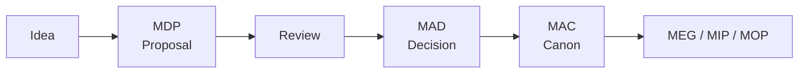

# Contributing to Mosaic Architecture

This repository is documentation. A change here changes what Mosaic *is*, so the process is a little more deliberate than for code.

[MDG-001 — Documentation Authority Guide](docs/engineering/documentation/mdg-001-documentation-authority-guide/index.md) is the authority for everything below. Where this file and that guide disagree, the guide governs and this file is the defect.

## Before You Start

Answer one question: **what kind of change is this?**

| You want to | Do this |
|-------------|---------|
| Fix a typo, a broken link, a stale path | Open a pull request directly. No proposal needed. |
| Clarify wording without changing meaning | Open a pull request directly. Say in the description that intent is unchanged. |
| Add a chapter to an existing specification | Open a pull request. Expect review from the document owner. |
| Change what Mosaic accepts as architecture | Start a proposal. See [The Lifecycle](#the-lifecycle). |
| Create a new specification | Scaffold it. See [Creating a New Document](#creating-a-new-document). |

The distinction that matters: **editorial changes preserve meaning, architectural changes do not.** If you cannot tell which you are making, treat it as architectural and open a proposal.

## The Lifecycle

Architecture is not changed by editing the Architecture Canon. It is changed by a proposal that is accepted, recorded as a decision, and only then absorbed into the Canon.



1. **Propose.** Write a [Mosaic Design Proposal](docs/engineering/documentation/mdg-001-documentation-authority-guide/02-document-types.md). State the problem before the solution, record the alternatives you rejected, and leave your open questions open. A proposal is allowed to be undecided; that is what makes it a proposal.
2. **Review.** The proposal is discussed. It may be accepted, deferred, rejected or withdrawn. All four are recorded in its `Status`.
3. **Decide.** An accepted proposal produces a Mosaic Architecture Decision recording *why*. Decisions are effectively immutable: a later change of direction is a new decision, not an edit to the old one.
4. **Absorb.** The Canon is updated to describe the architecture as it now stands. Supporting guides, protocols and playbooks follow.

Full detail is in [08 — Document Lifecycle](docs/engineering/documentation/mdg-001-documentation-authority-guide/08-document-lifecycle.md).

### Deferring Is a Real Outcome

A proposal that is not adopted is not deleted. `Status: Deferred` keeps the research, the mathematics and the unresolved questions available without letting them read as requirements. [MDP-001](docs/engineering/architecture/mdp-001-adaptive-composition-runtime/index.md) and [MDP-002](docs/engineering/architecture/mdp-002-tile-framework/index.md) are the worked examples.

## Creating a New Document

Do not copy an existing specification. Scaffold from the templates, which are the machine-readable form of [MDG-001](docs/engineering/documentation/mdg-001-documentation-authority-guide/index.md):

```bash
python3 scripts/new_doc.py --type mad --title "Module Signing Policy"
python3 scripts/new_doc.py --type meg --title "Caching Strategy" --dry-run
```

The scaffolder picks the right discipline directory, allocates the next identifier, stamps the metadata and registers the folder in navigation. See [templates/README.md](templates/README.md) for what each type is for and the copy procedure.

Then:

1. Replace every guidance comment as you write. A guidance comment left in a published specification is a defect.
2. Set the `Owner` to a real Git username.
3. Delete chapters the subject genuinely does not need, and add chapters it does. The skeleton is a floor, not a ceiling.
4. Run the checks below before opening a pull request.

**Choosing the type matters more than choosing the directory.** [02 — Document Types](docs/engineering/documentation/mdg-001-documentation-authority-guide/02-document-types.md) has a selection table keyed on the question you are answering. A MAC says what Mosaic *is*; a MEG says how to *build* it; a MAD says *why* it was decided; a MIP defines a *contract*. Putting material in the wrong type is the most expensive mistake to unwind.

## Status

Documents declare authority through `Status`. Prose carries no version number.

| Status | Meaning |
|--------|---------|
| `Draft` | Being written. Not authoritative. |
| `Review` | Complete enough to assess. Not yet authoritative. |
| `Active` | Authoritative. Rely on it. |
| `Deprecated` | Published for reference. Do not adopt for new work. |
| `Superseded` | Replaced. Names its replacement. |

Proposals additionally use `Deferred`, `Accepted`, `Rejected` and `Withdrawn`.

Only a contract defined by a [Mosaic Integration Protocol](docs/engineering/documentation/mdg-001-documentation-authority-guide/02-document-types.md) carries a version, and it is a major integer declared in the document body — `Event Protocol v1`, never `1.2.3`. Full rules: [03 — Status And Versioning](docs/engineering/documentation/mdg-001-documentation-authority-guide/03-versioning.md).

**Changing Status is a review outcome, not an edit.** Do not promote a document to `Active` in the same pull request that writes it.

## Metadata

Every page begins with exactly three fields, in this order:

```text
<!--
File: docs/engineering/guides/meg-016-caching-strategy/01-philosophy.md
Document: MEG-016
Status: Draft
-->
```

`File` must match the real path. `Document` and `Status` must be identical across every page of a specification. No other fields are permitted. The schema is defined by [07 — Repository Organisation](docs/engineering/documentation/mdg-001-documentation-authority-guide/07-repository-organisation.md).

## Writing Standards

Read [04 — Writing Standards](docs/engineering/documentation/mdg-001-documentation-authority-guide/04-writing-standards.md) once; it is short. The rules that catch people most often:

- **Terminology is fixed.** Platform, Module, Capability, Provider, Supervisor. Vale enforces this.
- **Normative language carries RFC 2119 meaning but ordinary capitalisation.** Write "must", not "MUST".
- **Relationship diagrams use Mermaid.** Text fences are for literal fixed-width content only — trees, commands, configuration.
- **Every reference to another Mosaic document is a relative hyperlink**, using the catalogued `ID — Canonical Title` form when named.
- **One authoritative home per concept.** Link, do not restate.

[10 — Standards Mapping](docs/engineering/documentation/mdg-001-documentation-authority-guide/10-standards-mapping.md) records which open standard each convention profiles, and why.

## Review

Documentation review is an architectural activity, not proofreading. [05 — Review Process](docs/engineering/documentation/mdg-001-documentation-authority-guide/05-review-process.md) defines four perspectives — editorial, structural, technical and architectural — and a document reaches `Active` only when all required reviews have concluded.

Reviewers should confirm:

- the document type is correct and does not encroach on another type's responsibility
- concepts are defined once and referenced elsewhere
- cross-references resolve and name the right owner
- terminology matches the rest of the library
- nothing is presented as authoritative that has not been accepted

The document `Owner` in Document Control is the steward. `CODEOWNERS` derives from that field, so the right reviewer is requested automatically.

## Running the Checks

```bash
python3 scripts/validate_docs.py          # MDG-001 conformance; run this first
python3 -m pytest scripts/test_new_doc.py # scaffolder tests
python3 -m mkdocs build --strict          # the site must build clean
vale docs                                 # terminology and voice
npx markdownlint-cli2 "docs/**/*.md"      # Markdown structure
lychee --config lychee.toml --offline .   # relative cross-references
```

`validate_docs.py --rules` lists every rule and the [MDG-001](docs/engineering/documentation/mdg-001-documentation-authority-guide/index.md) requirement it enforces. All of these run in CI on every pull request; the site deploys only when they pass.

If a rule blocks something you believe is correct, that is worth raising. The rule may be wrong, or [MDG-001](docs/engineering/documentation/mdg-001-documentation-authority-guide/index.md) may need amending. Do not work around it silently.

## Commits and Pull Requests

- **One specification folder per commit.** The documentation set is reviewed per specification, and mixed commits are hard to reason about later.
- Write commit messages that explain *why*, not just what moved.
- Fill in the pull request template. The lifecycle question on it is the one that matters.

## Identifiers

Identifiers are permanent. `MAD-003` means one thing forever.

- Numbers are allocated highest-plus-one. Gaps are never refilled.
- A withdrawn specification keeps its identifier and gains a `Superseded` record naming its replacement. See [MDS-006](docs/design/system/mds-006-composition-engine/index.md) and [MDS-007](docs/design/system/mds-007-tile-framework/index.md).
- Retired identifiers and retired chapter numbers are recorded in `chapter-registry.yml` with the reason.

## Questions

If you are unsure which document type fits, or whether your change is editorial or architectural, open an issue using the documentation change template rather than guessing. Choosing wrongly is more expensive to correct than asking.

If you hit a contradiction between two specifications, or a passage too vague to act on, record it in [review/open-questions.md](review/open-questions.md) rather than resolving it by inference. That register is deliberately unpublished, and answering an entry there is often more valuable than editing the prose around it.
