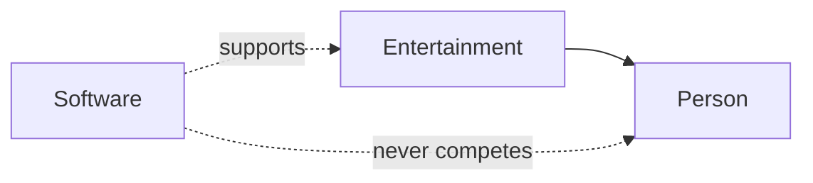

<!--
File: design/mdl/MDL-001 Vision/01-background.md
Document: MDL-001
Chapter: 01
Title: Background & Problem Statement
Status: Draft
Version: 0.1
-->

# Background & Problem Statement

---

# Introduction

Every successful design language begins with a clearly understood problem.

Apple's Human Interface Guidelines emerged from the need to make personal computing approachable.

Material Design sought to unify Google's fragmented product ecosystem.

Fluent Design aimed to create consistency across Windows, Office and Xbox.

The Mosaic Design Language exists because **modern entertainment has become fragmented from the user's perspective**.

This document argues that the problem is not the availability of media.

The problem is the experience required to enjoy it.

---

# The State of Entertainment Software

Modern entertainment software has reached an extraordinary level of technical capability.

Users can instantly stream television, films, anime, music and books from almost anywhere.

Yet the overall experience remains fragmented.

A single evening of entertainment might involve:

- continuing a television series
- checking when the next anime episode airs
- reading the manga adaptation
- browsing related artwork
- listening to the soundtrack
- finding the author's next novel
- discussing the series with friends

Although these activities are closely related from the user's perspective, software treats them as unrelated experiences.

The user is repeatedly forced to move between applications, interfaces and interaction models.

---

# Fragmentation Exists at Multiple Layers

Entertainment fragmentation is often described as a problem of services.

Netflix.

Disney+.

Prime Video.

Spotify.

Kindle.

Jellyfin.

Plex.

While this is true, it is only one layer of the problem.

A more fundamental fragmentation exists inside the user's attention.

Every application asks the user to:

- learn new navigation
- understand different terminology
- rebuild spatial memory
- adapt to different interaction models
- mentally switch contexts

The entertainment itself becomes secondary.

The software becomes primary.

Mosaic rejects this relationship.

---

# The Cost of Context Switching

Every interface transition carries cognitive cost.

Even seemingly insignificant actions require users to:

- locate familiar controls
- rebuild orientation
- recall terminology
- understand visual hierarchy
- identify where they were before

Research into media multitasking consistently demonstrates that people switch between digital content extremely frequently, often without consciously recognising how often those interruptions occur. These switches impose measurable cognitive overhead and fragment attention.  [oai_citation:0‡PMC](https://pmc.ncbi.nlm.nih.gov/articles/PMC3171998/?utm_source=chatgpt.com)

For Mosaic, every unnecessary context switch is considered design friction.

Reducing friction is therefore a primary design objective rather than an aesthetic preference.

---

# Existing Product Categories

Current entertainment software generally optimises one of four objectives.

## Commercial Streaming Platforms

Primary objective:

> Maximise engagement.

Characteristics include:

- autoplay
- trending content
- recommendation feeds
- promotion
- retention optimisation

Success is measured by continued consumption.

---

## Media Servers

Primary objective:

> Organise media collections.

Characteristics include:

- libraries
- metadata
- transcoding
- administration
- file management

Success is measured by organisation and accessibility.

---

## Collection Managers

Primary objective:

> Catalogue information.

These systems excel at recording information but rarely improve the enjoyment of consuming that information.

---

## Companion Applications

Very few products genuinely occupy this space.

A companion application exists to support an activity already chosen by the user.

It assists.

It informs.

It quietly disappears once its work is complete.

Mosaic intentionally positions itself within this category.

---

# The Missing Objective

Existing entertainment software typically optimises one of three outcomes.

- Distribution
- Organisation
- Engagement

Mosaic introduces a fourth.

> **Immersion**

Immersion becomes the primary optimisation target for every future design decision.

---

# Defining Immersion

Within the Mosaic Design Language, immersion is defined as:

> **The reduction of mental effort required to remain inside an entertainment experience.**

This definition intentionally extends beyond playback.

Immersion includes:

- watching
- reading
- listening
- discovering
- learning
- continuing
- exploring
- remembering

If software repeatedly demands attention for itself, immersion has been reduced regardless of how visually attractive the interface may be.

---

# Why Mosaic Exists

Mosaic does not exist to become another streaming platform.

It does not exist to become another media server.

It does not exist to become another library manager.

It exists because no current platform is primarily optimised for helping people remain inside the entertainment they have already chosen.

This philosophical distinction influences every subsequent MDL specification.

---

# Design Consequences

Accepting immersion as the primary optimisation target produces several immediate design consequences.

The interface should become quieter as confidence increases.

Artwork should become more expressive.

Navigation should become less prominent.

Movement should explain change rather than attract attention.

Recommendations should deepen the current experience rather than redirect attention elsewhere.

Administration should remain separate from entertainment.

These are not visual preferences.

They are direct consequences of the product vision.

---

# Position Statement

The following statement should guide every future design discussion.

> **Mosaic is not software for managing media.**
>
> **Mosaic is software for enjoying media.**

Whenever implementation decisions become unclear, contributors should evaluate whether the proposal strengthens enjoyment or merely strengthens management.

If management becomes more important than enjoyment, the proposal should be reconsidered.

---

# Core Design Challenge

The central challenge addressed by Mosaic can be represented as follows.

Software should strengthen the relationship between people and their entertainment.

It should never become the destination itself.

---

# Design Hypothesis

MDL is founded on a single long-term hypothesis.

> People do not need software that constantly asks for attention.

They need software that quietly assists until assistance is no longer required.

If this hypothesis proves correct, Mosaic should gradually become less noticeable as it becomes more capable.

That is considered success.

---

# Architectural Implications

The philosophy established within this chapter has direct consequences for future specifications.

| Specification | Consequence |
|--------------|-------------|
| MDL-002 Principles | Principles prioritise immersion over engagement. |
| MDL-003 Mental Model | Users experience a continuous entertainment world rather than isolated applications. |
| MDL-004 Interaction Model | Interfaces reorganise around changing focus instead of traditional page navigation. |
| MDL-005 Composition Model | Composition exists to communicate current context while minimising cognitive effort. |
| MDS Specifications | Visual systems support content rather than competing with it. |

---

# Review Status

**Status**

Draft

**Architectural Decisions Introduced**

- ADR-004: Mosaic optimises for immersion rather than engagement.
- ADR-005: Context switching is treated as measurable design friction.
- ADR-006: Software exists to support entertainment rather than become the entertainment.

**Next File**

`02-vision.md`