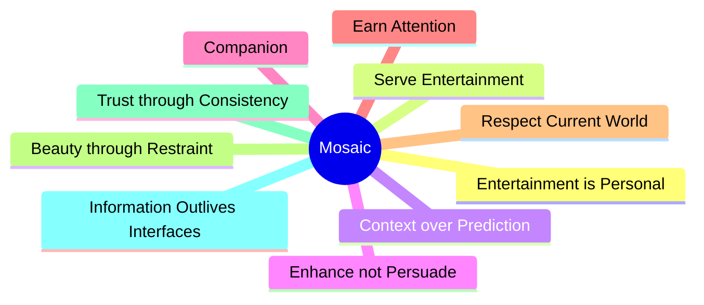

<!--
File: design/mdl/MDL-001 Vision/03-product-beliefs.md
Document: MDL-001
Chapter: 03
Title: Product Beliefs
Status: Draft
Version: 0.1
-->

# Product Beliefs

---

# Purpose

A vision explains **where** Mosaic is going.

Product beliefs explain **how we think**.

These beliefs are intentionally opinionated.

They exist to guide decision making when requirements, user requests or engineering trade-offs become unclear.

Unlike implementation details, product beliefs should remain stable over the lifetime of the platform.

Every future MDL principle, MDS specification and engineering decision should be traceable back to one or more beliefs defined in this chapter. Product visions are most effective when they express enduring beliefs rather than proposed technical solutions.  [oai_citation:0‡Hackney Development System](https://playbook.hackney.gov.uk/Product-Playbook/How%20we%20work/product-vision/?utm_source=chatgpt.com)

---

# PB-001
## Entertainment Is Personal

Entertainment is one of the most personal activities software can support.

People build emotional connections with:

- films
- television
- anime
- books
- music
- podcasts
- artwork
- characters
- stories

Software should respect those relationships.

It should never attempt to replace them.

---

### Implications

The interface should adapt to the user's interests.

The user should never adapt to the interface.

---

# PB-002
## Software Exists To Serve Entertainment

The purpose of Mosaic is not to showcase software.

The purpose of Mosaic is to support entertainment.

Whenever software begins competing for attention with the content itself, the design has failed.

This belief influences:

- visual hierarchy
- motion
- notifications
- recommendations
- overlays
- administration

---

### Design Consequences

Good software becomes quieter over time.

As confidence increases...

The interface should gradually disappear.

---

# PB-003
## Context Is More Valuable Than Prediction

Many modern platforms attempt to predict what users may enjoy next.

Prediction is valuable for commercial platforms whose primary objective is engagement.

Mosaic has different objectives.

Mosaic values **context**.

Understanding what someone is currently enjoying produces better experiences than attempting to persuade them towards something different.

---

### Example

Watching:

> Frieren

Commercial platform:

> Trending this week.

Mosaic:

- Next episode countdown.
- Manga continuation.
- Related soundtrack.
- Cast information.
- Production history.

The user's current interest becomes the centre of the experience.

---

# PB-004
## Enhancement Over Persuasion

Mosaic exists to deepen enjoyment.

Not redirect attention.

Recommendations should answer questions like:

- What naturally comes next?
- What belongs here?
- What helps me understand this better?

They should not answer:

> What keeps the user inside the application longest?

This distinction separates Mosaic from engagement-driven entertainment platforms.

---

# PB-005
## A Companion, Never A Salesperson

The personality of Mosaic is deliberately restrained.

If Mosaic were a person, it would be:

- quiet
- knowledgeable
- friendly
- sophisticated

It would not be:

- demanding
- loud
- promotional
- attention seeking

A good companion speaks when needed.

Then quietly steps aside.

---

### Behaviour

Good companion behaviour:

> "The next episode releases tomorrow."

Poor companion behaviour:

> "Trending now!"

---

# PB-006
## The Interface Should Earn Attention

Every element appearing on screen should justify its existence.

Visual noise creates cognitive noise.

The interface should occupy only the attention necessary to help the user.

When assistance is no longer required, the interface should retreat.

Examples include:

- playback beginning
- reading beginning
- music playback continuing
- long-form viewing

The entertainment becomes primary.

The interface becomes secondary.

---

# PB-007
## Respect The User's Current World

People rarely consume media randomly.

They exist inside temporary worlds.

Examples include:

- a particular television series
- an anime season
- an author
- a franchise
- an artist

Mosaic should strengthen the user's current world before encouraging exploration elsewhere.

This creates continuity rather than interruption.

---

# PB-008
## Beauty Comes From Restraint

Beautiful interfaces are not created by adding decoration.

They are created by removing unnecessary decisions.

Premium software is:

- calm
- deliberate
- coherent
- predictable

Not because it contains more effects.

Because it contains fewer distractions.

---

# PB-009
## Trust Is Earned Through Consistency

People should never wonder:

- why something moved
- why recommendations changed
- why navigation behaves differently
- why information disappeared

Consistency builds trust.

Trust builds confidence.

Confidence allows the interface to disappear.

---

# PB-010
## Information Outlives Interfaces

User interfaces evolve.

Technologies evolve.

Frameworks evolve.

The underlying knowledge remains valuable.

Although later MDL specifications formalise this architecture, Mosaic increasingly treats interfaces as temporary expressions of information rather than permanent structures.

This belief encourages separation between:

- knowledge
- relationships
- presentation

allowing future clients and experiences to evolve without redefining the underlying product philosophy.

---

# Summary

The beliefs described within this chapter may be summarised as follows.

Together these beliefs establish the philosophical foundation from which every future design principle is derived.

---

# Architectural Decisions

| ADR | Decision |
|------|----------|
| ADR-010 | Entertainment is considered a personal experience rather than a content catalogue. |
| ADR-011 | Context is preferred over behavioural prediction. |
| ADR-012 | Mosaic behaves as a companion rather than a recommendation engine. |
| ADR-013 | The interface earns attention instead of demanding it. |
| ADR-014 | Long-term architecture should favour information over presentation. |

---

# Review Status

**Status**

Draft

**Outstanding Questions**

None.

**Next File**

`04-goals.md`