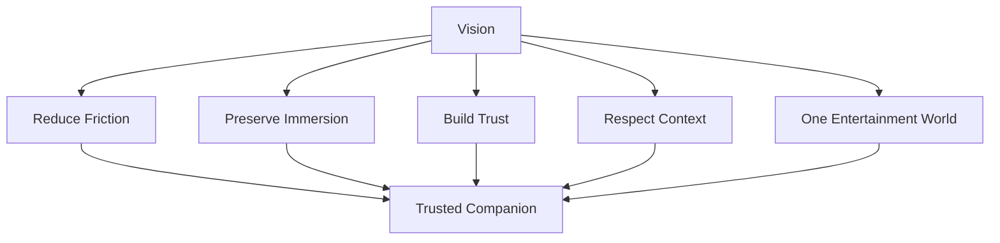

<!--
File: design/mdl/MDL-001 Vision/04-goals.md
Document: MDL-001
Chapter: 04
Title: Goals
Status: Draft
Version: 0.1
-->

# Goals

---

# Purpose

This chapter defines the long-term goals of the Mosaic Design Language.

Goals describe the outcomes MDL exists to achieve.

They intentionally avoid implementation details.

A goal explains **what success looks like**, not **how success is achieved**. This distinction ensures that future engineering and design teams retain flexibility while remaining aligned with the product vision.  [oai_citation:0‡IBM](https://www.ibm.com/docs/en/engineering-lifecycle-management-suite/doors-next/beta?topic=requirements-vision-document&utm_source=chatgpt.com)

---

# Design Goals

## Goal 1
### Eliminate Entertainment Friction

The primary objective of Mosaic is to reduce the mental effort required to enjoy personal entertainment.

Users should spend less time:

- navigating
- searching
- configuring
- remembering
- organising

and more time:

- watching
- reading
- listening
- discovering
- enjoying

Success is measured by reducing interaction overhead rather than increasing interaction volume.

---

## Goal 2
### Preserve Immersion

Every design decision should strengthen immersion.

Immersion is considered broken whenever the interface unnecessarily redirects the user's attention towards itself.

Examples include:

- excessive notifications
- promotional surfaces
- unnecessary configuration
- confusing navigation
- unpredictable movement

Good software should become progressively less noticeable during use.

---

## Goal 3
### Create One Entertainment World

Mosaic should feel like one coherent environment regardless of media type.

Television.

Anime.

Books.

Music.

Films.

Future media types.

They should all feel like different parts of the same world rather than different applications sharing the same logo.

Users should never feel they have "changed products."

Only that they have shifted focus.

---

## Goal 4
### Build A Trustworthy Companion

Mosaic should become software that users instinctively trust.

Trust is earned through:

- consistency
- predictability
- transparency
- restraint

The interface should never manipulate attention.

It should quietly assist until assistance is no longer required.

---

## Goal 5
### Respect Existing Interests

Mosaic should deepen existing interests before introducing new ones.

For example:

Watching an anime should naturally surface:

- upcoming episodes
- manga continuation
- soundtrack
- cast
- related works

rather than immediately attempting to redirect attention towards unrelated content.

The current experience is always considered more valuable than speculative engagement.

---

## Goal 6
### Adapt Without Surprising

The interface should continuously adapt to changing context.

However...

Adaptation should never feel unpredictable.

Users should understand:

- why something appeared
- why something disappeared
- why emphasis changed
- why recommendations evolved

Adaptation should strengthen understanding rather than weaken it.

---

## Goal 7
### Allow Entertainment To Lead

Media artwork, storytelling and emotional connection should become the primary source of visual identity.

The interface provides:

- structure
- clarity
- consistency

The entertainment provides:

- emotion
- atmosphere
- identity

Mosaic should never compete with the media it presents.

---

## Goal 8
### Build For Evolution

The vision of Mosaic should remain stable even as technology changes.

Future changes may include:

- new rendering engines
- new client platforms
- new interaction models
- new plugin systems
- new AI capabilities

These should evolve beneath the design language rather than forcing the design language to change.

MDL exists specifically to provide this long-term stability.

---

# Product Goals

The following goals describe what the completed Mosaic experience should achieve for users.

| Goal | Outcome |
|-------|---------|
| Reduce friction | Users spend less time managing software. |
| Preserve immersion | Users remain focused on entertainment. |
| Increase continuity | Media formats feel connected. |
| Strengthen trust | Behaviour becomes predictable. |
| Encourage exploration | Users naturally discover deeper relationships within their existing interests. |

---

# Engineering Goals

Although MDL is not an engineering specification, it establishes expectations that influence architecture.

Future systems should enable:

- adaptive composition
- context-aware presentation
- runtime atmosphere
- extensibility
- accessibility
- device independence

Engineering solutions should support these goals without redefining them.

---

# Design Success Metrics

The success of MDL should not be measured through traditional UI metrics alone.

Instead, contributors should ask questions such as:

- Does the interface require fewer conscious decisions?
- Does the user remain immersed longer?
- Does navigation become easier over time?
- Does the software quietly fade into the background?
- Does the current context feel respected?

Positive answers indicate progress towards the design goals.

---

# Goal Relationships

All design goals ultimately contribute towards a single outcome.

A trusted entertainment companion.

---

# Design Trade-offs

When goals conflict, they should be prioritised in the following order.

1. Preserve immersion.
2. Reduce friction.
3. Respect current context.
4. Maintain consistency.
5. Introduce new capabilities.

This ordering intentionally favours experience quality over feature quantity.

---

# Review Status

**Status**

Draft

**Architectural Decisions Introduced**

- ADR-015 — Reducing friction is the primary measure of design success.
- ADR-016 — Entertainment always has priority over interface expression.
- ADR-017 — New capabilities must strengthen, not weaken, immersion.

**Next File**

`05-non-goals.md`