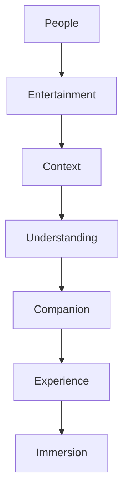

<!--
File: design/mdl/MDL-001 Vision/06-design-philosophy.md
Document: MDL-001
Chapter: 06
Title: Design Philosophy
Status: Draft
Version: 0.1
-->

# Design Philosophy

---

# Purpose

This chapter describes the philosophy that underpins every design decision within Mosaic.

Unlike principles, which help contributors choose between competing solutions, philosophy explains the worldview from which those principles emerge.

It answers one question:

> **How should Mosaic think?**

Every future specification should be able to trace its reasoning back to the philosophy established here.

---

# Design Philosophy Statement

> **Mosaic is a trusted entertainment companion that quietly adapts around people, allowing them to disappear into the worlds they love.**

This statement represents the essence of the Mosaic Design Language.

Everything else is an implementation.

---

# Philosophy Before Interface

Most software begins by designing screens.

Mosaic begins by designing relationships.

Relationships between:

- people
- entertainment
- information
- context
- understanding

The interface exists only to communicate those relationships.

The interface itself is never the product.

---

# People Before Technology

Technology changes continuously.

Programming languages evolve.

Rendering engines evolve.

Frameworks evolve.

Interaction devices evolve.

Human behaviour evolves much more slowly.

MDL therefore places people before technology.

The question is never:

> "What can this technology do?"

The question is:

> "What experience are we trying to create?"

Engineering decisions should support experience.

Experience should never be dictated by engineering.

---

# Entertainment Before Software

People do not open Mosaic because they enjoy software.

They open Mosaic because they enjoy entertainment.

This distinction sounds obvious.

It is also surprisingly easy to forget.

Whenever software becomes more memorable than the entertainment it presents, the design has failed.

The interface should gradually disappear as confidence increases.

Entertainment should become increasingly visible.

---

# Context Before Prediction

Many digital products attempt to understand users through prediction.

Prediction attempts to answer:

> What might this person want next?

Mosaic begins somewhere simpler.

Context asks:

> What is this person enjoying right now?

Current context is considered more valuable than speculative future behaviour.

This philosophy influences:

- recommendations
- navigation
- composition
- notifications
- plugins

Understanding should always precede prediction.

---

# Enhancement Before Persuasion

Commercial platforms often optimise attention.

Mosaic optimises enjoyment.

This creates a fundamentally different philosophy.

Instead of asking:

> How do we keep someone inside the application?

Mosaic asks:

> How do we improve the experience they have already chosen?

The distinction may appear subtle.

It fundamentally changes product behaviour.

Examples include:

Watching a television series.

Commercial response:

- trending releases
- featured content
- promoted originals

Mosaic response:

- next episode
- soundtrack
- source novel
- cast
- production history

One redirects.

The other deepens.

---

# Calm Before Excitement

Excitement is valuable.

Constant excitement is exhausting.

Mosaic should feel calm.

Not because calm is visually minimalist.

Because calm respects attention.

The interface should avoid:

- unnecessary urgency
- excessive visual noise
- competing animations
- promotional hierarchy

The software should communicate confidence through restraint.

Good design principles are intended to guide trade-offs rather than act as slogans. They provide teams with a consistent basis for choosing one solution over another.  [oai_citation:0‡Design Principles](https://principles.design/about/?utm_source=chatgpt.com)

---

# Consistency Before Cleverness

Novel interactions are encouraged.

Confusing interactions are not.

Originality should emerge from solving problems differently.

Not from inventing unfamiliar behaviours.

Whenever contributors propose something innovative they should ask:

> Does this improve understanding?

If the answer is no, novelty alone is insufficient.

---

# Systems Before Features

Features solve individual problems.

Systems solve categories of problems.

Mosaic intentionally invests in systems.

Examples include:

- adaptive composition
- runtime atmosphere
- information-driven presentation
- contextual navigation

These systems allow future features to emerge naturally instead of being individually designed.

A feature should strengthen an existing system before introducing a new one.

---

# Evolution Before Reinvention

The Mosaic Design Language is expected to evolve.

It is not expected to restart.

Future revisions should build upon existing philosophy rather than replacing it.

Large philosophical changes require evidence that the existing philosophy no longer serves users.

This creates continuity across decades rather than product cycles.

---

# The Companion Model

The personality of Mosaic may be summarised through one metaphor.

Mosaic is the knowledgeable friend sitting beside you on the sofa.

That friend:

- knows what you're watching
- remembers where you stopped
- knows when the next episode releases
- remembers which author wrote the novel
- knows which soundtrack is currently playing

They quietly mention useful information.

Then they stop talking.

They do not attempt to dominate the evening.

This metaphor should guide every future design discussion.

Whenever uncertainty exists contributors should ask:

> **Would a trusted companion behave like this?**

If the answer is no, the proposal should be reconsidered.

---

# Design Philosophy Model

Every layer exists to strengthen the relationship between people and entertainment.

The interface is simply the mechanism through which that relationship is expressed.

---

# Philosophy Summary

The Mosaic Design Language may be summarised through six philosophical statements.

1. People before technology.
2. Entertainment before software.
3. Context before prediction.
4. Enhancement before persuasion.
5. Calm before excitement.
6. Systems before features.

Every downstream MDL and MDS specification should reinforce these ideas.

---

# Architectural Decisions

| ADR | Decision |
|------|----------|
| ADR-022 | Experience always takes precedence over implementation technology. |
| ADR-023 | Context is considered a more reliable design foundation than behavioural prediction. |
| ADR-024 | Mosaic behaves as a companion rather than an engagement platform. |
| ADR-025 | New systems are preferred over isolated feature implementations. |

---

# Review Status

**Status**

Draft

**Outstanding Questions**

None.

**Next File**

`07-governance.md`