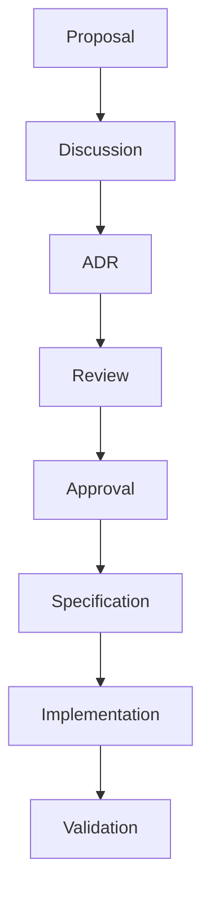
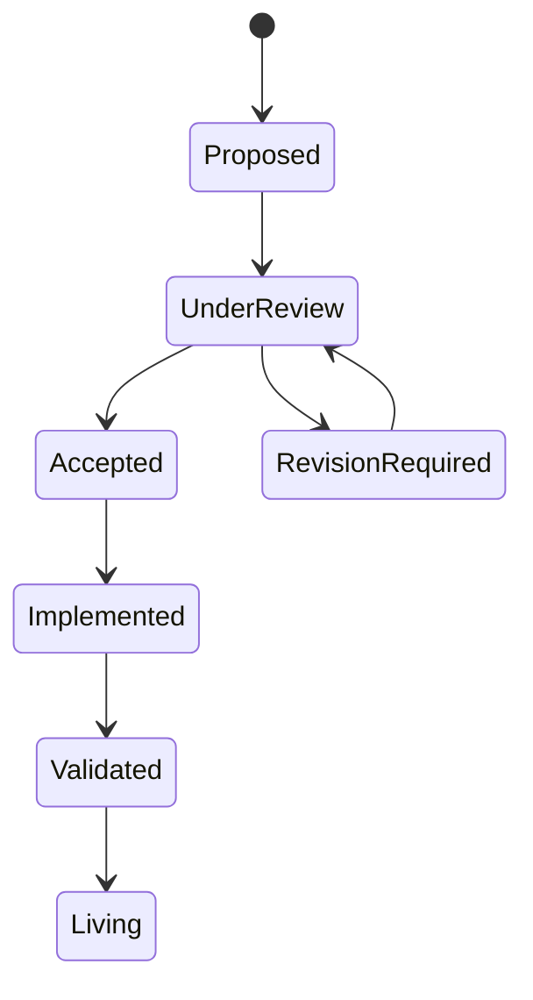

<!--
File: design/mdl/MDL-001 Vision/07-governance.md
Document: MDL-001
Chapter: 07
Title: Governance
Status: Draft
Version: 0.1
-->

# Governance

---

# Purpose

A design language only remains valuable if it is actively governed.

Without governance, design systems inevitably drift as individual features optimise for local requirements instead of the long-term product vision.

The purpose of governance is **not** to slow development.

Its purpose is to preserve coherence while allowing the product to evolve.

---

# Philosophy

Governance exists to protect the user experience.

It does **not** exist to protect individual design decisions.

Every contributor should feel empowered to challenge existing patterns when evidence suggests a better solution exists.

However, changes should always strengthen the Mosaic Design Language rather than fragment it.

The role of governance is therefore:

- preserve consistency
- encourage evolution
- document reasoning
- avoid accidental drift

---

# Governance Principles

The governance model for MDL is built upon five principles.

## 1. Philosophy Before Implementation

Implementation details are expected to evolve.

Philosophy should remain comparatively stable.

Whenever implementation and philosophy conflict, implementation should change first.

---

## 2. Decisions Must Be Traceable

Every significant design decision should be traceable to:

- Vision
- Principles
- Mental Model
- Interaction Model
- Composition Model

No significant design decision should exist without rationale.

Architectural Decision Records (ADRs) are widely recommended as a lightweight mechanism for preserving the context and consequences of important design decisions over time.  [oai_citation:0‡Google Cloud Documentation](https://docs.cloud.google.com/architecture/architecture-decision-records?hl=en&utm_source=chatgpt.com)

---

## 3. Evolution Over Reinvention

MDL is expected to evolve.

It is not expected to restart.

Future contributors should improve existing systems before inventing new ones.

Large philosophical changes require:

- evidence
- rationale
- documented consequences
- formal review

---

## 4. Repository Is The Source Of Truth

The Markdown documents stored within the Mosaic repository are the authoritative version of MDL.

Generated documentation is considered a publication artefact.

Examples include:

- PDF
- HTML
- Documentation website
- Printed copies

These should never be edited directly.

---

## 5. Every Decision Leaves A Trail

Whenever MDL changes:

The reason should be documented.

Future contributors should never need to guess:

- why a decision exists
- why alternatives were rejected
- why behaviour changed

Historical context is considered part of the design language.

---

# Governance Model

No design decision should move directly from idea to implementation.

---

# Design Authority

The following roles participate in MDL governance.

| Role | Responsibility |
|------|----------------|
| Founder | Product vision |
| Lead Design Systems Architect | Design integrity |
| Lead Engineer | Technical feasibility |
| Contributors | Proposals and implementation |
| Community | Feedback and validation |

Responsibility is intentionally distributed.

No single individual owns the design language indefinitely.

---

# Decision Types

Not every design decision requires the same level of review.

## Editorial

Examples:

- spelling
- wording
- clarification

Review:

Repository pull request.

---

## Design

Examples:

- interaction changes
- component behaviour
- terminology

Review:

Design review required.

---

## Philosophical

Examples:

- changing product beliefs
- changing principles
- redefining immersion
- altering companion philosophy

Review:

Founder approval required.

ADR required.

Version increment required.

---

# Design Review Process

Every significant proposal should answer the following questions.

## Vision

Does this strengthen the long-term vision?

---

## Philosophy

Does this align with the companion philosophy?

---

## Principles

Which MDL principles does this reinforce?

Which principles become weaker?

---

## User Experience

Does this reduce friction?

Does this preserve immersion?

Does this respect the user's current context?

---

## Future Evolution

Does this make future design simpler...

...or more complicated?

---

# Design Review Lifecycle

---

# Design Debt

Technical debt accumulates within software.

Design debt accumulates within experiences.

Examples include:

- duplicated interaction patterns
- inconsistent terminology
- competing navigation models
- unnecessary visual complexity
- exceptions without rationale

Design debt should be treated as seriously as technical debt.

Future specifications may introduce dedicated Design Debt Reviews.

---

# Specification Ownership

Each MDL specification has a designated owner.

Ownership exists to maintain quality.

Ownership does **not** imply exclusive authorship.

Contributors are encouraged to propose improvements through the normal review process.

---

# Success Criteria

Governance succeeds when:

- contributors make similar decisions independently
- specifications rarely contradict one another
- new features feel inevitable rather than bolted on
- historical decisions remain understandable years later
- the product evolves without losing its identity

---

# Architectural Decisions

| ADR | Decision |
|------|----------|
| ADR-026 | Markdown specifications stored in version control are the authoritative source of MDL. |
| ADR-027 | Significant philosophical changes require formal review and ADRs. |
| ADR-028 | Governance exists to preserve product identity rather than individual implementation details. |
| ADR-029 | Design debt should be tracked and reviewed alongside technical debt. |

---

# Review Status

**Status**

Draft

**Outstanding Questions**

None.

**Next File**

`08-adrs.md`