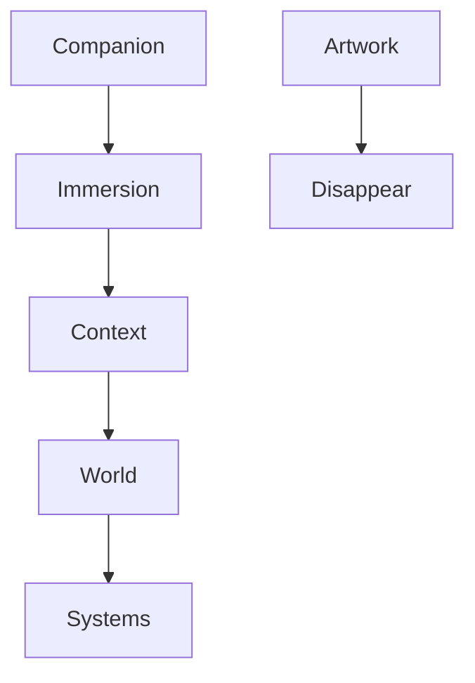

<!--
File: design/mdl/MDL-001 Vision/08-adrs.md
Document: MDL-001
Chapter: 08
Title: Architectural Decision Records
Status: Draft
Version: 0.1
-->

# Architectural Decision Records

---

# Purpose

Architectural Decision Records (ADRs) preserve the reasoning behind significant design decisions.

MDL is intended to guide Mosaic for many years.

Without recorded rationale, future contributors are forced to rediscover the reasoning behind decisions or, worse, unknowingly reverse them.

Every design decision recorded here should answer four questions:

1. What problem were we solving?
2. What decision was made?
3. Why was this decision chosen?
4. What are the long-term consequences?

This approach aligns with widely adopted ADR practices, where each decision captures its context, decision and consequences to preserve architectural knowledge over time.  [oai_citation:0‡AWS Documentation](https://docs.aws.amazon.com/prescriptive-guidance/latest/architectural-decision-records/adr-process.html?utm_source=chatgpt.com)

---

# ADR Format

Every future MDL and MDS ADR should follow the same structure.

```text
ADR-XXX

Status

Context

Decision

Consequences

Alternatives Considered

Related Specifications
```

One ADR should describe one significant decision.

Multiple unrelated decisions should never be combined into a single record.

---

# ADR-001

## Title

Treat Mosaic as an Entertainment Companion rather than a Media Server.

### Status

Accepted

### Context

Traditional media servers optimise organisation.

Commercial streaming services optimise engagement.

Neither philosophy reflects the long-term vision established during founder discovery.

### Decision

Mosaic is defined as an entertainment companion.

The interface exists to support a person's current entertainment experience rather than encourage unrelated consumption.

### Consequences

Future specifications should favour:

- assistance
- continuity
- immersion

over:

- promotion
- engagement
- feature visibility

### Alternatives Considered

- Media Server
- Streaming Platform
- Content Dashboard

Rejected because each encourages software to become the centre of attention.

### Related Specifications

- MDL-001 Vision
- MDL-002 Principles

---

# ADR-002

## Title

Optimise for Immersion rather than Engagement.

### Status

Accepted

### Context

Most entertainment software measures success using engagement metrics.

These objectives conflict with the desired Mosaic experience.

### Decision

Immersion becomes the primary optimisation target.

### Consequences

Future features should be evaluated according to whether they reduce friction and preserve attention.

Feature popularity alone is insufficient justification.

### Alternatives Considered

- Session length
- Watch time
- Click-through rate

Rejected because they optimise commercial outcomes rather than user experience.

---

# ADR-003

## Title

Context Is More Valuable Than Prediction.

### Status

Accepted

### Context

Recommendation engines generally attempt to predict future behaviour.

Founder workshops consistently identified current context as significantly more valuable.

### Decision

Mosaic should first understand what the user is currently doing.

Only then should it offer additional information.

### Consequences

Examples include:

Watching anime:

- next episode
- manga continuation
- soundtrack

instead of:

- unrelated trending content

### Related Specifications

MDL-003 Mental Model

MDL-004 Interaction Model

---

# ADR-004

## Title

The Interface Should Gradually Disappear.

### Status

Accepted

### Context

Users begin Mosaic because they wish to enjoy entertainment.

Not software.

### Decision

The interface should occupy attention only while it remains useful.

Once playback, reading or listening begins, interface chrome should progressively reduce its visual prominence.

### Consequences

Future MDS specifications should favour:

- restrained motion
- restrained overlays
- contextual controls
- artwork-first presentation

---

# ADR-005

## Title

Artwork Provides Emotion.

### Status

Accepted

### Context

Media already possesses a rich emotional identity through artwork.

Attempting to compete with that identity weakens both the content and the interface.

### Decision

Artwork becomes the primary source of emotional expression.

The interface provides:

- hierarchy
- clarity
- consistency

rather than emotional emphasis.

### Consequences

Future material and colour systems derive atmosphere from artwork while preserving a consistent Mosaic brand identity.

---

# ADR-006

## Title

The User's Current World Is The Primary Design Unit.

### Status

Accepted

### Context

Traditional applications organise themselves around pages.

Founder discovery established that people experience entertainment as connected worlds rather than isolated screens.

### Decision

Future specifications should organise experiences around the user's current world.

Navigation exists only to support changing focus.

### Consequences

This ADR directly motivates:

- Composition Model
- Interaction Model
- Runtime Composition Engine

---

# ADR-007

## Title

Build Systems Before Features.

### Status

Accepted

### Context

Feature-driven products accumulate inconsistency over time.

Systems allow future capabilities to emerge naturally.

### Decision

Where possible, Mosaic should invest in reusable systems rather than isolated features.

Examples include:

- adaptive composition
- runtime atmosphere
- information-driven presentation

### Consequences

Engineering effort may initially increase.

Long-term complexity decreases.

---

# ADR Relationships



Architectural decisions are intentionally connected.

No ADR should exist in isolation.

---

# Future ADRs

This document intentionally records only the foundational decisions required to establish the Mosaic Design Language.

Future MDL and MDS specifications are expected to introduce additional ADRs covering:

- terminology
- composition
- motion
- materials
- token architecture
- runtime systems
- extension model
- accessibility
- information architecture

Each ADR should remain focused on a single architecturally significant decision.

---

# ADR Governance

An ADR may be:

- Proposed
- Accepted
- Superseded
- Deprecated

Superseded ADRs should never be deleted.

Instead they should reference the ADR that replaces them.

Maintaining this decision history helps future contributors understand how and why the design language evolved, a common recommendation in established ADR practices.  [oai_citation:1‡github.com](https://github.com/architecture-decision-record/architecture-decision-record?utm_source=chatgpt.com)

---

# Review Status

**Status**

Draft

**Outstanding Questions**

None.

**Next File**

`09-contributor-guidance.md`