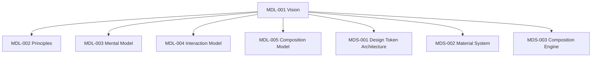

<!--
File: design/mdl/MDL-001 Vision/README.md
Specification: MDL-001
Title: Mosaic Design Language Vision
Status: Draft
Version: 0.1
-->

# MDL-001 — Mosaic Design Language Vision

> *Mosaic exists to remove the friction between people and the entertainment they love.*

---

## Purpose

MDL-001 is the constitutional document of the Mosaic Design Language (MDL).

Unlike traditional design specifications, this document does **not** define colours, typography, layouts or components.

Instead it defines **why** Mosaic exists.

Every future design and engineering decision should be traceable back to the philosophy established here.

If another MDL or MDS specification appears to conflict with MDL-001, that specification should be reconsidered before this document is modified.

---

## Scope

This specification defines:

- Product vision
- Product beliefs
- Design philosophy
- Long-term objectives
- Contributor mindset
- Design governance

This specification intentionally does **not** define:

- Colour systems
- Typography
- Motion
- Components
- Design tokens
- Layout rules
- Engineering implementation

Those concerns are defined by later MDL and MDS specifications.

---

# Specification Structure

- 00 Document Control
- 01 Background & Problem Statement
- 02 Vision
- 03 Product Beliefs
- 04 Goals
- 05 Non-Goals
- 06 Design Philosophy
- 07 Governance
- 08 Architectural Decision Records
- 09 Contributor Guidance
- 10 Design Review Checklist
- 11 Future Considerations
- Glossary
- References

---

# Dependencies

This specification has no dependencies.

All remaining MDL specifications depend on MDL-001.

---

# Repository Convention

Each chapter exists as an individual Markdown document.

This intentionally mirrors software architecture.

Small documents:

- review more easily
- version more cleanly
- minimise merge conflicts
- encourage focused discussion
- can be assembled into PDF, mdBook or documentation websites using tooling such as mdBook's `SUMMARY.md` and `book.toml`.  [oai_citation:0‡Rust Language](https://rust-lang.github.io/mdBook/guide/creating.html?utm_source=chatgpt.com)

---

# Review Status

**Status**

Draft

**Owner**

Lead Design Systems Architect

**Next File**

`00-document-control.md`