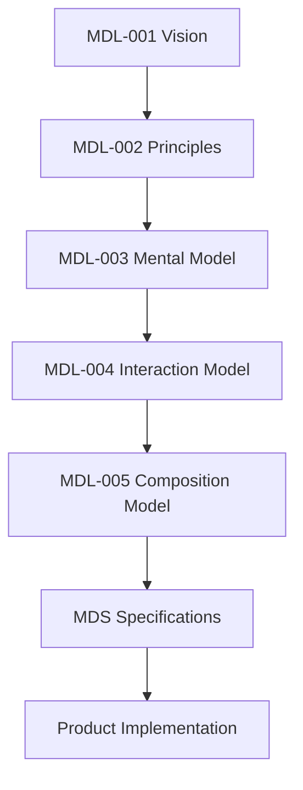

<!--
File: design/mdl/MDL-002 Principles/00-document-control.md
Document: MDL-002
Title: Design Principles
Status: Draft
Version: 0.1
-->

# Document Control

---

# Document Information

| Property | Value |
|----------|-------|
| Document ID | MDL-002 |
| Title | Mosaic Design Language — Principles |
| Classification | Internal |
| Status | Draft |
| Version | 0.1 |
| Owner | Lead Design Systems Architect |
| Parent Specification | MDL-001 Vision |
| Repository | `/design/mdl/MDL-002 Principles/` |

---

# Purpose

MDL-002 transforms the philosophy established by **MDL-001 Vision** into practical decision-making rules.

Vision explains **why** Mosaic exists.

Principles explain **how decisions are made**.

Every future design decision should be explainable by referencing one or more principles contained within this specification.

If a proposal cannot be justified using these principles, it should be reconsidered before implementation begins.

---

# Design Intent

A mature design language is not measured by the quality of its components.

It is measured by the consistency of decisions made by people who have never met one another.

MDL-002 exists so that two contributors working independently should naturally arrive at similar solutions because they are solving problems through the same philosophy.

The objective is not uniformity.

The objective is coherence.

---

# Relationship to MDL

The Mosaic Design Language is intentionally hierarchical.

Every specification beneath MDL-002 should inherit its decision-making framework from the principles defined here.

No specification may contradict these principles without formally amending MDL-002.

---

# Principle Hierarchy

Not all principles possess equal authority.

The following precedence should be used whenever two principles appear to conflict.

| Priority | Principle |
|----------|-----------|
| 1 | Preserve the Vision |
| 2 | Reduce Friction |
| 3 | Preserve Immersion |
| 4 | Respect Current Context |
| 5 | Maintain Consistency |
| 6 | Improve Discoverability |
| 7 | Introduce New Capability |

This hierarchy deliberately favours user experience over feature expansion.

---

# How To Read This Specification

Each principle is intentionally structured using the same format.

Every chapter contains:

- Principle Statement
- Motivation
- Design Rationale
- Good Examples
- Anti-patterns
- Engineering Implications
- Review Questions
- Related ADRs
- Related Specifications

This structure allows contributors to quickly understand not only **what** the principle is, but **how** it should influence implementation.

---

# Design Authority

The principles contained within this specification are considered normative.

Visual systems may evolve.

Implementation technologies may evolve.

The principles should evolve only when there is compelling evidence that they no longer support the product vision.

Changes require:

- Founder approval
- Design Systems approval
- Updated ADR
- Specification version increment

---

# Intended Audience

MDL-002 should be considered required reading for:

- Product Designers
- UX Engineers
- Frontend Engineers
- Platform Engineers
- Plugin Authors
- Community Maintainers

Knowledge of this document is assumed throughout every subsequent MDL and MDS specification.

---

# Expected Outcome

After reading MDL-002, a contributor should be capable of answering questions such as:

- Which solution is more aligned with Mosaic?
- Should this interaction exist?
- Does this feature strengthen or weaken immersion?
- Should this become part of the core platform or remain an extension?
- Does this proposal deserve to become part of the design language?

without relying upon subjective preference.

---

# Success Criteria

MDL-002 succeeds when:

- design reviews become faster
- contributors make similar decisions independently
- discussions reference principles instead of opinions
- implementation becomes more consistent
- future specifications become easier to write

The greatest success of a principle is that contributors eventually stop consciously referring to it because it has become part of how they naturally think about Mosaic.

---

# Review Status

**Status**

Draft

**Dependencies**

- MDL-001 Vision

**Supersedes**

None.

**Next File**

`01-what-is-a-principle.md`
