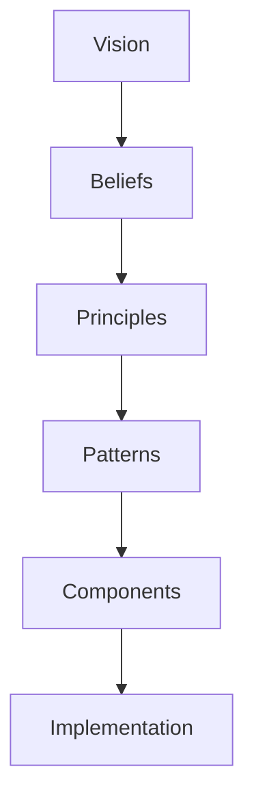

<!--
File: design/mdl/MDL-002 Principles/01-what-is-a-principle.md
Document: MDL-002
Chapter: 01
Title: What Is A Principle?
Status: Draft
Version: 0.1
-->

# What Is A Principle?

---

# Purpose

Before defining the principles of the Mosaic Design Language, it is important to establish what a principle actually is.

Within Mosaic, a principle is **not**:

- a feature
- a requirement
- a user story
- a coding standard
- a design trend
- a visual preference

A principle is a decision-making rule.

Its purpose is to help contributors consistently choose between multiple valid solutions.

---

# Definition

A design principle is a durable statement that guides decision-making across every layer of the product.

Unlike implementation details, principles should survive:

- technology changes
- framework changes
- platform changes
- organisational changes
- contributor changes

A well-written principle remains useful years after the software that first implemented it has been replaced.

---

# Why Principles Exist

Every non-trivial product eventually reaches a point where multiple solutions appear equally reasonable.

Examples include:

Should information be immediately visible...

...or progressively revealed?

Should the interface become more expressive...

...or quieter?

Should plugins create UI...

...or contribute information?

Should recommendations prioritise popularity...

...or current context?

Without principles these questions become subjective.

Different contributors produce different answers.

The product slowly loses coherence.

Principles exist to prevent this.

---

# Design Decisions

Every design decision is an optimisation.

The only question is:

> **What are we optimising for?**

Commercial streaming platforms typically optimise for:

- engagement
- watch time
- retention
- conversion

Traditional media servers often optimise for:

- organisation
- administration
- configuration

Mosaic intentionally optimises for:

- immersion
- continuity
- understanding
- trust
- reduced cognitive effort

Every principle defined within MDL-002 exists to reinforce those optimisation targets.

---

# Principles Are Not Rules

Rules prescribe behaviour.

Principles guide judgement.

For example:

A rule might state:

> "Navigation must always appear on the left."

A principle instead asks:

> "Does this navigation reduce friction?"

The first constrains implementation.

The second encourages thoughtful design.

Whenever possible, Mosaic prefers principles over rules.

Rules should emerge naturally from repeatedly applying principles.

---

# Characteristics Of A Good Principle

Every principle within MDL should satisfy the following characteristics.

## Durable

It should remain useful for many years.

---

## Technology Independent

It should not depend upon:

- Go
- GraphQL
- HTMX
- WebAssembly
- SwiftUI
- React

Technologies evolve.

Principles should not.

---

## Actionable

A contributor should be capable of making a real design decision after reading the principle.

If a principle cannot influence behaviour, it is merely philosophy.

---

## Testable

A reviewer should be capable of asking:

> "Does this proposal satisfy the principle?"

If the answer cannot be evaluated, the principle requires refinement.

---

## Broad

A principle should apply equally to:

- backend systems
- frontend applications
- mobile clients
- television interfaces
- plugins
- documentation

The implementation may differ.

The reasoning should remain consistent.

---

# Principles Are Hierarchical

Not every principle possesses equal authority.

Some principles exist because they support more fundamental ideas.



Implementation may evolve frequently.

Principles should evolve rarely.

Vision should evolve only when absolutely necessary.

---

# Applying A Principle

When faced with two valid solutions, contributors should ask:

```
Which option most strongly reinforces the principle?

↓

Why?

↓

Can that reasoning be explained to another contributor?

↓

Would that reasoning still make sense in five years?

↓

If yes

Proceed.
```

The purpose of principles is not simply to justify decisions.

Their purpose is to make those decisions understandable to future contributors.

---

# Anti-pattern

The following statement is **not** a design principle.

> "Dark mode should use #121212."

It is:

- implementation specific
- visually prescriptive
- technology dependent

The equivalent Mosaic principle would instead be:

> "The interface should quietly recede behind entertainment."

One principle.

Many possible implementations.

---

# Principle Lifecycle

Every principle should pass through the following lifecycle.


Principles should only be retired when evidence demonstrates that they no longer support the vision established by MDL-001.

---

# Relationship To The Remaining Specification

The remainder of MDL-002 defines the seven governing principles of Mosaic.

Each chapter should be interpreted using the framework established here.

Future contributors are encouraged to challenge implementations.

They should challenge principles only with significant evidence and formal design review.

---

# Review Status

**Status**

Draft

**Next File**

`02-decision-hierarchy.md`
