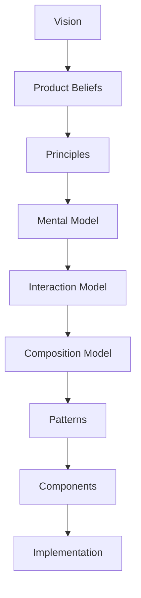

<!--
File: design/mdl/MDL-002 Principles/02-decision-hierarchy.md
Document: MDL-002
Chapter: 02
Title: Decision Hierarchy
Status: Draft
Version: 0.1
-->

# Decision Hierarchy

---

# Purpose

Not every design decision carries equal importance.

Changing the wording of a button is fundamentally different from redefining how Mosaic understands entertainment.

Without a hierarchy, teams frequently spend disproportionate effort debating implementation details while unknowingly violating higher-level design intent.

The purpose of this chapter is to establish the order in which design decisions should be made.

Every downstream specification, implementation and review process should follow this hierarchy.

---

# The Hierarchy

The Mosaic Design Language is intentionally layered.



Higher layers explain *why*.

Lower layers explain *how*.

No lower layer may contradict a higher layer.

---

# Layer One

## Vision

Question answered:

> Why does Mosaic exist?

Authority:

Highest.

Changing the vision fundamentally changes the identity of Mosaic.

Examples:

- Remove friction.
- Preserve immersion.
- Become an entertainment companion.

---

# Layer Two

## Product Beliefs

Question answered:

> What do we believe about entertainment?

Beliefs describe the worldview from which all principles emerge.

Examples:

- Entertainment is personal.
- Context is more valuable than prediction.
- Software exists to serve entertainment.

---

# Layer Three

## Principles

Question answered:

> How do we make decisions?

Principles convert philosophy into repeatable decision-making tools.

Examples:

- Content Leads.
- Movement Preserves Understanding.
- Every Feature Earns Its Place.

A principle should influence hundreds of future implementation decisions.

---

# Layer Four

## Mental Model

Question answered:

> How should users think Mosaic works?

The mental model defines the conceptual architecture experienced by users.

Examples:

- World
- Focus
- Context
- Composition

Users should never need to understand implementation architecture.

---

# Layer Five

## Interaction Model

Question answered:

> How does Mosaic behave?

Interaction defines behaviour.

Examples include:

- focus changes
- composition changes
- movement
- continuity
- transitions

Interaction is independent from appearance.

---

# Layer Six

## Composition

Question answered:

> How should information be organised?

Composition determines:

- hierarchy
- emphasis
- relationships
- breathing space
- adaptive layouts

Composition should communicate understanding before aesthetics.

---

# Layer Seven

## Patterns

Patterns solve recurring user problems.

Examples include:

- Continuing a series
- Reading a book
- Discovering related media
- Managing downloads

Patterns combine multiple systems into coherent experiences.

Patterns should reuse existing principles rather than invent new ones.

---

# Layer Eight

## Components

Components implement patterns.

Examples include:

- Hero
- Timeline
- Progress
- Player
- Navigation

Components should remain interchangeable.

Replacing a component should not require redefining philosophy.

---

# Layer Nine

## Implementation

The final layer.

Examples include:

- HTML
- CSS
- SwiftUI
- Compose
- Flutter
- HTMX
- React

Implementation changes frequently.

It therefore possesses the lowest architectural authority.

---

# Reading The Hierarchy

Every design discussion should begin at the highest relevant layer.

For example.

Question:

> Should Timeline become larger?

Wrong discussion:

```
Timeline

↓

CSS

↓

Spacing
```

Correct discussion:

```
Current Context

↓

Composition

↓

Hierarchy

↓

Timeline

↓

Component

↓

Spacing
```

The implementation should emerge naturally from the higher-level reasoning.

---

# Resolving Conflicts

Whenever two valid proposals exist, contributors should compare them against progressively higher layers.

Example.

Proposal A:

Adds a highly requested feature.

Proposal B:

Slightly fewer features but significantly reduces friction.

Decision process.

```
Vision

↓

Reduce Friction

↓

Proposal B
```

Proposal B wins.

Not because fewer features are inherently better.

Because the Vision possesses higher authority than feature quantity.

---

# Principle Escalation

When implementation decisions cannot be resolved locally, escalation should proceed upwards.

```
Implementation

↓

Component

↓

Pattern

↓

Composition

↓

Interaction

↓

Mental Model

↓

Principles

↓

Vision
```

The first layer capable of resolving the disagreement should make the decision.

Escalating beyond that layer is unnecessary.

This mirrors established decision-making frameworks where higher-order principles resolve lower-level implementation conflicts.  [oai_citation:0‡Design Principles](https://principles.design/field-guide/?utm_source=chatgpt.com)

---

# Decision Ownership

| Layer | Primary Owner |
|---------|---------------|
| Vision | Founder |
| Product Beliefs | Founder + Design |
| Principles | Design Systems |
| Mental Model | Design Systems |
| Interaction | Design Systems |
| Composition | Design Systems |
| Patterns | Product Design |
| Components | Design System Team |
| Implementation | Engineering |

Ownership defines stewardship.

It does not prevent contributions.

---

# Long-Term Stability

Expected lifespan of each layer.

| Layer | Expected Lifetime |
|---------|------------------|
| Vision | Decades |
| Beliefs | Decades |
| Principles | Years |
| Mental Model | Years |
| Interaction | Years |
| Composition | Years |
| Patterns | Months to Years |
| Components | Months |
| Implementation | Weeks to Months |

This hierarchy intentionally reflects the expectation that philosophy changes significantly more slowly than technology.

---

# Architectural Decisions

| ADR | Decision |
|------|----------|
| ADR-001 | Design decisions are hierarchical rather than independent. |
| ADR-002 | Higher-order decisions always take precedence over lower-order implementation concerns. |
| ADR-003 | Components implement philosophy rather than define it. |
| ADR-004 | Engineering implementation possesses the lowest architectural authority within MDL. |

---

# Review Status

**Status**

Draft

**Next File**

`03-principle-01-context-before-prediction.md`
