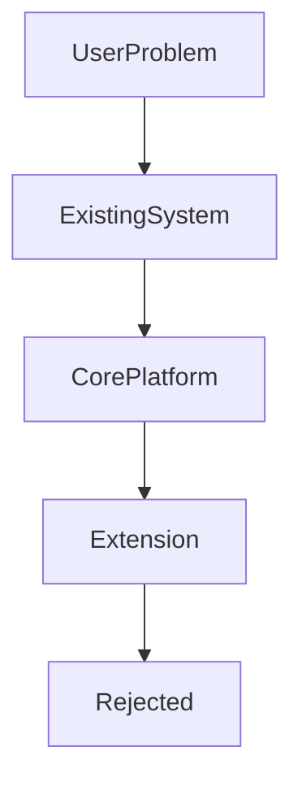

<!--
File: design/mdl/MDL-002 Principles/07-principle-05-every-feature-earns-its-place.md
Document: MDL-002
Chapter: 07
Principle: 05
Title: Every Feature Earns Its Place
Status: Draft
Version: 0.1
-->

# Principle 05 — Every Feature Earns Its Place

---

# Principle Statement

> **Every feature introduced into Mosaic must justify the cognitive cost it imposes upon the user.**

Features are not valuable because they exist.

They are valuable because they improve the user's experience without weakening the product as a whole.

Every feature added to Mosaic becomes part of the user's mental model.

Every unnecessary feature therefore becomes permanent cognitive debt.

---

# Why This Principle Exists

Software naturally accumulates functionality.

Every feature request appears reasonable when viewed in isolation.

Over time this leads to:

- additional settings
- additional navigation
- additional interaction patterns
- duplicated capabilities
- inconsistent terminology
- competing workflows

Eventually the product becomes harder to learn than the problems it originally solved.

Mosaic deliberately resists this trend.

---

# Definition

A feature earns its place when it satisfies all of the following:

- solves a genuine user problem
- aligns with MDL
- strengthens existing systems
- reduces more friction than it introduces
- remains understandable without explanation

Failure in any one area should trigger redesign before implementation.

---

# Design Rationale

Feature count is not a measure of product quality.

Two products may provide identical capabilities.

One requires twenty interactions.

The other requires five.

The second product has not become simpler because it removed features.

It became simpler because the features cooperate.

The objective of Mosaic is not feature reduction.

The objective is **feature coherence**.

---

# The Cost Of Every Feature

Every new capability introduces hidden costs.

Examples include:

- documentation
- localisation
- accessibility
- testing
- maintenance
- discoverability
- user education
- design consistency

These costs exist whether or not users actively use the feature.

Consequently, the burden of proof belongs to the feature.

Not to the design language.

---

# Decision Framework

Every proposed feature should answer the following questions.

## Problem

What user problem is being solved?

---

## Existing System

Can an existing Mosaic system already solve this?

---

## User Value

Will users naturally benefit from this capability?

---

## Complexity

How much complexity does the proposal introduce?

---

## Alternatives

Was a simpler solution considered?

---

## Long-term Maintenance

Will future contributors understand why this feature exists?

---

# Feature Hierarchy

Not every feature belongs in the core platform.

The preferred outcome is always:

Existing System

If an existing system cannot solve the problem, contributors should determine whether the capability belongs:

- within the core platform
- within an extension
- outside Mosaic entirely

---

# Good Examples

## Example 01

A user wants to continue reading after finishing an anime.

Proposal:

Expose manga continuation.

Reasoning:

Strengthens current context.

Deepens the current experience.

Requires no new interaction model.

Accepted.

---

## Example 02

A user wants chapter progress.

Proposal:

Extend the existing Progress system.

Reasoning:

Existing system already communicates progression.

No new UI concept introduced.

Accepted.

---

## Example 03

A plugin introduces a new media type.

Proposal:

Provide information through the existing composition engine.

Reasoning:

The plugin extends existing systems rather than introducing independent interface behaviour.

Accepted.

---

# Poor Examples

## Duplicate Navigation

Proposal:

Add another navigation area specifically for books.

Problem:

Existing navigation already supports domains.

Rejected.

---

## New Dashboard

Proposal:

Create a separate dashboard for recommendations.

Problem:

Duplicates composition.

Weakens current context.

Rejected.

---

## Special Case Components

Proposal:

Create a completely new widget because one plugin requires it.

Problem:

The existing tile framework should evolve instead.

Rejected pending redesign.

---

# Core Platform vs Extension

A useful feature does not automatically belong within the core Mosaic experience.

Core functionality should remain intentionally focused.

Community extensions exist precisely because Mosaic is designed as a platform.

When deciding whether a feature belongs in the core platform, contributors should ask:

> Does every user benefit from this capability?

If the answer is no...

The proposal may still be valuable.

It may simply belong within an extension.

This philosophy helps prevent unnecessary platform growth while encouraging ecosystem innovation. Platform design guidance consistently recommends strengthening core capabilities while enabling specialised functionality through extension points rather than expanding the platform indefinitely.  [oai_citation:0‡W3C](https://www.w3.org/TR/design-principles/?utm_source=chatgpt.com)

---

# Design Debt

Features that fail to earn their place create design debt.

Examples include:

- duplicated concepts
- overlapping capabilities
- inconsistent interaction models
- special-case behaviour
- unnecessary configuration

Unlike technical debt, design debt directly affects every user.

It should therefore be removed whenever practical.

---

# Relationship To Other Principles

This principle reinforces:

- Content Leads
- Context Before Prediction
- The Platform Enables
- Be A Companion

It intentionally discourages feature accumulation as a measure of product progress.

---

# Review Questions

Before approving a feature ask:

- What problem does this solve?
- Does an existing system already solve it?
- What complexity does it introduce?
- Could this be implemented as an extension?
- Will contributors still understand why this exists five years from now?
- If this feature disappeared tomorrow, would users notice?

If the answers remain unclear, the feature has not yet earned its place.

---

# Litmus Test

Every feature should be capable of completing the following sentence.

> **"Mosaic is better because..."**

If the sentence cannot be completed clearly without referencing implementation details, the proposal should be reconsidered.

---

# Summary

Features are investments.

Every investment should return more clarity than complexity.

The role of MDL is not to prevent innovation.

Its role is to ensure that innovation strengthens the product rather than gradually fragmenting it.

---

# Related Specifications

- MDL-001 Vision
- MDL-005 Composition Model
- MDS-003 Composition Engine
- MDS-011 Extension Design Specification

---

# Architectural Decisions

| ADR | Decision |
|------|----------|
| ADR-017 | Every feature must justify its cognitive cost. |
| ADR-018 | Existing systems should be extended before new systems are introduced. |
| ADR-019 | Features benefiting specialised audiences should preferentially become extensions rather than core functionality. |

---

# Review Status

**Status**

Draft

**Next File**

`08-principle-06-the-platform-enables.md`
