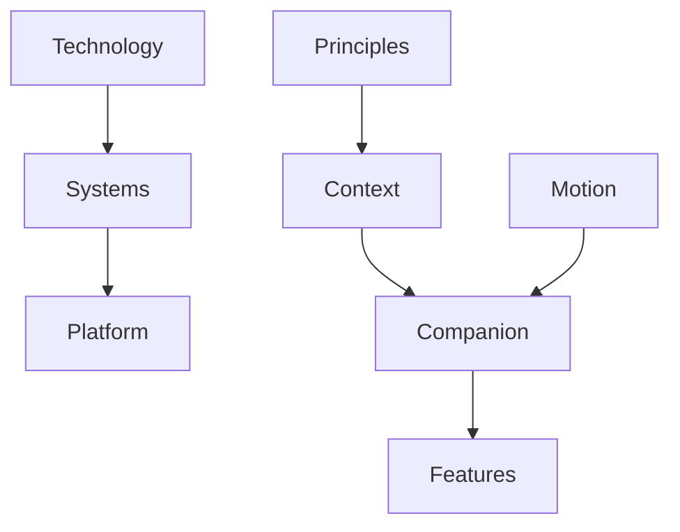

<!--
File: design/mdl/MDL-002 Principles/12-adrs.md
Document: MDL-002
Chapter: 12
Title: Architectural Decision Records
Status: Draft
Version: 0.1
-->

# Architectural Decision Records

---

# Purpose

Architectural Decision Records (ADRs) preserve the reasoning behind the principles defined within MDL-002.

The principles themselves describe **how decisions should be made**.

The ADRs explain **why these principles exist**.

This distinction is important.

Future contributors should be able to understand not only the principle itself, but also the design problem that originally motivated it.

ADRs are intentionally lightweight records capturing context, decision and consequences so future teams understand why important architectural choices were made.  [oai_citation:0‡GitHub](https://github.com/architecture-decision-record/architecture-decision-record?utm_source=chatgpt.com)

---

# ADR Format

Every future ADR within Mosaic should follow the same structure.

```text
ADR Number

Status

Context

Decision

Consequences

Alternatives Considered

Related Specifications
```

Each ADR should describe **one** significant decision.

Never multiple.

---

# ADR-041

## Title

Establish Principles As The Primary Design Authority

### Status

Accepted

### Context

Without explicit principles, design discussions naturally become subjective.

Individual contributors optimise for local requirements.

The product gradually loses coherence.

### Decision

Create MDL-002 as the authoritative source for all design decision making.

### Consequences

Future specifications must reference MDL principles.

Personal preference alone is not sufficient justification for design decisions.

### Alternatives Considered

- Team conventions
- Style guides
- Component documentation

Rejected because none explain *why* decisions should be made.

---

# ADR-042

## Title

Prioritise Context Over Behavioural Prediction

### Status

Accepted

### Context

Commercial entertainment platforms typically optimise future engagement.

Founder discovery established that Mosaic should optimise the current experience instead.

### Decision

Current context becomes the primary input for experience design.

### Consequences

Future systems should prioritise:

- current activity
- current focus
- current relationships

before considering predictive behaviour.

### Alternatives Considered

Recommendation-first interfaces.

Rejected because they encourage attention redirection rather than immersion.

---

# ADR-043

## Title

Treat Motion As Communication

### Status

Accepted

### Context

Decorative animation frequently increases visual complexity without improving understanding.

### Decision

Every animation within Mosaic must communicate meaningful state change.

### Consequences

Future motion systems should optimise:

- continuity
- hierarchy
- explanation

rather than spectacle.

---

# ADR-044

## Title

Prefer Systems Over Features

### Status

Accepted

### Context

Feature-driven software naturally accumulates duplication and inconsistency.

### Decision

Invest in reusable systems before individual capabilities.

Examples include:

- Composition Engine
- Material System
- Information Model
- Runtime Atmosphere

### Consequences

Initial engineering investment increases.

Long-term complexity decreases.

Future features become cheaper to implement.

---

# ADR-045

## Title

Core Platform Owns Experience

### Status

Accepted

### Context

Extension ecosystems frequently fragment visual consistency by allowing arbitrary interface implementation.

### Decision

The core platform owns:

- presentation
- composition
- interaction
- accessibility

Extensions contribute capability.

Not interface.

### Consequences

Users experience one coherent product regardless of installed extensions.

---

# ADR-046

## Title

Adopt The Companion As The Behavioural Metaphor

### Status

Accepted

### Context

The founder consistently described Mosaic as:

> "A nerdy friend who loves what I love."

This metaphor appeared repeatedly throughout discovery workshops.

### Decision

The companion becomes the primary behavioural metaphor for Mosaic.

### Consequences

Future interaction design should favour:

- helpfulness
- restraint
- trust
- continuity

over:

- persuasion
- promotion
- engagement

---

# ADR-047

## Title

Every Feature Must Justify Cognitive Cost

### Status

Accepted

### Context

Every additional feature permanently increases product complexity.

### Decision

Features are evaluated according to:

- user value
- cognitive cost
- system alignment

rather than implementation effort.

### Consequences

The burden of proof belongs to new functionality.

Existing systems should be extended before introducing additional concepts.

---

# ADR-048

## Title

The Design Language Is Technology Independent

### Status

Accepted

### Context

Implementation technologies inevitably change.

The philosophy of the product should not.

### Decision

MDL intentionally avoids dependence upon:

- programming languages
- frameworks
- rendering engines
- frontend libraries

### Consequences

Future implementations may evolve without rewriting the design language.

---

# ADR Relationships



The principles intentionally reinforce one another.

No ADR should be interpreted in isolation.

---

# Superseding ADRs

Future ADRs should **supersede** earlier decisions rather than replacing them.

Historical reasoning remains valuable even after implementation evolves.

Every superseded ADR should include:

- replacement ADR
- date superseded
- rationale
- migration impact

Maintaining decision history preserves architectural knowledge and avoids repeatedly revisiting settled questions.  [oai_citation:1‡GitHub](https://github.com/architecture-decision-record/architecture-decision-record?utm_source=chatgpt.com)

---

# Review Status

**Status**

Draft

**Next File**

`13-contributor-guidance.md`
