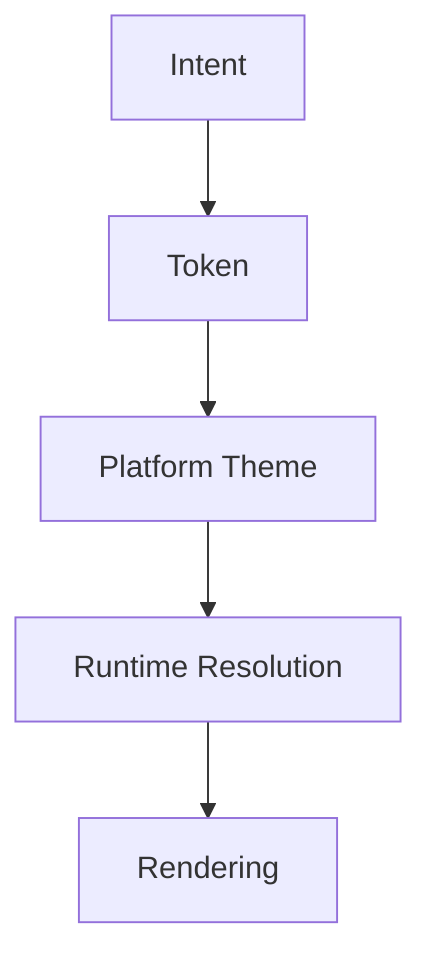

<!--
File: design/mds/MDS-001 Design Token Architecture/01-what-is-a-design-token.md
Document: MDS-001
Chapter: 01
Title: What Is A Design Token?
Status: Draft
Version: 0.1
-->

# What Is A Design Token?

---

# Purpose

Before defining the Mosaic token architecture, contributors must first understand what a Design Token represents within the Mosaic Design System.

Many design systems describe tokens as variables.

Others describe them as design decisions.

Within Mosaic they are something slightly different.

A Design Token is **the implementation of design intent**.

This distinction underpins the remainder of MDS.

---

# Definition

Within the Mosaic Design System, a **Design Token** is defined as:

> **The smallest implementation unit capable of expressing a design decision independently from any platform or technology.**

A token should communicate:

- meaning
- intent
- responsibility

before it communicates:

- colour
- spacing
- typography
- implementation

---

# Why Tokens Exist

Without tokens, implementation becomes tightly coupled to presentation.

Example.

Poor.

```css
color: #4F46E5;
padding: 16px;
border-radius: 12px;
```

Nothing communicates:

- why these values exist
- whether they should change
- where they should be reused

Instead.

```
Surface.Primary

↓

Primitive Value
```

The meaning survives.

The value may evolve.

---

# Tokens Are Not Variables

Although tokens often become:

- CSS variables
- Flutter ThemeData
- SwiftUI environment values
- Compose theme objects

they are **not** those things.

Those are implementation artefacts.

The token exists before implementation.

```
Token

↓

Platform Theme

↓

Runtime

↓

Rendering
```

This distinction allows Mosaic to remain implementation independent.

---

# Tokens Express Intent

Every token should answer one question.

> **Why does this value exist?**

Examples.

Poor.

```
Blue500
```

Better.

```
Brand.Primary
```

Better.

```
Surface.Hero.Background
```

Notice the progression.

Implementation becomes increasingly semantic.

---

# Tokens Are Stable

Values change.

Intent changes far less frequently.

Example.

```
Brand.Primary

↓

Indigo

↓

Teal

↓

Cyan
```

The token remains.

Only its implementation changes.

Applications consuming semantic tokens therefore require no modification.

---

# Tokens Are Hierarchical

Tokens intentionally exist within layers.

```
Primitive

↓

Semantic

↓

Composition

↓

Component

↓

Runtime
```

Each layer adds meaning.

No layer should bypass another without strong architectural justification.

---

# Tokens Belong To The Design System

Applications should consume tokens.

Applications should **not** invent them.

This ensures:

- consistency
- maintainability
- portability
- accessibility

Every Mosaic client should therefore obtain design decisions from the same token architecture.

---

# Tokens Are Cross-Platform

A Design Token should never depend upon:

- CSS
- Flutter
- SwiftUI
- Compose
- HTML

Instead.

```
Surface.Primary

↓

CSS Variable

↓

Flutter Theme

↓

SwiftUI Environment

↓

Compose Theme
```

The token remains identical.

Only implementation differs.

---

# Tokens Are Machine Readable

Although tokens communicate design intent to people, they should also communicate structure to tooling.

Future tooling should be capable of generating:

- CSS variables
- JSON
- YAML
- Flutter
- SwiftUI
- Compose
- TypeScript
- Go

from one canonical token definition.

The architecture should therefore favour clarity over implementation convenience.

---

# Tokens Are Runtime Aware

Unlike many design systems, Mosaic introduces Runtime Tokens.

Runtime Tokens allow the Design System to respond to:

- artwork
- Focus
- Context
- accessibility
- device class

while preserving the same semantic token hierarchy.

Example.

```
Atmosphere.Primary

↓

Generated From Artwork
```

The consuming component remains unaware of the generation process.

---

# Tokens Are Not Components

One of the most common mistakes contributors make is treating components as tokens.

Example.

```
Button.Primary
```

This is generally **too specific**.

Instead.

```
Action.Primary

↓

Consumed By Button
```

The token communicates intent.

The component consumes that intent.

This separation significantly improves reuse.

---

# Good Examples

## Example 01

```
Text.Primary
```

Communicates meaning.

Not implementation.

---

## Example 02

```
Surface.Hero
```

Communicates responsibility.

Not colour.

---

## Example 03

```
Spacing.Section
```

Communicates relationship.

Not pixel values.

---

# Anti-patterns

## Colour Tokens As Semantic Tokens

```
Blue500
```

Meaning depends entirely upon colour.

---

## Platform Tokens

```
CSS.Primary
```

Technology has leaked into architecture.

---

## Component Tokens

```
CardBlueBackground
```

Multiple concepts merged into one token.

Reuse becomes difficult.

---

## Magic Values

```
16

24

32
```

Values appear directly throughout implementation.

Meaning has been lost.

---

# The Token Pipeline

Every Design Token should follow the same conceptual lifecycle.



Notice that implementation appears only after the token has already communicated intent.

---

# Relationship To Future Chapters

This chapter establishes what a token is.

The following chapters define:

- token hierarchy
- primitive tokens
- semantic tokens
- composition tokens
- runtime tokens
- token resolution

Together they form the complete Design Token Architecture.

---

# Summary

Design Tokens are not implementation values.

They are the implementation of design intent.

Their responsibility is to preserve meaning while allowing implementation to evolve.

Every future Mosaic client should therefore think in tokens...

...not colours.

...not spacing.

...not components.

Understanding should always precede implementation.

---

# Review Status

**Status**

Draft

**Next File**

`02-token-hierarchy.md`
