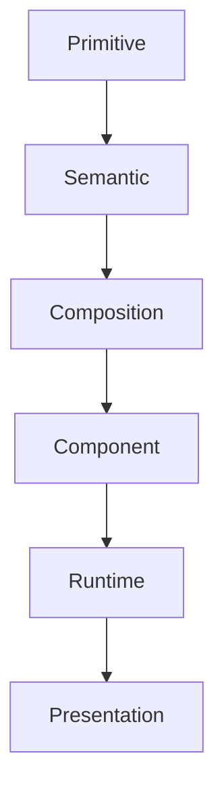

<!--
File: design/mds/MDS-001 Design Token Architecture/02-token-hierarchy.md
Document: MDS-001
Chapter: 02
Title: Token Hierarchy
Status: Draft
Version: 0.1
-->

# Token Hierarchy

---

# Purpose

A Design Token Architecture is only valuable if every token has a clearly defined responsibility.

Without hierarchy:

- tokens duplicate one another
- components consume inconsistent values
- themes become difficult to evolve
- runtime adaptation becomes unpredictable

This chapter defines the canonical hierarchy of every token used within Mosaic.

Every future MDS specification should build upon this hierarchy.

It should never replace it.

---

# The Hierarchy

The Mosaic Design System intentionally separates tokens into six conceptual layers.

```text
Primitive

↓

Semantic

↓

Composition

↓

Component

↓

Runtime

↓

Presentation
```

Each layer exists for one reason only.

No layer should perform the responsibilities of another.

---

# Why Layers Exist

Most token systems contain only two layers.

```
Primitive

↓

Semantic
```

This works well for relatively static interfaces.

Mosaic intentionally supports:

- adaptive composition
- runtime atmosphere
- contextual hierarchy
- artwork-driven experiences
- multiple client platforms

These capabilities require additional abstraction.

The hierarchy therefore separates:

Meaning

from

Implementation

at every stage.

---

# Layer 01

## Primitive

Purpose:

Represent physical values.

Primitive Tokens answer:

> **What physical value exists?**

Examples include:

- colours
- spacing
- typography sizes
- blur radii
- corner radii
- elevation values

Primitive Tokens intentionally possess **no semantic meaning**.

Example.

```
Primitive.Colour.Indigo.500
```

Nothing about this token explains:

- where it should be used
- why it exists

That responsibility belongs to Semantic Tokens.

---

# Layer 02

## Semantic

Purpose:

Represent design intent.

Semantic Tokens answer:

> **Why does this value exist?**

Examples include:

```
Surface.Primary

Text.Secondary

Border.Subtle

Action.Primary

Atmosphere.Supporting
```

Components should consume Semantic Tokens rather than Primitive Tokens.

This allows implementation to evolve without changing consuming code.

---

# Layer 03

## Composition

Purpose:

Represent compositional intent.

Composition Tokens answer:

> **What role does this concept play within the current Composition?**

Examples include:

```
Hero

Anchor

Supporting

Peripheral

Overlay

Navigation
```

Composition Tokens intentionally describe:

importance

rather than

appearance.

---

# Layer 04

## Component

Purpose:

Map semantic meaning onto reusable interface primitives.

Component Tokens answer:

> **How should this component express its role?**

Examples include:

```
Button.Primary

Tile.Hero

Navigation.Active

Timeline.Current
```

Component Tokens should consume:

- Semantic Tokens
- Composition Tokens

They should never consume Primitive Tokens directly.

---

# Layer 05

## Runtime

Purpose:

Adapt the Design System to the user's current World.

Runtime Tokens answer:

> **What changed?**

Examples include:

```
Atmosphere.Primary

Current.Domain

Current.Focus

Device.Class

Accessibility.Motion
```

Runtime Tokens are generated.

They are not manually authored.

Future runtime systems will continuously resolve these tokens.

---

# Layer 06

## Presentation

Purpose:

Produce implementation artefacts.

Examples include:

- CSS Variables
- Flutter ThemeData
- SwiftUI Environment
- Compose Theme
- Design Kit Variables

Presentation is intentionally excluded from the Design Token Architecture.

It is generated from it.

---

# Responsibility Matrix

| Layer | Responsibility | Changes Frequently |
|--------|----------------|-------------------|
| Primitive | Physical values | Rarely |
| Semantic | Meaning | Very rarely |
| Composition | Experience roles | Rarely |
| Component | Interface mapping | Occasionally |
| Runtime | Current World | Continuously |
| Presentation | Platform implementation | Continuously |

Notice that the higher layers change significantly less frequently than the lower layers.

---

# Information Flow

Token flow always proceeds in one direction.



Tokens should never resolve backwards.

For example:

Presentation should never determine:

- Semantic
- Composition
- Priority

Understanding always precedes implementation.

---

# Dependency Rules

Every layer may consume tokens from layers above it.

Example.

```
Component

↓

Semantic

↓

Primitive
```

It may **not** bypass layers unnecessarily.

Poor.

```
Component

↓

Primitive
```

Meaning has been skipped.

This weakens maintainability.

---

# Hierarchy Example

A Hero Tile.

```text
Primitive

↓

Colour.Indigo.600

↓

Semantic

↓

Surface.Primary

↓

Composition

↓

Hero

↓

Component

↓

Tile.Hero

↓

Runtime

↓

Atmosphere.Primary

↓

Presentation

↓

CSS Variable
```

Every layer contributes exactly one responsibility.

No layer duplicates another.

---

# Layer Independence

Each layer should remain independently replaceable.

Examples.

Primitive colours may change.

Semantic meaning remains.

Component implementations may change.

Composition remains.

Presentation frameworks may change.

Runtime behaviour remains.

This separation significantly improves long-term maintainability.

---

# Anti-patterns

## Component → Primitive

Components directly consuming physical values.

Meaning disappears.

---

## Runtime → Primitive

Runtime generating raw colours instead of semantic intent.

Consistency weakens.

---

## Semantic → Presentation

Semantic Tokens directly referencing CSS variables.

Architecture becomes platform dependent.

---

## Composition As Components

Treating:

```
Hero
```

as a component rather than a compositional role.

Future adaptability decreases.

---

# Hierarchy Litmus Test

Contributors should be able to answer:

> **Which responsibility belongs exclusively to this layer?**

If the answer is:

"Several."

The hierarchy probably requires refinement.

Every layer should possess one responsibility.

---

# Relationship To Future Specifications

Future specifications define every layer in greater detail.

Examples include:

- MDS-002 Colour System
- MDS-003 Material System
- MDS-004 Typography
- MDS-006 Composition Engine
- MDS-008 Component Library

Each specification should extend one or more layers without redefining the hierarchy itself.

---

# Summary

The Token Hierarchy is the backbone of the Mosaic Design System.

It ensures that:

- meaning remains stable
- implementation remains flexible
- runtime adaptation becomes possible
- clients remain consistent
- contributors think in intent rather than values

Every future token introduced into Mosaic should have a clear home within this hierarchy.

---

# Review Status

**Status**

Draft

**Next File**

`03-primitive-tokens.md`
