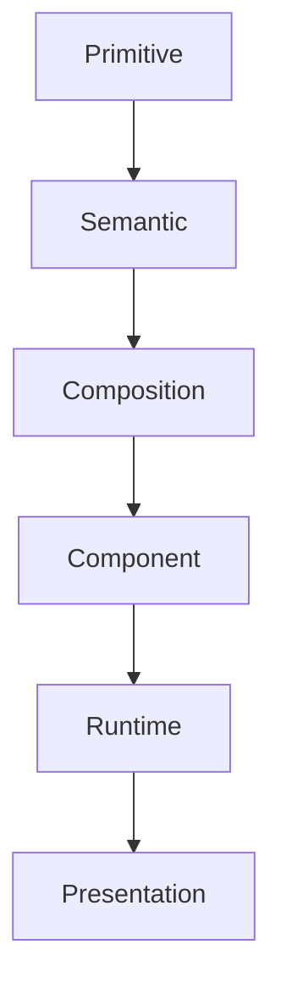

<!--
File: design/mds/MDS-001 Design Token Architecture/03-primitive-tokens.md
Document: MDS-001
Chapter: 03
Title: Primitive Tokens
Status: Draft
Version: 0.1
-->

# Primitive Tokens

---

# Purpose

Primitive Tokens form the physical foundation of the Mosaic Design System.

They represent measurable values rather than design intent.

Primitive Tokens intentionally possess **no semantic meaning**.

This distinction is fundamental.

Primitive Tokens describe **what exists physically**.

They never describe **why it exists**.

---

# Definition

Within MDS, a **Primitive Token** is defined as:

> **A platform-independent physical design value that contains no contextual or semantic meaning.**

Primitive Tokens are the lowest stable layer within the Design Token Architecture.

Every higher token layer ultimately resolves to Primitive Tokens.

Applications should almost never consume them directly.

---

# Why Primitive Tokens Exist

Every design system ultimately resolves to physical values.

Examples include:

- colours
- spacing
- typography sizes
- corner radii
- opacity
- blur
- elevation

Without Primitive Tokens, these values become duplicated throughout implementations.

Primitive Tokens establish one canonical source of physical truth.

---

# Primitive Tokens Are Value Objects

Primitive Tokens intentionally communicate only measurable values.

Examples.

Good.

```
Primitive.Colour.Indigo.500

Primitive.Space.16

Primitive.Radius.8

Primitive.Blur.24
```

Poor.

```
PrimaryButtonBlue

HeroSpacing

SidebarRadius
```

These contain implementation meaning.

Primitive Tokens must remain implementation agnostic.

---

# Primitive Tokens Are Not Semantic

One of the most important architectural rules within Mosaic is:

> **Primitive Tokens never communicate intent.**

Example.

```
Primitive.Colour.Blue.500
```

This token does **not** mean:

- primary
- action
- hero
- navigation

It simply describes one physical colour.

Semantic meaning belongs to the next layer.

---

# Primitive Categories

The Primitive layer is intentionally small.

Current categories include:

```
Primitive

├── Colour

├── Space

├── Radius

├── Typography

├── Elevation

├── Blur

├── Opacity

├── Duration

├── Easing

└── ZIndex
```

Future categories should be introduced sparingly.

Primitive growth should remain slow.

---

# Colour

Purpose.

Represent raw colour values.

Examples.

```
Primitive.Colour.Cyan.500

Primitive.Colour.Slate.900

Primitive.Colour.White

Primitive.Colour.Black
```

Primitive Colours should never be consumed directly by components.

---

# Space

Purpose.

Represent physical spacing units.

Examples.

```
Primitive.Space.2

Primitive.Space.4

Primitive.Space.8

Primitive.Space.16

Primitive.Space.24

Primitive.Space.32
```

Spacing meaning belongs to Semantic Tokens.

---

# Radius

Purpose.

Represent physical corner radii.

Examples.

```
Primitive.Radius.4

Primitive.Radius.8

Primitive.Radius.12

Primitive.Radius.20
```

Radius Tokens intentionally avoid describing where they should be used.

---

# Typography

Purpose.

Represent measurable typography values.

Examples.

```
Primitive.Font.Size.14

Primitive.Font.Weight.600

Primitive.LineHeight.24
```

Typography hierarchy belongs to later specifications.

Primitive Tokens only communicate measurable values.

---

# Elevation

Purpose.

Represent physical depth.

Examples.

```
Primitive.Elevation.0

Primitive.Elevation.1

Primitive.Elevation.2
```

Whether elevation communicates:

- Hero
- Overlay
- Surface

is determined later.

---

# Blur

Purpose.

Represent physical blur intensity.

Examples.

```
Primitive.Blur.8

Primitive.Blur.16

Primitive.Blur.24
```

Blur meaning belongs to Material Tokens.

Primitive Blur simply defines available values.

---

# Opacity

Purpose.

Represent transparency.

Examples.

```
Primitive.Opacity.100

Primitive.Opacity.80

Primitive.Opacity.60

Primitive.Opacity.40
```

These values intentionally possess no semantic meaning.

---

# Motion

Primitive Motion consists of measurable values only.

Examples.

```
Primitive.Duration.100

Primitive.Duration.200

Primitive.Duration.300
```

```
Primitive.Easing.Standard

Primitive.Easing.Decelerate
```

Motion intent belongs to later specifications.

---

# Primitive Naming

Primitive Tokens should follow the same naming convention.

```
Primitive

↓

Category

↓

Family

↓

Variant
```

Example.

```
Primitive

↓

Colour

↓

Cyan

↓

500
```

Naming should communicate structure.

Not usage.

---

# Primitive Stability

Primitive Tokens should change infrequently.

Changing Primitive values potentially affects every consuming Semantic Token.

Consequently:

Primitive additions are preferred over frequent modification.

Existing Primitive Tokens should remain stable whenever practical.

---

# Primitive Consumption

Applications should avoid consuming Primitive Tokens directly.

Poor.

```
Button

↓

Primitive.Colour.Cyan.500
```

Preferred.

```
Button

↓

Semantic.Action.Primary

↓

Primitive.Colour.Cyan.500
```

Meaning remains preserved.

---

# Primitive Independence

Primitive Tokens should remain:

- platform independent
- framework independent
- component independent

Primitive Tokens should never reference:

- CSS
- Flutter
- SwiftUI
- HTML
- Components

Implementation belongs to later layers.

---

# Anti-patterns

## Semantic Primitive

```
Primitive.Primary
```

Meaning has leaked into the Primitive layer.

---

## Component Primitive

```
Primitive.Button.Blue
```

Component responsibility has leaked downwards.

---

## Runtime Primitive

```
Primitive.CurrentArtwork
```

Runtime behaviour belongs elsewhere.

---

## Platform Primitive

```
Primitive.CSS.Blue
```

Platform concerns should never appear within Primitive Tokens.

---

# Primitive Model



Primitive Tokens provide the physical foundation.

Every higher layer progressively adds meaning.

---

# Litmus Test

A contributor should be able to ask:

> **Could this value exist without Mosaic?**

If the answer is yes...

It probably belongs within Primitive Tokens.

If the answer depends upon:

- context
- behaviour
- hierarchy
- interface

it belongs elsewhere.

---

# Summary

Primitive Tokens intentionally know nothing about the product.

They simply provide stable physical values.

Everything meaningful within Mosaic emerges by progressively layering:

- semantics
- composition
- components
- runtime behaviour

on top of these primitive foundations.

That separation is what allows the Design System to evolve without losing conceptual integrity.

---

# Review Status

**Status**

Draft

**Next File**

`04-semantic-tokens.md`
