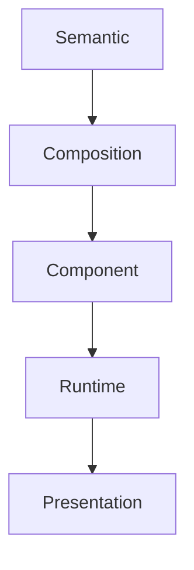

<!--
File: design/mds/MDS-001 Design Token Architecture/05-composition-tokens.md
Document: MDS-001
Chapter: 05
Title: Composition Tokens
Status: Draft
Version: 0.1
-->

# Composition Tokens

---

# Purpose

Primitive Tokens describe physical values.

Semantic Tokens describe design intent.

Composition Tokens describe **compositional roles**.

This distinction is unique to the Mosaic Design System.

Traditional design systems frequently stop at Semantic Tokens.

Mosaic introduces an additional layer because the platform's interface is not static.

It is continuously reorganised by the Composition Model.

Composition Tokens provide the implementation bridge between:

- MDL-005 Composition Model

and

- runtime presentation.

---

# Definition

Within MDS, a **Composition Token** is defined as:

> **A token describing the compositional responsibility of an element independently from its presentation.**

Composition Tokens answer:

> **"What role does this thing play inside the current Composition?"**

They intentionally avoid answering:

> **"What should it look like?"**

---

# Why Composition Tokens Exist

Imagine two pieces of information.

```
Continue Watching

↓

Next Episode
```

Both may consume:

```
Surface.Primary
```

Both may consume:

```
Text.Primary
```

Yet one is significantly more important.

Semantic Tokens cannot express this difference.

Composition Tokens can.

---

# Composition Before Components

Composition Tokens intentionally exist before Components.

```
Composition

↓

Component

↓

Presentation
```

This allows:

- Hero
- Timeline
- Navigation
- Progress

to share identical compositional behaviour while using completely different components.

---

# Composition Categories

The current Composition Token taxonomy consists of:

```
Composition

├── Hero

├── Anchor

├── Primary

├── Supporting

├── Contextual

├── Peripheral

├── Overlay

├── Navigation

├── Modal

└── Background
```

These categories are conceptual.

They intentionally avoid implementation terminology.

---

# Hero

Purpose.

Communicate the primary concept within the current Composition.

Example.

```
Composition.Hero
```

The Hero token should influence:

- emphasis
- visual weight
- breathing space
- movement priority

It should not define:

- colour
- typography
- dimensions

Those responsibilities belong elsewhere.

---

# Anchor

Purpose.

Preserve orientation.

Example.

```
Composition.Anchor
```

Anchors intentionally remain behaviourally stable.

Future runtime systems should preferentially preserve Anchors during adaptive recomposition.

---

# Primary

Purpose.

Represent information directly supporting the Hero.

Examples include:

- progress
- next episode
- current chapter

Primary Tokens communicate conceptual proximity to the Hero.

---

# Supporting

Purpose.

Strengthen understanding without competing for attention.

Examples include:

- timeline
- queue
- continuation
- bookmarks

Supporting Tokens should remain visible while allowing the Hero to dominate.

---

# Contextual

Purpose.

Provide explanation.

Examples include:

- cast
- author
- soundtrack
- reviews
- relationships

Contextual Tokens enrich understanding.

They should rarely become the visual centre of a Composition.

---

# Peripheral

Purpose.

Represent information valuable but not immediately relevant.

Examples include:

- collections
- history
- statistics
- diagnostics

Peripheral Tokens should naturally compress before higher-priority compositional roles.

---

# Overlay

Purpose.

Temporarily communicate information requiring immediate interaction.

Examples include:

- playback controls
- search
- confirmations

Overlay Tokens intentionally possess temporary behavioural ownership.

They should relinquish emphasis once interaction completes.

---

# Navigation

Purpose.

Represent navigational anchors.

Unlike Hero Tokens...

Navigation Tokens should optimise:

- stability
- predictability
- orientation

rather than attention.

---

# Background

Purpose.

Communicate supporting environmental information.

Examples include:

- atmospheric materials
- decorative relationships
- passive artwork

Background Tokens should never compete with active understanding.

---

# Composition Tokens Are Behavioural

Unlike Semantic Tokens, Composition Tokens intentionally change.

Example.

```
Timeline

↓

Supporting
```

After playback completes.

```
Timeline

↓

Primary
```

Nothing about the Timeline changed.

Only its compositional role.

Composition Tokens therefore describe **behavioural intent** rather than permanent identity.

---

# Composition Tokens Consume Semantic Tokens

Example.

```
Composition.Hero

↓

Semantic.Surface.Hero

↓

Primitive Values
```

Composition Tokens should never reference Primitive Tokens directly.

Meaning should remain layered.

---

# Runtime Adaptation

Composition Tokens are expected to participate heavily in runtime adaptation.

Example.

```
Composition.Supporting

↓

Composition.Primary
```

This promotion occurs because:

- Context changed
- Priority changed
- Behaviour changed

The component itself remains identical.

Only its compositional responsibility changes.

---

# Component Consumption

Components should consume Composition Tokens.

Not infer them.

Poor.

```
Timeline

↓

If Important...
```

Preferred.

```
Composition.Primary

↓

Timeline
```

The Composition Engine owns compositional reasoning.

Components communicate it.

---

# Composition Independence

Composition Tokens intentionally remain independent from:

- devices
- layouts
- frameworks
- rendering engines

Desktop.

```
Composition.Hero
```

Television.

```
Composition.Hero
```

Voice.

```
Composition.Hero
```

The role remains identical.

Presentation changes.

---

# Good Examples

```
Composition.Hero

↓

Surface.Hero

↓

Tile.Hero
```

```
Composition.Supporting

↓

Surface.Secondary

↓

Timeline
```

```
Composition.Peripheral

↓

Surface.Canvas

↓

Collection Shelf
```

Each layer contributes one responsibility.

---

# Anti-patterns

## Component Composition

```
Timeline.Primary
```

Component owns composition.

Incorrect.

---

## Colour Composition

```
BlueHero
```

Presentation has leaked into composition.

---

## Device Composition

```
MobileHero
```

Composition should remain device independent.

---

## Static Composition

Composition Tokens never change.

Adaptive behaviour becomes impossible.

---

# Composition Token Model



Composition Tokens bridge:

design intent

and

runtime behaviour.

---

# Litmus Test

Contributors should ask:

> **If this component disappeared tomorrow, would this compositional role still exist?**

If the answer is yes...

It belongs within Composition Tokens.

If the answer is no...

It probably belongs within Component Tokens instead.

---

# Summary

Composition Tokens are one of the defining innovations of the Mosaic Design System.

They allow runtime systems to reorganise understanding without requiring components to understand behaviour.

This separation enables:

- adaptive composition
- runtime hierarchy
- device independence
- plugin consistency
- future evolution

Every future runtime implementation should treat Composition Tokens as behavioural intent rather than visual styling.

---

# Review Status

**Status**

Draft

**Next File**

`06-runtime-tokens.md`
