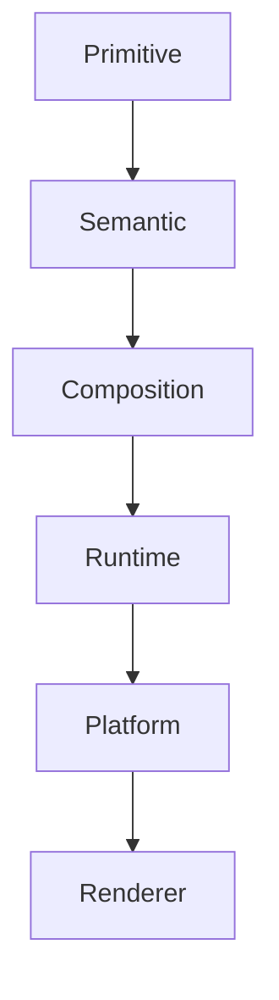
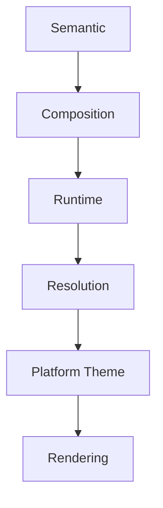

<!--
File: design/mds/MDS-001 Design Token Architecture/07-token-resolution.md
Document: MDS-001
Chapter: 07
Title: Token Resolution
Status: Draft
Version: 0.1
-->

# Token Resolution

---

# Purpose

Previous chapters defined the layers of the Design Token Architecture.

This chapter defines **how those layers become usable design values at runtime**.

Token Resolution is responsible for transforming abstract design intent into concrete values without exposing implementation complexity to components.

Components should never ask:

> **"Which colour should I use?"**

Instead they should ask:

> **"Which token represents my responsibility?"**

The Design System resolves everything else.

---

# Definition

Within MDS, **Token Resolution** is defined as:

> **The deterministic process by which an abstract design token is resolved into a platform-specific implementation value.**

Resolution is an implementation process.

The Design Language remains unchanged throughout.

---

# Why Resolution Exists

Consider the following component.

```
Hero Tile
```

Without token resolution, the component would need to understand:

- theme
- artwork
- accessibility
- platform
- device
- colour palette
- contrast
- motion

The component becomes responsible for far too many decisions.

Instead.

```
Hero Tile

↓

Surface.Hero
```

Everything else becomes the responsibility of the Design System.

---

# One Direction

Token Resolution always flows in one direction.

```text
Primitive

↓

Semantic

↓

Composition

↓

Runtime

↓

Platform

↓

Rendering
```

Tokens should never resolve backwards.

Presentation should never redefine semantic meaning.

---

# Resolution Pipeline

Every token should pass through the same conceptual pipeline.



Every layer contributes one responsibility.

No layer duplicates another.

---

# Resolution Inputs

Resolution may evaluate:

- current World
- current Focus
- current Context
- artwork
- accessibility
- user preferences
- device class
- platform theme

Importantly...

These inputs never change the semantic meaning of a token.

They only influence its implementation.

---

# Deterministic Resolution

Given identical inputs...

Resolution should always produce identical outputs.

Example.

```
Surface.Hero

+

Current Artwork

+

Dark Theme

+

Desktop

↓

Resolved Surface
```

The same request should always produce the same result.

Deterministic behaviour is essential for:

- predictability
- testing
- caching
- accessibility
- consistency

---

# Resolution Order

The Runtime Resolver should evaluate inputs in a consistent order.

```text
1.

Primitive Values

↓

2.

Semantic Meaning

↓

3.

Composition Role

↓

4.

Runtime Inputs

↓

5.

Accessibility

↓

6.

Platform

↓

7.

Resolved Value
```

Earlier stages establish meaning.

Later stages refine implementation.

---

# Resolution Never Changes Intent

One of the most important architectural guarantees of Mosaic is:

> **Resolution changes implementation.**

> **Resolution never changes meaning.**

Example.

```
Surface.Hero
```

Dark Mode.

↓

Slate Background.

Light Mode.

↓

White Background.

Artwork Mode.

↓

Artwork-derived Acrylic.

The semantic meaning remains:

```
Surface.Hero
```

Meaning survives.

Implementation evolves.

---

# Resolution Context

The Runtime Resolver should understand current context.

Example.

```
Playback

↓

Surface.Hero
```

may resolve differently from:

```
Browsing

↓

Surface.Hero
```

because runtime atmosphere changes.

The token itself remains identical.

Only resolution differs.

---

# Resolution Priority

Multiple runtime influences may exist simultaneously.

Example.

```
Artwork

Accessibility

Dark Mode

Television
```

The Runtime Resolver should evaluate them using a defined priority.

Recommended conceptual priority.

```
Accessibility

↓

User Preferences

↓

Composition

↓

Artwork

↓

Device

↓

Platform Defaults
```

Accessibility should always take precedence over aesthetics.

---

# Fallback Resolution

Every token must possess a valid fallback.

Poor.

```
Artwork Missing

↓

Failure
```

Preferred.

```
Artwork Missing

↓

Brand Tokens

↓

Resolved Value
```

Components should never receive unresolved tokens.

The Design System should always produce a meaningful result.

---

# Lazy Resolution

Resolution should occur only when required.

Example.

```
Unused Token

↓

Not Resolved
```

The platform should avoid resolving values that will never be rendered.

This improves runtime efficiency while preserving identical behaviour.

---

# Resolution Cache

Runtime resolution is expected to be cacheable.

Example.

```
Current Artwork

↓

Atmosphere

↓

Resolved Surface

↓

Cache
```

As long as the runtime inputs remain unchanged, the resolved value should remain stable.

Future Composition Engines may invalidate this cache when:

- Focus changes
- Context changes
- artwork changes
- accessibility changes

---

# Resolution Is Invisible

Components should never know:

- how tokens were resolved
- where values originated
- whether runtime adaptation occurred

Components consume:

```
Resolved Tokens
```

Nothing else.

This dramatically simplifies component implementation.

---

# Good Examples

```
Surface.Hero

↓

Runtime.Atmosphere

↓

Resolved Acrylic Surface
```

```
Text.Primary

↓

Accessibility

↓

Higher Contrast
```

```
Spacing.Section

↓

Television

↓

Expanded Physical Spacing
```

Every example preserves semantic meaning.

Only implementation changes.

---

# Anti-patterns

## Component Resolution

```
Component

↓

Determine Theme

↓

Determine Colours
```

Resolution responsibility has leaked.

---

## Platform Resolution

```
Flutter

↓

Invent Semantic Meaning
```

Meaning belongs above implementation.

---

## Runtime Mutation

```
Runtime

↓

Change Token Identity
```

Runtime should only resolve.

Never redefine.

---

## Partial Resolution

Components receiving unresolved token chains.

Every rendered value should be fully resolved before presentation.

---

# Resolution Model



Resolution exists to remove implementation complexity from the rest of the Design System.

---

# Relationship To Future Specifications

Future specifications are expected to define:

- Runtime Resolver
- Theme Resolver
- Atmosphere Generator
- Accessibility Resolver
- Platform Adapters

These systems collectively implement the conceptual process defined by this chapter.

---

# Summary

Token Resolution is the implementation bridge between design intent and rendered interface.

Its responsibility is to ensure that every component receives the correct implementation value while remaining completely unaware of:

- runtime adaptation
- artwork analysis
- accessibility
- platform differences
- device capabilities

The Design System owns complexity.

Components consume clarity.

---

# Review Status

**Status**

Draft

**Next File**

`08-token-inheritance.md`
