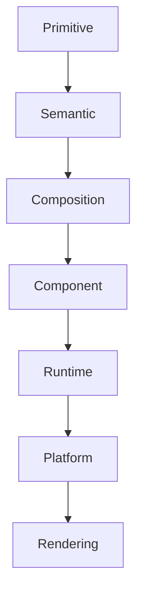

<!--
File: design/mds/MDS-001 Design Token Architecture/08-token-inheritance.md
Document: MDS-001
Chapter: 08
Title: Token Inheritance
Status: Draft
Version: 0.1
-->

# Token Inheritance

---

# Purpose

One of the primary responsibilities of the Mosaic Design Token Architecture is allowing design decisions to evolve without requiring widespread implementation changes.

Token Inheritance provides this capability.

Instead of every component defining its own values, components inherit increasingly specialised design intent from higher layers of the architecture.

Inheritance therefore allows the Design System to express:

- consistency
- adaptability
- maintainability

through one coherent hierarchy.

---

# Definition

Within MDS, **Token Inheritance** is defined as:

> **The process by which a token derives its meaning or implementation from another token while preserving a single responsibility at each layer.**

Inheritance exists to preserve meaning.

Not duplicate values.

---

# Why Inheritance Exists

Without inheritance, every component becomes responsible for resolving its own appearance.

Example.

```
Hero Tile

↓

Colour

↓

Spacing

↓

Radius

↓

Blur

↓

Elevation
```

Every component repeats identical decisions.

Instead.

```
Hero Tile

↓

Composition.Hero

↓

Surface.Hero

↓

Primitive Values
```

Responsibility becomes centralised.

Consistency naturally follows.

---

# Inheritance Hierarchy

Inheritance always follows the same architectural direction.

```text
Primitive

↓

Semantic

↓

Composition

↓

Component

↓

Runtime

↓

Platform
```

No layer should inherit directly from a lower layer.

Each layer inherits only the responsibilities it requires.

---

# Primitive Inheritance

Primitive Tokens do not inherit.

They represent the physical foundation of the Design System.

Example.

```
Primitive.Space.16
```

This value is absolute.

Primitive Tokens terminate the inheritance chain.

---

# Semantic Inheritance

Semantic Tokens inherit physical implementation.

Example.

```
Surface.Primary

↓

Primitive.Colour.Slate.950
```

The Semantic Token gains:

- colour
- contrast
- physical implementation

while preserving semantic meaning.

---

# Composition Inheritance

Composition Tokens inherit semantic meaning.

Example.

```
Composition.Hero

↓

Surface.Hero

↓

Text.Primary

↓

Elevation.Primary
```

Composition therefore combines multiple semantic concepts into one compositional role.

Importantly...

It still does not know anything about components.

---

# Component Inheritance

Components inherit compositional responsibilities.

Example.

```
Hero Tile

↓

Composition.Hero

↓

Semantic.Surface.Hero

↓

Primitive Values
```

The component consumes design intent.

It does not create it.

---

# Runtime Inheritance

Runtime Tokens inherit the complete conceptual chain.

Example.

```
Runtime.Atmosphere.Primary

↓

Composition.Hero

↓

Surface.Hero

↓

Primitive Colour
```

Runtime then resolves implementation according to:

- artwork
- accessibility
- device
- user preferences

Meaning remains unchanged.

---

# Platform Inheritance

Platform implementations inherit fully resolved Runtime Tokens.

Examples include:

- CSS Variables
- Flutter Theme
- SwiftUI Environment
- Compose Theme

Platform code should never reconstruct inheritance.

It should consume the completed result.

---

# Multiple Inheritance

A token may inherit from multiple parent tokens.

Example.

```
Composition.Hero

↓

Surface.Hero

↓

Text.Primary

↓

Elevation.Primary

↓

Spacing.Section
```

The resulting role communicates:

- hierarchy
- material
- typography
- rhythm

without duplicating implementation.

Multiple inheritance should remain intentional and predictable.

---

# Override Rules

Inheritance should support controlled overrides.

Permitted.

```
Runtime

↓

Accessibility Override
```

Not permitted.

```
Component

↓

Primitive Override
```

Bypassing semantic layers weakens the architecture.

Overrides should occur as high in the hierarchy as practical.

---

# Local Overrides

Occasionally local overrides are necessary.

These should remain exceptional.

Before introducing an override ask:

1. Can an existing Semantic Token solve this?
2. Can Composition solve this?
3. Is Runtime the correct place?
4. Is a new token required?

Overrides should be the exception.

Not the default workflow.

---

# Inheritance And Themes

Themes should never redefine semantic meaning.

Instead.

```
Surface.Primary

↓

Dark Theme

↓

Slate 950
```

```
Surface.Primary

↓

Light Theme

↓

Slate 50
```

The consuming component remains identical.

Only implementation changes.

---

# Inheritance And Extensions

Extensions should inherit the complete Design System.

Plugins should consume:

- Semantic Tokens
- Composition Tokens

They should never redefine:

- Primitive values
- Runtime resolution
- Platform implementation

This guarantees ecosystem consistency.

---

# Good Examples

```
Button

↓

Action.Primary

↓

Primitive Colour
```

```
Hero Tile

↓

Composition.Hero

↓

Surface.Hero

↓

Primitive Values
```

```
Timeline

↓

Composition.Supporting

↓

Surface.Secondary

↓

Primitive Values
```

Meaning accumulates.

Implementation remains centralised.

---

# Anti-patterns

## Primitive Consumption

```
Component

↓

Primitive
```

Semantic meaning has been bypassed.

---

## Circular Inheritance

```
Semantic

↓

Component

↓

Semantic
```

Inheritance should always remain directional.

---

## Component Overrides

Components redefining inherited values locally.

Consistency weakens.

---

## Runtime Mutation

Runtime changing semantic identity.

Runtime resolves implementation.

It never changes meaning.

---

# Inheritance Model



Every layer contributes additional understanding.

No layer duplicates responsibilities owned elsewhere.

---

# Relationship To Future Specifications

Future specifications should inherit from this architecture.

Examples include:

- Colour System
- Material System
- Typography
- Motion
- Component Library

None of these specifications should redefine inheritance.

They should extend it.

---

# Litmus Test

Contributors should ask:

> **Can this change be made higher in the hierarchy?**

If the answer is yes...

The change should almost always occur there.

Higher-level inheritance generally produces:

- fewer overrides
- stronger consistency
- easier maintenance

---

# Summary

Token Inheritance allows Mosaic to express one coherent Design System across:

- multiple devices
- multiple themes
- runtime adaptation
- accessibility
- future implementations

Every layer inherits meaning from the layer above it while adding exactly one new responsibility.

This deliberate separation is what allows the Design System to evolve without losing conceptual integrity.

---

# Review Status

**Status**

Draft

**Next File**

`09-token-versioning.md`
