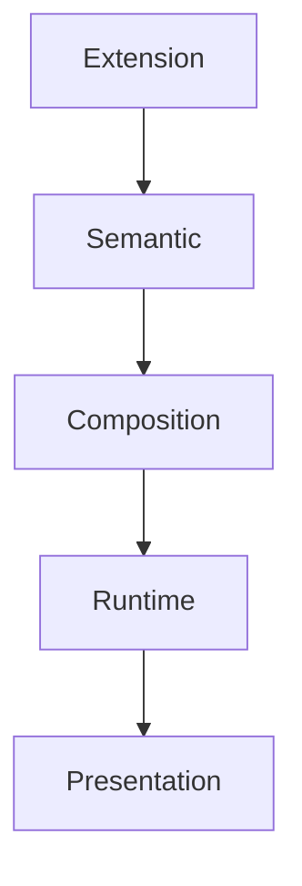

<!--
File: design/mds/MDS-001 Design Token Architecture/10-extension-tokens.md
Document: MDS-001
Chapter: 10
Title: Extension Tokens
Status: Draft
Version: 0.1
-->

# Extension Tokens

---

# Purpose

Mosaic is fundamentally a platform.

Extensions are expected to become one of the primary ways the platform evolves over time.

The Design Token Architecture must therefore provide a mechanism through which extensions can participate in the Design System without fragmenting it.

This chapter defines that mechanism.

The objective is simple.

> **Every extension should feel native.**

Not merely compatible.

---

# Definition

Within MDS, **Extension Tokens** are defined as:

> **Tokens contributed by extensions that integrate into the Mosaic Design Token Architecture without redefining the platform's visual language.**

Extension Tokens extend.

They never replace.

---

# Why Extension Tokens Exist

Without a token architecture, extensions typically choose their own:

- colours
- spacing
- typography
- interaction
- hierarchy

Over time this produces several independent design languages inside one application.

Users no longer experience:

> Mosaic

They experience:

> Mosaic plus several unrelated interfaces.

Extension Tokens prevent this.

---

# Platform Ownership

The core platform always owns:

- Primitive Tokens
- Semantic Tokens
- Composition Tokens
- Runtime Tokens

Extensions never redefine these layers.

Instead they consume them.

The platform remains the source of truth.

---

# Extension Responsibilities

Extensions may contribute:

- new semantic concepts
- additional domain-specific meanings
- specialised capabilities

Examples include:

```
Manga

↓

Reading Progress
```

```
Audiobooks

↓

Listening Position
```

```
Calendar

↓

Upcoming Release
```

These concepts become part of the existing Composition rather than creating independent visual systems.

---

# Information Before Presentation

Extension authors should think in information.

Not interface.

Poor.

```
Anime Extension

↓

Custom Hero

↓

Custom Timeline

↓

Custom Colours
```

Preferred.

```
Anime Extension

↓

Episode Release

↓

Studio

↓

Voice Actor

↓

Relationship
```

The platform determines how these concepts become interface.

---

# Extension Token Namespace

Every extension should define its own namespace.

Example.

```text
Extension

↓

Anime

↓

Episode

↓

Release
```

or

```text
Extension

↓

Books

↓

Chapter

↓

Progress
```

Namespaces prevent collisions while remaining readable.

---

# Extension Categories

Extensions should contribute tokens only within clearly defined categories.

Examples include:

```text
Extension

├── Domain

├── Capability

├── Information

├── Relationship

├── Expression Hint

└── Metadata
```

These categories intentionally avoid:

- colour
- spacing
- materials
- typography

Those remain platform concerns.

---

# Expression Hints

An extension may suggest how information is naturally expressed.

Example.

```
Episode Countdown

↓

Timeline
```

This is an **Expression Hint**.

It is not an instruction.

The Composition Engine remains responsible for determining the final Expression.

If the current Context requires another Expression, the platform should ignore the hint.

---

# Runtime Participation

Extensions participate in Runtime resolution indirectly.

Example.

```
Anime Extension

↓

Episode Release

↓

Runtime Context

↓

Composition

↓

Timeline

↓

Presentation
```

The extension never resolves Runtime Tokens.

It merely enriches the information available to the Runtime Resolver.

---

# Token Consumption

Extensions should consume the same Semantic Tokens as the core platform.

Examples.

```
Text.Primary

Surface.Secondary

Action.Primary

Border.Subtle
```

Using platform tokens ensures that extensions inherit:

- accessibility
- themes
- runtime atmosphere
- future redesigns

automatically.

---

# Forbidden Responsibilities

Extensions should **not** define:

- Primitive Tokens
- Brand Tokens
- Runtime Tokens
- Material Tokens
- Motion Tokens
- Component Tokens

These remain exclusively owned by the platform.

Allowing extensions to redefine these layers would inevitably fragment the Design System.

---

# Theme Compatibility

Because extensions consume Semantic Tokens rather than physical values:

Dark Mode.

↓

Works.

Light Mode.

↓

Works.

Artwork Atmosphere.

↓

Works.

Accessibility.

↓

Works.

The extension receives future improvements automatically.

No additional implementation is required.

---

# Future Marketplace

The long-term goal of the Mosaic extension ecosystem is that users cannot visually distinguish:

Official functionality

from

Community functionality.

The Design Token Architecture is one of the primary mechanisms through which this consistency is achieved.

Users should recognise:

> Mosaic

Not:

> Several plugins sharing the same window.

---

# Good Examples

## Anime Extension

Contributes:

```
Episode Release

Studio

Opening Theme

Relationship
```

Consumes:

```
Surface.Primary

Text.Primary

Composition.Supporting
```

---

## Books Extension

Contributes:

```
Reading Progress

Series Order

Bookmarks
```

Consumes:

```
Composition.Hero

Text.Secondary

Action.Primary
```

---

## Music Extension

Contributes:

```
Current Track

Album

Concert
```

Consumes:

```
Surface.Hero

Composition.Primary

Runtime.Atmosphere
```

The visual language remains unified.

---

# Anti-patterns

## Brand Tokens

```
Anime.Primary.Purple
```

Extensions should not create competing brands.

---

## Custom Themes

Extensions providing independent colour systems.

The platform loses visual coherence.

---

## Runtime Generation

Extensions generating their own Runtime Tokens.

Runtime belongs exclusively to the platform.

---

## Component Libraries

Extensions introducing:

- custom cards
- custom buttons
- custom layouts

The platform loses ownership of interface.

---

# Extension Registration

Future runtime implementations should allow extensions to register token contributions declaratively.

Conceptually.

```yaml
extension:
  id: anime

contributes:

  information:
    - episode.release
    - episode.runtime

  relationships:
    - adaptation
    - sequel

  expressions:
    - timeline
```

Notice that the extension contributes meaning.

Not presentation.

---

# Token Resolution

Extension Tokens should participate in the standard resolution pipeline.



Extensions never bypass the platform.

They enrich it.

---

# Litmus Test

Extension authors should ask:

> **If Mosaic completely redesigned its interface tomorrow, would my extension still work?**

If the answer is:

**Yes.**

The extension probably depends upon semantic architecture.

If the answer is:

**No.**

The extension probably depends upon implementation.

---

# Summary

Extension Tokens allow Mosaic to scale into a large ecosystem without sacrificing a coherent design language.

Extensions contribute:

- knowledge
- capability
- relationships

The platform contributes:

- hierarchy
- composition
- runtime
- presentation

This separation ensures that every extension naturally becomes part of one unified Mosaic experience.

---

# Review Status

**Status**

Draft

**Next File**

`11-governance.md`
