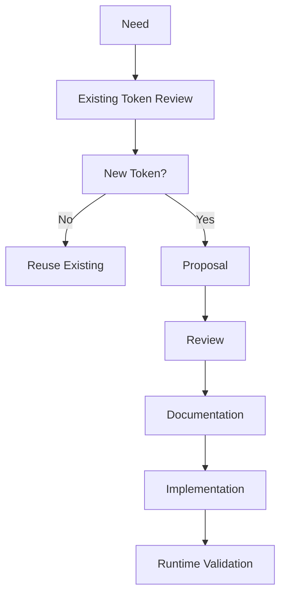

<!--
File: design/mds/MDS-001 Design Token Architecture/11-governance.md
Document: MDS-001
Chapter: 11
Title: Token Governance
Status: Draft
Version: 0.1
-->

# Token Governance

---

# Purpose

The Design Token Architecture is a shared contract between:

- Design
- Engineering
- Runtime Systems
- Extensions
- Tooling

Without governance, token systems naturally fragment.

Teams introduce duplicate tokens.

Semantic meaning drifts.

Components begin consuming primitive values.

Extensions invent competing token hierarchies.

Over time, the Design System becomes increasingly difficult to maintain.

This chapter defines how the Mosaic Design Token Architecture should evolve while preserving long-term consistency.

---

# Governance Philosophy

Tokens should be treated as public APIs.

Once a token becomes part of the Design System, other systems begin depending upon it.

Changing a token therefore has architectural consequences.

Token governance exists to preserve:

- consistency
- compatibility
- maintainability
- predictability

rather than simply enforcing naming conventions.

---

# The Token Contract

Every token published by the Design System forms part of the public design contract.

That contract guarantees:

- stable semantic meaning
- deterministic resolution
- documented inheritance
- predictable lifecycle

The contract intentionally does **not** guarantee:

- implementation values
- colour palettes
- runtime algorithms

These may evolve without breaking consumers.

---

# Token Ownership

Each layer has a defined owner.

| Layer | Owner |
|---------|-------|
| Primitive | Design Systems |
| Semantic | Design Systems |
| Composition | Design Systems |
| Runtime | Runtime Engine |
| Platform | Client Implementations |

Ownership exists to preserve architectural integrity.

It does not prevent contribution.

---

# Introducing New Tokens

Before introducing a token, contributors should answer the following questions.

## Question One

Does an existing token already describe this intent?

---

## Question Two

Is the proposed token semantic...

or implementation?

---

## Question Three

Does the new token belong at the correct architectural layer?

---

## Question Four

Will the token remain meaningful in five years?

---

## Question Five

Would another contributor naturally discover this token?

If the answer to any question is "no", refinement should continue before implementation.

---

# Token Creation Workflow

Every new token should follow the same lifecycle.



The preferred outcome is always:

Reuse.

Not growth.

---

# Layer Governance

Each layer follows slightly different governance rules.

## Primitive

Growth should remain extremely slow.

Primitive Tokens should represent long-lived physical values.

---

## Semantic

Semantic Tokens form the public Design API.

New Semantic Tokens require strong justification.

---

## Composition

Composition Tokens affect runtime behaviour.

Changes require Design Systems review.

---

## Runtime

Runtime Tokens may evolve more frequently.

However, they must never alter semantic intent.

---

## Platform

Platform implementations should consume tokens.

They should not redefine them.

---

# Token Reviews

Every proposed token should be reviewed against:

- MDL Vision
- Design Principles
- Mental Model
- Composition Model

The question should never be:

> "Does this token work?"

Instead ask:

> **"Does this token strengthen the architecture?"**

---

# Duplicate Tokens

Duplicate semantic meaning is one of the greatest threats to long-term maintainability.

Poor.

```
Surface.Primary

Primary.Surface

Canvas.Primary
```

Three tokens.

One meaning.

Preferred.

```
Surface.Primary
```

One meaning.

One token.

One source of truth.

---

# Token Drift

Token Drift occurs when:

- meaning changes
- implementation leaks upwards
- layers become blurred
- duplicate semantics appear
- component-specific tokens accumulate

Token Drift weakens the Design System significantly faster than visual inconsistency.

It should therefore be treated as architectural debt.

---

# Token Debt

Examples include:

- duplicated Semantic Tokens
- unnecessary aliases
- Primitive Token consumption
- component-specific values
- undocumented Runtime Tokens

Token debt should be removed whenever practical.

Adding additional abstraction should never become easier than maintaining architectural clarity.

---

# Extension Governance

Extensions may propose new Semantic Tokens.

They may not introduce:

- Primitive categories
- Runtime architecture
- Composition hierarchy

Core platform ownership remains preserved.

Extension proposals should demonstrate:

- reuse
- compatibility
- long-term usefulness

before acceptance.

---

# Automated Validation

Future tooling should automatically validate:

- naming conventions
- hierarchy correctness
- inheritance
- duplicate semantics
- deprecated tokens
- unused tokens

Automated validation should supplement architectural review.

It should never replace it.

---

# Governance Checklist

Every token proposal should satisfy:

- [ ] Correct architectural layer.
- [ ] Existing tokens evaluated.
- [ ] Semantic meaning documented.
- [ ] Runtime implications reviewed.
- [ ] Component impact assessed.
- [ ] Extension compatibility maintained.
- [ ] Documentation updated.

---

# Success Criteria

The Token Architecture succeeds when:

- contributors naturally reuse existing tokens
- semantic names remain stable
- runtime adaptation remains invisible
- extensions integrate without fragmentation
- implementations remain framework independent

The strongest Design Token Architecture is one contributors rarely need to think about consciously.

They simply trust it.

---

# Architectural Decisions

| ADR | Decision |
|------|----------|
| ADR-080 | Design Tokens are treated as a public architectural contract. |
| ADR-081 | Semantic stability has higher priority than implementation stability. |
| ADR-082 | Reuse is preferred over introducing new tokens. |
| ADR-083 | Token drift is considered architectural debt. |

---

# Review Status

**Status**

Draft

**Next File**

`12-adrs.md`
