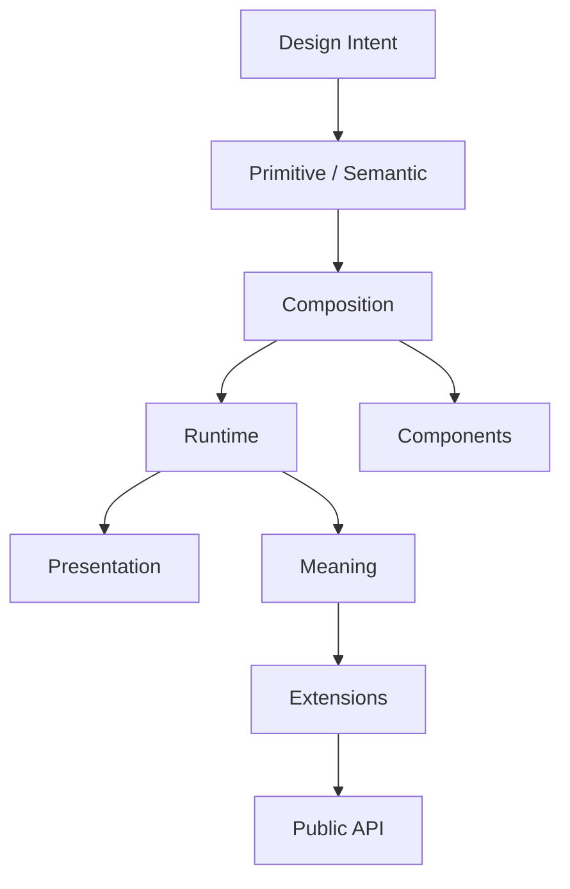

<!--
File: design/mds/MDS-001 Design Token Architecture/12-adrs.md
Document: MDS-001
Chapter: 12
Title: Architectural Decision Records
Status: Draft
Version: 0.1
-->

# Architectural Decision Records

---

# Purpose

The Architectural Decision Records (ADRs) contained within MDS-001 preserve the architectural reasoning behind the Design Token Architecture.

Where the MDL specifications established:

- Vision
- Principles
- Mental Model
- Interaction
- Composition

MDS-001 establishes how those concepts become machine-readable implementation.

These ADRs explain why the token architecture has been deliberately layered and why responsibility is separated between Primitive, Semantic, Composition and Runtime Tokens.

Future contributors should consult these ADRs before proposing structural changes to the Design System.

---

# ADR Format

All Mosaic ADRs follow the standard structure.

```text
ADR Number

Status

Context

Decision

Consequences

Alternatives Considered

Related Specifications
```

Each ADR records one architectural decision.

---

# ADR-084

## Title

Treat Design Tokens As Architectural Concepts

### Status

Accepted

### Context

Many Design Systems treat tokens as implementation variables.

This tightly couples tokens to frontend technologies.

### Decision

Design Tokens become architectural concepts representing design intent rather than implementation values.

### Consequences

Future client implementations remain interchangeable while sharing one common Design Language.

---

# ADR-085

## Title

Separate Primitive Tokens From Semantic Tokens

### Status

Accepted

### Context

Direct consumption of colour and spacing values weakens long-term maintainability.

### Decision

Primitive Tokens represent physical values.

Semantic Tokens represent design meaning.

### Consequences

Themes, runtime systems and accessibility improvements can evolve without changing component implementations.

---

# ADR-086

## Title

Introduce Composition Tokens

### Status

Accepted

### Context

Semantic Tokens alone cannot adequately describe compositional responsibilities.

### Decision

Composition Tokens become an independent architectural layer.

### Consequences

Runtime systems gain the ability to reorganise hierarchy without modifying component implementations.

---

# ADR-087

## Title

Introduce Runtime Tokens

### Status

Accepted

### Context

Traditional Design Systems assume static design values.

Mosaic requires adaptation based upon:

- artwork
- Focus
- Context
- accessibility
- device

### Decision

Runtime Tokens become dynamically resolved implementation values.

### Consequences

The platform becomes adaptive while preserving stable semantic architecture.

---

# ADR-088

## Title

Presentation Is Generated

### Status

Accepted

### Context

Different platforms require different implementation technologies.

### Decision

Presentation becomes the generated output of the Design Token Architecture.

### Consequences

Future platforms may consume identical Design Tokens while producing different implementation artefacts.

---

# ADR-089

## Title

Components Consume Meaning Rather Than Values

### Status

Accepted

### Context

Components directly consuming Primitive Tokens become tightly coupled to implementation.

### Decision

Components consume Semantic and Composition Tokens.

Primitive Tokens remain hidden beneath the architecture.

### Consequences

Component implementations become significantly easier to maintain and migrate.

---

# ADR-090

## Title

Runtime Never Changes Meaning

### Status

Accepted

### Context

Runtime adaptation introduces significant implementation flexibility.

Without architectural boundaries runtime could accidentally redefine semantic intent.

### Decision

Runtime Tokens may alter implementation.

They must never alter semantic meaning.

### Consequences

Artwork adaptation, accessibility and platform changes remain predictable.

---

# ADR-091

## Title

Extensions Participate Through Semantic Architecture

### Status

Accepted

### Context

Allowing extensions to introduce their own token hierarchies fragments product identity.

### Decision

Extensions contribute information and consume existing Design Tokens.

The platform owns Runtime and Presentation.

### Consequences

Community extensions naturally inherit future Design System improvements.

---

# ADR-092

## Title

Treat The Design Token Hierarchy As A Stable API

### Status

Accepted

### Context

Applications, tooling and extensions all depend upon token names.

### Decision

The token hierarchy becomes a public architectural contract.

Semantic stability receives higher priority than implementation stability.

### Consequences

Future redesigns become dramatically less disruptive.

---

# ADR Relationships



Each decision reinforces a single architectural objective.

**Meaning should remain stable while implementation remains flexible.**

---

# Future ADRs

Future Design Token ADRs are expected to formalise:

- Token Schema
- Token Registry
- Runtime Resolver
- Theme Generation
- Multi-Brand Architecture
- Token Validation
- Build Pipelines
- Design Tool Synchronisation
- SDK Code Generation

These intentionally remain outside the scope of MDS-001 Version 0.1.

---

# ADR Governance

Changes to the Design Token Architecture should occur only when:

- semantic ambiguity exists,
- architectural layering proves insufficient,
- runtime evolution requires new abstraction,
- multiple specifications repeatedly conflict.

Implementation convenience is **not** sufficient justification for changing the architecture.

---

# Summary

The ADRs contained within MDS-001 define one of the most important implementation boundaries within Mosaic.

Applications should never consume raw implementation values.

Instead they consume stable architectural meaning.

This separation allows the Design System to evolve continuously while preserving one coherent design language across every client, extension and future platform.

---

# Review Status

**Status**

Draft

**Next File**

`13-contributor-guidance.md`
