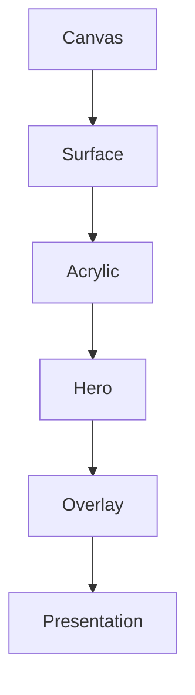

<!--
File: design/mds/MDS-003 Material System/02-material-hierarchy.md
Document: MDS-003
Chapter: 02
Title: Material Hierarchy
Status: Draft
Version: 0.1
-->

# Material Hierarchy

---

# Purpose

Every physical object communicates importance.

A sheet of paper does not feel the same as polished acrylic.

Glass does not feel the same as carved stone.

Likewise, every material within Mosaic should communicate its role through its physical behaviour.

The Material Hierarchy defines the architectural relationship between every material used throughout the platform.

It answers one question.

> **"How physically present should this part of the interface feel?"**

---

# Definition

Within MDS, **Material Hierarchy** is defined as:

> **The ordered system through which materials communicate hierarchy using physical behaviour rather than decoration.**

Material Hierarchy is independent from:

- colour
- typography
- components
- layout

It is an environmental system.

---

# Why Hierarchy Exists

Without Material Hierarchy:

Every surface behaves identically.

Every object appears equally important.

Users must rely entirely upon colour or layout to understand hierarchy.

Mosaic intentionally distributes hierarchy across multiple systems.

Including:

- Composition
- Colour
- Typography
- Motion
- Materials

Materials reinforce understanding.

They never create it independently.

---

# Material Layers

The Mosaic Material System defines five primary layers.

```text
Canvas

↓

Surface

↓

Acrylic

↓

Hero

↓

Overlay
```

Each layer increases perceived physical presence.

---

# Layer 01

## Canvas

Purpose.

Represent the environment.

The Canvas should feel:

- calm
- stable
- neutral
- distant

It should receive only subtle influence from Runtime Atmosphere.

The Canvas exists to support everything above it.

It should rarely attract attention itself.

---

# Layer 02

## Surface

Purpose.

Group related understanding.

Examples include:

- tiles
- panels
- collections
- shelves

Surfaces should possess:

- gentle separation
- minimal elevation
- restrained material response

Surfaces organise information.

They should not dominate it.

---

# Layer 03

## Acrylic

Purpose.

Create physical presence.

Acrylic introduces:

- translucency
- refraction
- environmental lighting
- perceived depth

Acrylic should feel:

- premium
- contemporary
- substantial

Importantly...

Acrylic is **not glass**.

Glass disappears.

Acrylic possesses presence.

It occupies space while remaining connected to its surroundings.

This distinction forms one of the defining visual characteristics of Mosaic.

---

# Layer 04

## Hero

Purpose.

Communicate current importance.

Hero Materials receive the strongest influence from:

- Runtime Atmosphere
- Artwork
- Refraction

Hero Materials should feel:

- illuminated
- immersive
- emotionally connected

without becoming visually dominant.

The entertainment remains the emotional centre.

The Hero Material quietly supports it.

---

# Layer 05

## Overlay

Purpose.

Temporarily communicate interaction.

Examples include:

- playback controls
- dialogs
- search
- menus

Overlay Materials should prioritise:

- readability
- separation
- focus

Runtime Atmosphere influence should reduce while overlays remain active.

Interaction always has higher priority than atmosphere.

---

# Physical Presence

Every material possesses perceived physical weight.

Conceptually.

```text
Canvas

↓

Very Light

Surface

↓

Light

Acrylic

↓

Medium

Hero

↓

High

Overlay

↓

Highest
```

Physical weight influences:

- depth
- refraction
- diffusion
- translucency
- environmental response

It should not be confused with visual brightness.

---

# Material Relationships

Materials should behave like members of the same physical family.

Poor.

```
Glass

Metal

Paper

Plastic
```

Each behaves independently.

Preferred.

```
Canvas

↓

Surface

↓

Acrylic

↓

Hero

↓

Overlay
```

Every material shares:

- lighting model
- refraction language
- environmental response

The differences are gradual.

Not absolute.

---

# Hierarchy Is Behaviour

Material Hierarchy should evolve alongside Composition.

Example.

```
Hero Changes

↓

Material Importance Changes

↓

Lighting Changes

↓

Refraction Changes
```

Materials should never change independently from behavioural hierarchy.

They respond to understanding.

Not interface events.

---

# Hierarchy Across Themes

The hierarchy remains identical across themes.

Light Theme.

```
Canvas

↓

Paper-like
```

Dark Theme.

```
Canvas

↓

Slate-like
```

Hero remains Hero.

Acrylic remains Acrylic.

Only physical interpretation changes.

---

# Hierarchy Across Devices

Different rendering technologies may communicate Material Hierarchy differently.

Desktop.

↓

High-quality acrylic.

Mobile.

↓

Reduced translucency.

Television.

↓

Greater perceived depth.

The behavioural hierarchy remains unchanged.

---

# Runtime Behaviour

Runtime Atmosphere should influence each layer differently.

| Material | Atmosphere Influence |
|-----------|---------------------:|
| Canvas | Very Low |
| Surface | Low |
| Acrylic | Medium |
| Hero | High |
| Overlay | Minimal |

This prevents atmosphere from overwhelming the interface.

The user's attention naturally remains on current content.

---

# Plugins

Extensions never define materials.

Plugins contribute:

- Information
- Relationships
- Expressions

The Material System determines:

- physical presence
- lighting
- hierarchy
- atmosphere

Every extension therefore inherits one coherent physical language.

---

# Good Examples

## Continue Watching

Canvas remains neutral.

Hero gently illuminated.

Supporting tiles receive subtle acrylic.

Navigation remains restrained.

The hierarchy is immediately understandable.

---

## Playback

Video dominates.

Controls appear using Overlay Material.

Atmosphere reduces.

Readability increases.

Interaction feels effortless.

---

## Administration

Canvas becomes calmer.

Atmosphere becomes minimal.

Materials remain recognisably Mosaic while supporting productivity rather than immersion.

---

# Anti-patterns

## Everything Acrylic

Every surface possesses identical material.

Hierarchy disappears.

---

## Decorative Depth

Elevation exists purely because it looks modern.

No additional understanding is communicated.

---

## Theme Materials

Different themes invent different material hierarchies.

Users lose physical consistency.

---

## Plugin Materials

Extensions introducing their own material behaviour.

The physical language fragments.

---

# Material Hierarchy Model



Each material increases physical presence while remaining part of one coherent environmental system.

---

# Relationship To Future Chapters

The following chapters define each material individually.

Including:

- Canvas
- Acrylic
- Hero Material
- Overlay Material
- Refraction
- UV-indexed Refraction
- Light Transport

This chapter establishes only the hierarchy connecting them.

---

# Summary

Material Hierarchy defines how physical presence communicates importance.

It allows users to understand hierarchy before consciously analysing colour or layout.

Every material belongs to one coherent physical family.

The interface should feel constructed from one environmental language rather than several unrelated visual effects.

That physical coherence is one of the defining characteristics of the Mosaic Material System.

---

# Review Status

**Status**

Draft

**Next File**

`03-canvas.md`
