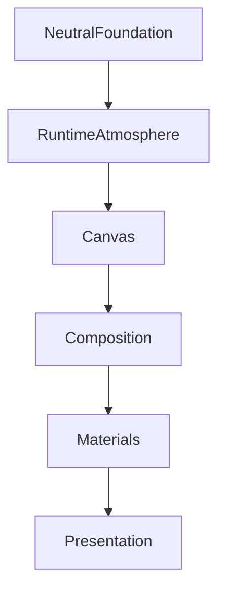

<!--
File: design/mds/MDS-003 Material System/03-canvas.md
Document: MDS-003
Chapter: 03
Title: Canvas
Status: Draft
Version: 0.1
-->

# Canvas

---

# Purpose

The Canvas is the foundation of every Mosaic experience.

Everything else exists upon it.

Unlike ordinary application backgrounds, the Canvas is **not** empty space.

It is an environmental material.

Its responsibility is to create a calm, stable world in which entertainment can exist.

The Canvas should quietly disappear from conscious attention while subtly reinforcing the atmosphere established by the current entertainment.

---

# Definition

Within MDS, **Canvas** is defined as:

> **The foundational material representing the environmental space in which every Mosaic Composition exists.**

Canvas is not:

- wallpaper
- artwork
- decoration
- branding

Canvas represents the environment itself.

---

# Philosophy

A museum wall exists to support paintings.

It should not compete with them.

Likewise, the Mosaic Canvas exists to support entertainment.

It should create:

- calm
- space
- depth
- confidence

without asking for attention.

The Canvas should never become the Hero.

---

# Behaviour

The Canvas should always feel:

- stable
- continuous
- restrained
- physically distant

Unlike Acrylic, it should not appear to float above the content.

Instead it should behave as the physical environment surrounding every interface element.

---

# Canvas Responsibilities

The Canvas has five responsibilities.

### 1. Establish Environment

The Canvas defines the overall visual environment before any interface elements appear.

---

### 2. Support Atmosphere

Runtime Atmosphere subtly influences the Canvas.

The influence should remain extremely restrained.

---

### 3. Provide Contrast

Foreground materials must always remain distinguishable from the Canvas.

---

### 4. Preserve Calm

The Canvas should reduce visual noise.

Never increase it.

---

### 5. Maintain Continuity

The Canvas should remain visually continuous while the rest of the Composition evolves.

---

# Runtime Atmosphere

Canvas participates in Runtime Atmosphere.

However...

It possesses the **lowest atmospheric weighting** of every material.

Conceptually.

```
Artwork

↓

Atmosphere

↓

Canvas

↓

Very Low Influence
```

The user should perceive the atmosphere emotionally.

Not consciously notice coloured backgrounds.

---

# Neutrality

The Canvas should begin from a neutral foundation.

Examples.

Light Theme.

```
Warm Paper
```

Dark Theme.

```
Deep Slate
```

Future implementations may refine these neutrals.

The underlying philosophy remains unchanged.

Neutrality provides room for:

- artwork
- Hero materials
- Acrylic
- typography

to become visually expressive.

---

# Texture

The Canvas may contain an extremely subtle physical texture.

Examples include:

- fine grain
- paper fibre
- soft diffusion
- micro-noise

Texture should exist to prevent the interface feeling digitally flat.

It should never become recognisable as a pattern.

Users should feel texture rather than see it.

---

# Lighting

The Canvas should receive indirect environmental light.

Unlike Hero Materials, which respond visibly to atmosphere...

Canvas should respond almost imperceptibly.

Example.

```
Sci-Fi Artwork

↓

Very subtle cool environmental shift.
```

```
Fantasy Artwork

↓

Very subtle warm environmental shift.
```

The effect should resemble ambient room lighting.

Not recolouring.

---

# Canvas And Motion

The Canvas should rarely move.

Instead...

Materials move within the Canvas.

The environment remains stable.

This stability significantly improves orientation.

If the Canvas appears to move independently from the user's World, continuity weakens.

---

# Canvas And Composition

Canvas exists beneath every Composition.

Conceptually.

```text
Canvas

↓

Composition

↓

Materials

↓

Content
```

The Composition may evolve continuously.

Canvas should remain behaviourally stable.

This stability creates the feeling that the user remains inside one coherent environment.

---

# Canvas Across Themes

Light Theme.

Canvas behaves like softly illuminated paper.

Dark Theme.

Canvas behaves like deep architectural slate.

OLED Theme.

Canvas may approach true black where appropriate.

Despite these differences...

Users should always recognise:

```
Canvas
```

The material identity remains stable.

Only environmental interpretation changes.

---

# Canvas Across Devices

Different devices may implement Canvas differently.

Desktop.

Subtle texture.

Television.

Slightly deeper luminance.

Mobile.

Reduced texture for performance.

The perceived material should remain consistent regardless of implementation.

---

# Canvas And Accessibility

Accessibility possesses higher authority than atmosphere.

The Canvas should always preserve:

- text readability
- contrast
- orientation

Atmospheric influence should automatically reduce whenever readability would otherwise decrease.

---

# Canvas And Refraction

Canvas does not refract.

Instead...

It receives refracted light from surrounding Acrylic materials.

Conceptually.

```text
Artwork

↓

Atmosphere

↓

Acrylic Refraction

↓

Canvas Reflection
```

This relationship subtly reinforces depth while preventing visual clutter.

---

# Good Examples

## Library

Large calm Canvas.

Artwork provides emotion.

Hero softly illuminated.

The environment feels spacious.

---

## Playback

Canvas almost disappears.

Video dominates.

Overlay materials float naturally above it.

Nothing distracts from the entertainment.

---

## Administration

Canvas becomes even calmer.

Atmosphere influence decreases.

The environment supports productivity without abandoning Mosaic identity.

---

# Anti-patterns

## Decorative Background

Canvas becomes artwork.

Content loses prominence.

---

## Heavy Atmosphere

Canvas strongly adopts artwork colours.

The interface becomes visually noisy.

---

## Flat Black

Large areas of featureless black.

Depth disappears.

The environment feels empty rather than calm.

---

## Moving Background

Canvas animates independently from interaction.

Continuity weakens.

---

# Canvas Model



The Canvas provides the environmental foundation upon which every Mosaic experience is built.

---

# Relationship To Future Chapters

The following chapters build upon Canvas by introducing increasingly expressive materials.

Including:

- Acrylic
- Hero Material
- Overlay Material
- Refraction
- Light Transport

Canvas remains the calm foundation beneath them all.

---

# Summary

Canvas is the quietest material within Mosaic.

It should rarely be noticed.

Instead it should create the feeling that:

- entertainment has room to breathe,
- materials belong somewhere,
- atmosphere exists naturally,
- and the user's World occupies one coherent physical environment.

When successful, users will remember the entertainment.

Not the surface beneath it.

---

# Review Status

**Status**

Draft

**Next File**

`04-acrylic.md`
