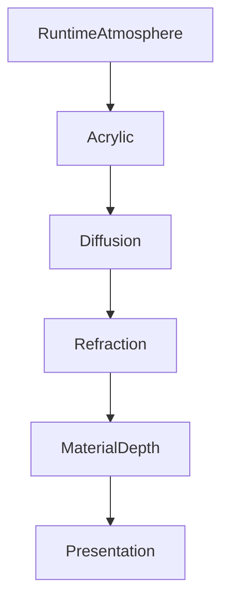

<!--
File: design/mds/MDS-003 Material System/04-acrylic.md
Document: MDS-003
Chapter: 04
Title: Acrylic
Status: Draft
Version: 0.1
-->

# Acrylic

---

# Purpose

Acrylic is the defining material of the Mosaic Design System.

It is the physical medium through which the user's entertainment influences the interface.

Unlike glass, Acrylic should not disappear.

Unlike opaque panels, Acrylic should not isolate itself from its surroundings.

Instead, Acrylic should behave like a premium physical material that:

- possesses depth,
- receives light,
- refracts colour,
- softly diffuses atmosphere,
- remains structurally present.

It is one of the most recognisable characteristics of the Mosaic visual language.

---

# Definition

Within MDS, **Acrylic** is defined as:

> **A semi-translucent material that receives environmental light and Runtime Atmosphere while preserving hierarchy, readability and physical presence.**

Acrylic is not:

- glass,
- blur,
- transparency,
- opacity,
- frosted panels.

Those are implementation techniques.

Acrylic is a material.

---

# Philosophy

The industry often treats acrylic as:

```
Blur

+

Transparency
```

Mosaic intentionally rejects this.

Instead Acrylic behaves more like a solid object.

Imagine a thick polished acrylic tile placed onto a table.

It possesses:

- edges,
- thickness,
- internal diffusion,
- light transport,
- subtle reflections.

The interface should communicate that same feeling.

---

# Acrylic Is Present

Glass attempts to disappear.

Acrylic should remain visible.

Not because it is visually loud...

but because it physically exists.

Users should perceive:

- depth,
- volume,
- softness,

rather than simply:

- blur.

This distinction creates a much more premium material language.

---

# Acrylic Responsibilities

Acrylic performs five primary responsibilities.

---

## 1. Receive Atmosphere

Acrylic receives Runtime Atmosphere from surrounding entertainment.

It should never generate atmosphere independently.

---

## 2. Transport Light

Light should appear to travel through Acrylic.

This behaviour is formalised later through the Refraction System.

---

## 3. Preserve Hierarchy

Despite receiving atmospheric colour, Acrylic must remain structurally readable.

Hierarchy always takes precedence over visual richness.

---

## 4. Create Depth

Acrylic communicates physical layering.

It should feel thicker than ordinary interface panels.

---

## 5. Support Continuity

Atmosphere should move naturally through Acrylic during interaction.

Nothing should appear to flash or abruptly recolour.

---

# Acrylic Is Not Transparent

Transparency implies seeing through a material.

Acrylic implies seeing **within** a material.

This distinction is important.

Poor.

```
Transparent Blur

↓

Background Visible
```

Preferred.

```
Light Enters

↓

Diffusion

↓

Refraction

↓

Soft Reflection

↓

Material
```

The material becomes believable rather than decorative.

---

# Runtime Atmosphere

Runtime Atmosphere provides the energy.

Acrylic determines how that energy behaves.

Conceptually.

```text
Artwork

↓

Runtime Atmosphere

↓

Acrylic

↓

Refraction

↓

Presentation
```

Acrylic should therefore be considered an interpreter of atmosphere rather than its source.

---

# Diffusion

Incoming atmosphere should diffuse naturally.

Examples.

Strong artwork colours.

↓

Soft internal glow.

↓

Neutral readable surface.

The material should smooth environmental changes.

Not amplify them.

---

# Refraction

Unlike ordinary translucent materials...

Acrylic should refract light.

Refraction should create:

- gentle colour movement,
- perceived depth,
- environmental richness.

It should never distort:

- typography,
- interaction,
- hierarchy.

Understanding remains more important than spectacle.

---

# Internal Depth

Acrylic should possess perceived thickness.

Future implementations may communicate this through:

- layered diffusion,
- internal highlights,
- edge lighting,
- soft gradients.

Thickness should be perceived.

Not measured.

---

# Edge Behaviour

Edges define Acrylic.

They communicate:

- structure,
- precision,
- craftsmanship.

Edges should respond more strongly to Runtime Atmosphere than central surfaces.

This creates the feeling that light is travelling through the material rather than simply colouring it.

---

# Hero Acrylic

Hero Materials receive the strongest Acrylic treatment.

Examples include:

- stronger refraction,
- richer environmental light,
- greater perceived thickness.

Importantly...

The Hero should still remain secondary to the entertainment artwork itself.

Artwork remains the emotional centre.

---

# Supporting Acrylic

Supporting materials should receive noticeably less atmospheric influence.

Examples include:

- timeline,
- progress,
- shelves,
- navigation.

Supporting Acrylic should feel related to the Hero without competing with it.

---

# Overlay Acrylic

Overlay Acrylic prioritises readability.

Atmospheric influence should reduce significantly.

Interaction takes precedence over immersion.

Dialogs.

Menus.

Playback controls.

All require stronger separation from the environment.

---

# Movement

Acrylic should respond naturally during interaction.

Changing Focus.

↓

Atmosphere gradually redistributes.

Moving Hero.

↓

Refraction subtly shifts.

Playback begins.

↓

Acrylic influence reduces.

Materials should appear physically consistent throughout every interaction.

---

# Themes

Light Theme.

Acrylic appears:

- brighter,
- softer,
- more diffused.

Dark Theme.

Acrylic appears:

- deeper,
- richer,
- more luminous.

Both remain recognisably the same material.

Only environmental lighting changes.

---

# Accessibility

Accessibility should always constrain Acrylic.

If diffusion or refraction would reduce:

- readability,
- contrast,
- orientation,

their intensity should reduce automatically.

Acrylic exists to enrich understanding.

Not complicate it.

---

# Performance

Future implementations should optimise Acrylic aggressively.

Preferred techniques include:

- cached atmosphere,
- GPU acceleration,
- incremental updates,
- shared material layers.

Users should experience premium materials without perceiving computational cost.

---

# Plugins

Extensions never define Acrylic.

Plugins contribute:

- Information,
- Artwork,
- Relationships.

The Material System determines how Acrylic behaves.

This guarantees every extension inherits the same physical language.

---

# Good Examples

## Hero

Poster softly illuminates Acrylic.

Edges gently glow.

Typography remains perfectly readable.

The material feels physically present.

---

## Continue Watching

Timeline receives subtle atmospheric diffusion.

Hero remains dominant.

Nothing feels disconnected.

---

## Playback

Controls float using restrained Acrylic.

Video remains visually dominant.

Interaction feels calm.

---

# Anti-patterns

## Frosted Glass

Heavy blur becomes the defining characteristic.

Material identity disappears.

---

## Fully Transparent Panels

Background dominates foreground.

Depth weakens.

---

## Plastic Shine

Strong specular highlights unrelated to Runtime Atmosphere.

The material feels artificial.

---

## Decorative Refraction

Colour movement exists purely because it looks impressive.

No additional understanding is communicated.

---

# Acrylic Model



Acrylic transforms environmental light into believable physical presence.

---

# Relationship To Future Chapters

The following chapters expand Acrylic into increasingly sophisticated physical behaviour.

Including:

- Hero Material
- Overlay Material
- Refraction
- UV-Indexed Refraction
- Light Transport
- Runtime Material Resolution

These systems all build upon the Acrylic behaviour established here.

---

# Summary

Acrylic is the defining material of Mosaic.

It should feel:

- substantial,
- refined,
- illuminated,
- calm.

It is not glass.

It is not blur.

It is the physical medium through which entertainment quietly reaches into the interface.

When successful, Acrylic should make the interface feel handcrafted rather than rendered.

---

# Review Status

**Status**

Draft

**Next File**

`05-hero-material.md`
