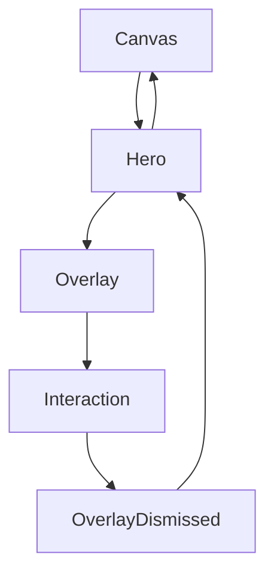

<!--
File: design/mds/MDS-003 Material System/06-overlay-material.md
Document: MDS-003
Chapter: 06
Title: Overlay Material
Status: Draft
Version: 0.1
-->

# Overlay Material

---

# Purpose

Overlay Material represents temporary physical presence.

Unlike Canvas, which defines the environment...

or Hero Material, which expresses the user's current World...

Overlay Material exists only while interaction requires it.

Its responsibility is to provide clarity without breaking immersion.

When Overlay Material appears, users should feel that the interface has momentarily stepped forward to assist them.

Once its purpose has been fulfilled, it should quietly retreat back into the environment.

---

# Definition

Within MDS, **Overlay Material** is defined as:

> **A temporary material layer that prioritises interaction, readability and focus while preserving continuity with the surrounding environment.**

Overlay Material is intentionally transient.

It exists to support behaviour.

Not to permanently occupy the interface.

---

# Philosophy

Imagine placing a polished acrylic sheet onto a desk while working.

It briefly becomes the object receiving your attention.

Once your work is complete...

It is removed.

The desk remains.

Overlay Material behaves the same way.

It temporarily becomes the physical centre of interaction before quietly disappearing again.

---

# Temporary Presence

Overlay Material should never feel permanent.

Examples include:

- playback controls
- command palettes
- search
- dialogs
- menus
- confirmation sheets
- context menus

Every Overlay should communicate:

> "I am here to help."

Never:

> "I have replaced your World."

---

# Overlay Owns Interaction

While active, Overlay Material temporarily receives the highest interaction priority.

However...

It should **not** receive the strongest atmospheric influence.

Interaction always possesses higher authority than immersion.

Conceptually.

```
Interaction

↓

Readability

↓

Atmosphere
```

This ordering should remain consistent across every Overlay.

---

# Overlay And Atmosphere

Overlay Materials continue participating in Runtime Atmosphere.

However...

Atmospheric influence should be intentionally reduced.

Reasons include:

- readability
- contrast
- interaction precision
- accessibility

The Overlay should remain visually connected to the surrounding World without inheriting its full emotional intensity.

---

# Overlay Is Acrylic

Overlay Material is derived from Acrylic.

It inherits:

- translucency
- diffusion
- refraction
- physical presence

It differs by modifying:

- atmosphere weighting
- contrast
- edge definition
- readability

Overlay Material is therefore a specialised Acrylic.

Not an independent material family.

---

# Overlay And Canvas

Overlay Material should never disconnect from the Canvas.

Instead.

```
Canvas

↓

Overlay Emerges

↓

Canvas Remains Visible

↓

Overlay Leaves

↓

Canvas Continues
```

The environment remains continuous throughout the interaction.

---

# Overlay And Hero

When Overlay Material appears above a Hero:

The Hero should quietly recede.

Not disappear.

Conceptually.

```
Hero

↓

Reduced Emphasis

↓

Overlay

↓

Interaction

↓

Overlay Closes

↓

Hero Returns
```

Users should never feel that the Hero has been replaced.

Only temporarily obscured.

---

# Overlay And Playback

Playback provides a particularly important example.

Video becomes the Hero.

Overlay Material appears only while:

- seeking
- pausing
- adjusting subtitles
- changing audio
- browsing chapters

When controls disappear:

The video immediately regains visual dominance.

The Overlay never competes with playback longer than necessary.

---

# Overlay And Search

Search is considered an Overlay interaction.

The user's current World remains beneath it.

Example.

```
Watching Frieren

↓

Search

↓

Results

↓

Close Search

↓

Watching Frieren
```

Focus has not necessarily changed.

The Overlay simply provided temporary assistance.

---

# Overlay And Reading

Reading requires particularly restrained overlays.

Examples include:

- chapter navigation
- bookmarks
- glossary
- search

The Overlay should appear lightweight.

It should never interrupt reading rhythm unnecessarily.

---

# Edge Behaviour

Overlay Materials should possess stronger edge definition than ordinary Acrylic.

This improves:

- separation
- focus
- readability

The effect should remain subtle.

Users should perceive confidence rather than borders.

---

# Refraction

Overlay Material participates in Refraction.

However...

Refraction intensity should reduce.

Reasons include:

- readability
- interaction precision
- accessibility

The Overlay should still feel physically related to surrounding Acrylic.

It simply behaves more conservatively.

---

# Motion

Overlay Material should feel physically connected to the World.

Preferred.

```
Overlay

↓

Emerges

↓

Interaction

↓

Returns
```

Avoid.

```
Overlay

↓

Appears

↓

Disappears
```

Movement should communicate physical presence.

Not interface visibility.

---

# Accessibility

Overlay Material must always prioritise:

- readability
- contrast
- orientation
- focus

If Runtime Atmosphere would reduce interaction quality:

Its influence should automatically decrease.

Accessibility remains the highest authority.

---

# Performance

Overlay Materials should favour stability over complexity.

Preferred.

- cached atmosphere
- simplified refraction
- restrained diffusion

Interaction should always remain highly responsive.

Users should never perceive latency introduced by material rendering.

---

# Plugins

Extensions should never implement Overlay Materials independently.

Plugins request interactions.

The platform presents them.

Every Overlay should therefore inherit:

- Material behaviour
- Runtime Atmosphere
- Accessibility
- Motion

automatically.

---

# Good Examples

## Playback Controls

Controls softly emerge from the surrounding Acrylic.

Video remains recognisable beneath.

Interaction feels immediate.

---

## Search

Search appears as a confident material layer.

The previous Composition remains visible beneath it.

Closing Search naturally restores the previous Context.

---

## Context Menu

Menu briefly becomes the interaction centre.

Atmosphere remains subtle.

Typography remains perfectly readable.

---

# Anti-patterns

## Opaque Dialogs

Overlay completely disconnects from the surrounding World.

Continuity weakens.

---

## Decorative Blur

Heavy blur dominates interaction.

Readability decreases.

---

## Floating Glass

Overlay appears unrelated to the surrounding Material System.

Physical coherence disappears.

---

## Permanent Overlay

Temporary materials remain visible after interaction ends.

The interface begins feeling cluttered.

---

# Overlay Material Model



Overlay temporarily becomes the centre of interaction.

The World beneath it never disappears.

---

# Relationship To Future Chapters

The following chapters expand upon the physical behaviour shared by every material.

Including:

- Refraction
- UV-Indexed Refraction
- Light Transport
- Runtime Material Resolution

Overlay Material demonstrates how those systems should adapt when interaction becomes more important than atmosphere.

---

# Summary

Overlay Material exists to help.

It should appear:

- confident,
- readable,
- physically believable,
- temporary.

It should never interrupt the user's relationship with their entertainment.

Instead, it should quietly step forward when needed...

...and quietly disappear once its work is complete.

That restraint is what makes Overlay Material feel like part of Mosaic rather than another layer placed on top of it.

---

# Review Status

**Status**

Draft

**Next File**

`07-refraction.md`
