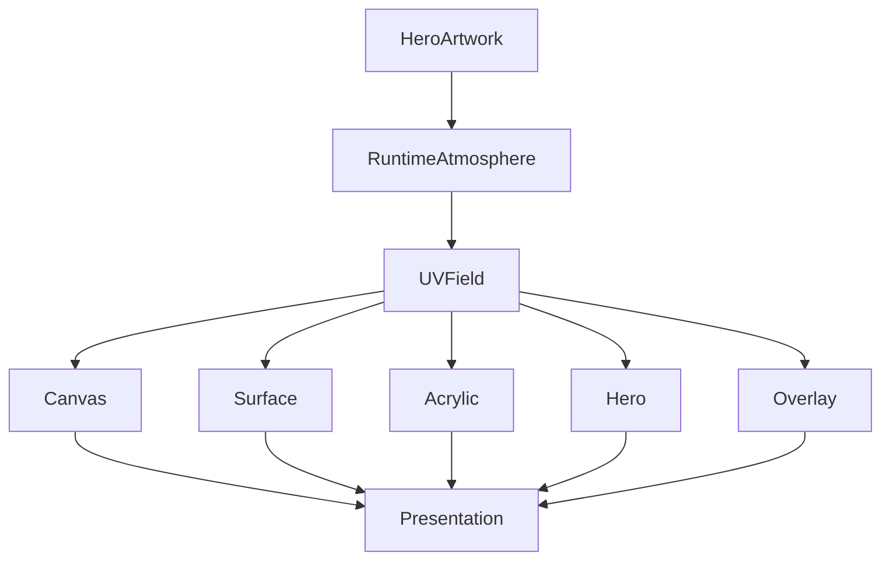

<!--
File: design/mds/MDS-003 Material System/08-uv-indexed-refraction.md
Document: MDS-003
Chapter: 08
Title: UV-Indexed Refraction
Status: Draft
Version: 0.1
-->

# UV-Indexed Refraction

---

# Purpose

The previous chapter established **Refraction** as the physical behaviour through which Runtime Atmosphere travels through Mosaic materials.

This chapter introduces the mechanism that makes that behaviour practical.

**UV-Indexed Refraction**.

Rather than treating every material as receiving uniform environmental lighting, Mosaic maps atmospheric influence into a normalised spatial coordinate system.

This allows Runtime Atmosphere to behave like physical light rather than decorative colour.

UV-Indexed Refraction is expected to become one of the defining technical characteristics of the Mosaic Material System.

---

# Philosophy

Entertainment should illuminate the interface naturally.

Not uniformly.

Imagine sunlight entering a room.

Surfaces closest to the window receive stronger light.

More distant surfaces receive less.

The same principle applies within Mosaic.

The Hero acts as the conceptual light source.

Every surrounding material receives atmosphere according to its relationship with that Hero.

Not according to arbitrary layout.

---

# Definition

Within MDS, **UV-Indexed Refraction** is defined as:

> **A spatial lighting model in which Runtime Atmosphere is projected into a normalised coordinate system and sampled by materials according to their relationship with the current Hero.**

The system describes:

- where light exists,
- how it propagates,
- how materials sample it,

independently from rendering technology.

---

# Why UV Coordinates?

Screen coordinates are unstable.

Examples.

Desktop.

```
1920 × 1080
```

Tablet.

```
2048 × 1536
```

Phone.

```
1179 × 2556
```

Using pixels would require every client to solve atmosphere differently.

Instead Mosaic normalises every composition into UV space.

```
0.0 → 1.0
```

Both axes.

Every client therefore shares one conceptual lighting model.

Presentation adapts.

The lighting model remains identical.

---

# Conceptual UV Space

Every Composition generates a normalised atmospheric space.

```text
0,0 -------------------- 1,0

 |                        |

 |                        |

 |                        |

0,1 -------------------- 1,1
```

The Hero defines the primary light origin.

Runtime Atmosphere is projected into this coordinate space.

Materials sample from it.

---

# Hero As Light Source

The Hero does not emit colour.

It emits environmental influence.

Conceptually.

```text
Hero Artwork

↓

Colour Extraction

↓

Runtime Atmosphere

↓

UV Light Field
```

Every surrounding material samples from this shared environmental field.

This creates one coherent visual environment.

---

# Light Falloff

Environmental influence should decrease naturally with conceptual distance.

Example.

```text
Hero

↓

Timeline

↓

Related Works

↓

Peripheral Collections
```

The Timeline should receive stronger atmospheric influence than Peripheral Collections.

This is **not** because of pixels.

It is because of compositional relationship.

The UV field therefore reflects the Composition rather than the screen.

---

# Conceptual Rather Than Geometric

The UV field should follow conceptual space.

Not physical space.

Example.

A Hero positioned at the bottom of a television interface should still illuminate conceptually related surfaces.

The implementation may project that field differently.

The conceptual relationship remains unchanged.

This distinction allows Composition to remain device independent.

---

# Material Sampling

Every material samples the UV field differently.

| Material | Sampling Strength |
|----------|------------------:|
| Canvas | Minimal |
| Surface | Low |
| Acrylic | Medium |
| Hero | Maximum |
| Overlay | Reduced |

Sampling strength reflects Material Hierarchy.

Not rendering capability.

---

# Multi-Layer Refraction

The UV field should contain multiple conceptual channels.

Examples include:

```text
Atmosphere

↓

Hue

↓

Intensity

↓

Temperature

↓

Direction
```

Materials may sample these independently.

Future renderers remain free to implement these channels differently while preserving identical behaviour.

---

# Directional Lighting

The UV field should preserve directional information.

Example.

```text
Hero

↓

Upper Left

↓

Light propagates diagonally
```

Materials therefore know not only:

- how much atmosphere exists,

but also:

- where it originates.

This dramatically improves perceived physicality.

---

# Dynamic Reprojection

When Focus changes:

The UV field should not reset.

Preferred.

```text
Old Hero

↓

Blend

↓

Field Reprojects

↓

New Hero
```

Avoid.

```text
Old Field

↓

Delete

↓

New Field
```

Users should perceive environmental evolution.

Not regeneration.

---

# Domain Independence

The UV model should remain identical across every domain.

Television.

↓

Poster.

Books.

↓

Cover.

Music.

↓

Album Artwork.

Games.

↓

Key Art.

Different media.

One lighting model.

---

# Performance Strategy

The UV field should be generated once per meaningful atmospheric change.

Typical invalidation events include:

- Hero changes
- artwork changes
- theme changes
- accessibility changes

Ordinary interaction should sample the existing field rather than regenerate it.

Future implementations are expected to cache UV fields aggressively.

---

# Resolution Independence

Because UV coordinates are normalised:

Desktop.

↓

High resolution.

Phone.

↓

Lower resolution.

Television.

↓

4K.

The lighting model remains identical.

Only sampling precision changes.

---

# Refraction Sampling

Conceptually.

```text
Runtime Atmosphere

↓

UV Field

↓

Material Samples

↓

Diffusion

↓

Presentation
```

Every material samples from the same atmospheric environment.

This creates coherence throughout the interface.

---

# Accessibility

Accessibility should constrain UV influence.

If atmospheric gradients reduce:

- contrast,
- readability,
- focus,

sampling strength should automatically decrease.

The UV model should preserve understanding before realism.

---

# Relationship To Motion

The Motion System should never animate UV coordinates directly.

Instead.

Behaviour changes.

↓

Composition changes.

↓

UV field updates.

↓

Materials naturally respond.

The physical world appears to evolve because understanding evolved.

Not because an animation was added.

---

# Future Implementation

Although implementation belongs to future specifications, the conceptual architecture supports technologies such as:

- GPU shaders
- Skia Runtime Effects
- Metal fragment pipelines
- Vulkan shaders
- WebGPU
- WebGL
- Flutter Impeller

All implementations should preserve the same conceptual UV behaviour.

Rendering technology remains an implementation detail.

---

# Plugins

Extensions never interact with UV space.

Plugins contribute:

- artwork
- relationships
- information

The platform constructs:

- Runtime Atmosphere
- UV field
- Material behaviour

This guarantees one consistent environmental model across every extension.

---

# Good Examples

## Film

Poster becomes Hero.

↓

Cool environmental light.

↓

Nearby Acrylic samples stronger.

↓

Peripheral materials sample less.

↓

The interface feels physically illuminated.

---

## Book

Illustrated cover.

↓

Warm atmosphere.

↓

Hero edges glow softly.

↓

Reading controls remain neutral.

The environment supports reading rather than distracting from it.

---

## Music

Album artwork.

↓

Subtle magenta atmosphere.

↓

Playback controls remain readable.

↓

Hero receives strongest response.

The user's attention remains on the album.

---

# Anti-patterns

## Screen Space Lighting

Lighting determined entirely by screen coordinates.

Composition is ignored.

---

## Uniform Atmosphere

Every surface receives identical atmospheric influence.

Hierarchy weakens.

---

## Per-Component Lighting

Each component independently calculates atmosphere.

The interface fragments.

---

## Colour Projection

Artwork colours copied directly onto interface surfaces.

Physical credibility disappears.

---

# UV Refraction Model



One environmental field.

Many materials.

One coherent world.

---

# Relationship To Future Chapters

The next chapter defines **Light Transport**.

Where UV-Indexed Refraction explains:

> **Where light exists**

Light Transport explains:

> **How that light physically moves through the Material System.**

Together these chapters establish the physical simulation model that distinguishes Mosaic from traditional interface frameworks.

---

# Summary

UV-Indexed Refraction transforms Runtime Atmosphere from a colour system into an environmental lighting model.

Rather than colouring components...

Mosaic creates one shared atmospheric field that every material samples according to its role within the Composition.

This produces an interface that feels:

- coherent,
- physical,
- calm,
- immersive.

Users should feel as though their entertainment is gently illuminating the world around it.

Not recolouring the software beneath it.

---

# Review Status

**Status**

Draft

**Next File**

`09-light-transport.md`
