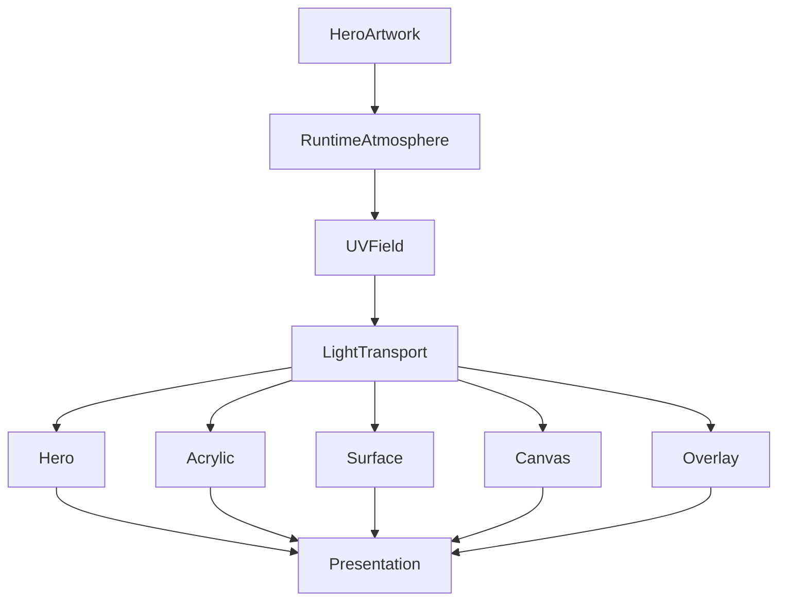

<!--
File: design/mds/MDS-003 Material System/09-light-transport.md
Document: MDS-003
Chapter: 09
Title: Light Transport
Status: Draft
Version: 0.1
-->

# Light Transport

---

# Purpose

The previous chapters established:

- Runtime Atmosphere
- Acrylic
- Refraction
- UV-Indexed Refraction

This chapter defines the conceptual behaviour that connects them.

**Light Transport** describes how environmental light moves through the Mosaic Material System.

Unlike traditional user interfaces, which simply paint colour onto surfaces, Mosaic models the movement of light as a first-class architectural concept.

The objective is not physical simulation.

The objective is perceived physicality.

---

# Definition

Within MDS, **Light Transport** is defined as:

> **The conceptual movement of environmental light through the Mosaic Material System in order to communicate depth, hierarchy and atmosphere.**

Light Transport is an architectural model.

Not a rendering algorithm.

---

# Philosophy

Imagine entering a modern gallery.

Light enters the room.

It reflects from paintings.

Travels across polished acrylic.

Softly illuminates nearby surfaces.

Nothing glows independently.

Everything participates in the same environment.

That is the experience Mosaic attempts to recreate.

The interface should feel illuminated.

Not coloured.

---

# Light Is Shared

One of the most important rules within Mosaic is:

> **There is only one environment.**

Every material participates in that environment.

Poor.

```text
Hero

↓

Own Lighting
```

Preferred.

```text
Environment

↓

Shared Light

↓

Many Materials
```

The Material System should feel physically coherent.

---

# Light Origin

Environmental light originates conceptually from:

```text
Current Hero

↓

Runtime Atmosphere

↓

Environmental Light
```

The Hero does not emit visible light.

Instead it influences the environmental lighting field.

The distinction prevents exaggerated visual effects while preserving immersion.

---

# Transport Stages

Conceptually, light moves through several stages.

```text
Artwork

↓

Atmosphere

↓

UV Field

↓

Material Sampling

↓

Diffusion

↓

Refraction

↓

Presentation
```

Each stage contributes one responsibility.

No stage duplicates another.

---

# Material Response

Different materials transport light differently.

| Material | Behaviour |
|----------|-----------|
| Canvas | Receives ambient light |
| Surface | Receives soft diffusion |
| Acrylic | Refracts and diffuses |
| Hero | Highest environmental response |
| Overlay | Controlled, readability-first response |

This hierarchy mirrors the Material Hierarchy established earlier.

---

# Energy Conservation

Light Transport should preserve perceived energy.

If one material receives stronger atmospheric influence...

Nearby materials should naturally receive less.

The environment should feel balanced.

Not uniformly illuminated.

This principle prevents visual overload while improving perceived realism.

---

# Diffusion

Transported light should soften naturally.

Strong local colour should gradually become:

- broader
- calmer
- less saturated

Diffusion prevents materials from feeling digitally coloured.

Instead they appear physically illuminated.

---

# Edge Transport

Edges should transport light differently from flat surfaces.

Conceptually.

```text
Incoming Light

↓

Internal Material

↓

Edge Highlight

↓

Soft Exit
```

Edges communicate:

- thickness
- craftsmanship
- physical presence

Future renderers may implement this differently.

The conceptual behaviour should remain stable.

---

# Hero Influence

Hero Material possesses the strongest transport behaviour.

Nearby Acrylic should inherit:

- colour temperature
- ambient luminance
- subtle reflected highlights

Peripheral materials should inherit significantly less.

The Hero therefore becomes the environmental centre without becoming visually dominant.

---

# Temporal Transport

Light should evolve continuously.

Preferred.

```text
Artwork Changes

↓

Atmosphere Blends

↓

Light Redistributes

↓

Materials Respond
```

Avoid.

```text
Artwork Changes

↓

Entire Interface Recolours
```

Users should perceive environmental continuity rather than colour replacement.

---

# Composition Awareness

Light Transport should respect Composition.

Primary concepts receive stronger environmental participation.

Peripheral concepts remain calmer.

Composition therefore influences perceived physicality without components requiring knowledge of lighting behaviour.

---

# Device Independence

The conceptual transport model should remain identical across:

- Desktop
- Television
- Mobile
- Tablet

Different devices may implement:

- sampling precision
- shader complexity
- blur quality

The perceived physical behaviour should remain recognisably Mosaic.

---

# Accessibility

Accessibility constrains Light Transport.

Examples.

High Contrast.

↓

Reduced diffusion.

Reduced Motion.

↓

Simplified temporal blending.

Low Vision.

↓

Reduced atmospheric variation.

The Material System should always preserve readability before physical realism.

---

# Performance Strategy

Future implementations should optimise Light Transport through:

- cached atmospheric fields
- incremental updates
- GPU acceleration
- temporal interpolation
- shared material buffers

Light Transport should never require complete recomputation during ordinary interaction.

Only meaningful environmental changes should trigger recalculation.

---

# Runtime Updates

Typical recalculation events include:

- Hero changes
- Focus changes
- artwork changes
- theme changes
- accessibility changes

Scrolling, hovering or small UI interactions should generally reuse existing transport data.

This keeps the interface visually stable while remaining computationally efficient.

---

# Plugin Participation

Extensions contribute:

- artwork
- metadata
- information

Plugins never participate directly in Light Transport.

The platform constructs one shared lighting model for every extension.

This guarantees a consistent physical language throughout the ecosystem.

---

# Good Examples

## Film

Poster introduces cool environmental light.

Hero Acrylic receives strongest transport.

Nearby tiles inherit subtle reflected lighting.

Canvas remains calm.

---

## Book

Illustrated cover creates warm environmental lighting.

Reading controls remain largely neutral.

Atmosphere supports reading without distraction.

---

## Music

Album artwork softly influences playback surfaces.

Controls remain semantically coloured.

The interface feels unified.

---

# Anti-patterns

## Independent Lighting

Every component calculates its own environmental response.

The interface fragments.

---

## Static Lighting

Materials ignore changing artwork.

The interface feels disconnected from entertainment.

---

## Decorative Bloom

Light exists because it looks dramatic.

No additional understanding is created.

---

## Colour Flood

Environmental light saturates every surface equally.

Hierarchy disappears.

---

# Light Transport Model



One shared environmental light model.

Many material responses.

One coherent physical world.

---

# Relationship To Future Chapter

The next chapter defines **Runtime Material Resolution**.

Where Light Transport explains:

> **How environmental light moves**

Runtime Material Resolution explains:

> **How every material resolves into concrete runtime behaviour.**

It is the bridge between conceptual material behaviour and implementation.

---

# Summary

Light Transport is the physical behaviour that unifies every material within Mosaic.

Rather than colouring individual components, the platform creates one coherent environmental lighting model that every material interprets according to its role.

The result should feel:

- physical,
- calm,
- believable,
- emotionally connected.

Users should never think about light.

They should simply feel that the interface naturally belongs beside the entertainment they love.

---

# Review Status

**Status**

Draft

**Next File**

`10-runtime-material-resolution.md`
