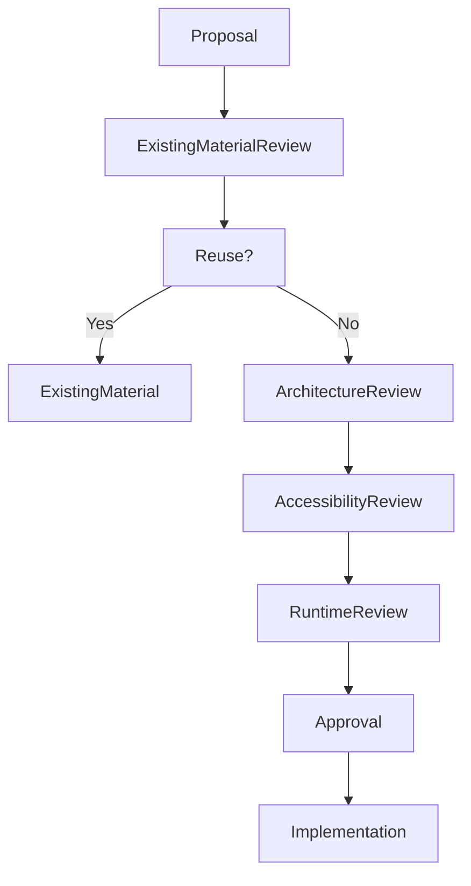

<!--
File: design/mds/MDS-003 Material System/11-governance.md
Document: MDS-003
Chapter: 11
Title: Material System Governance
Status: Draft
Version: 0.1
-->

# Material System Governance

---

# Purpose

The Material System defines the physical language of Mosaic.

Unlike implementation techniques, materials become part of the user's long-term perception of the product.

People may never consciously remember:

- blur radius,
- shader implementation,
- translucency algorithms.

They will remember:

- how substantial the interface felt,
- whether it felt calm,
- whether it felt premium,
- whether it belonged beside their entertainment.

This chapter defines how the Material System should evolve while preserving that identity.

---

# Governance Philosophy

Materials should evolve technologically.

They should remain behaviourally consistent.

The objective is not preserving shaders.

It is preserving perception.

Future rendering engines may completely replace today's implementation.

Users should still recognise:

> **This feels like Mosaic.**

---

# Material Identity

Every Material within Mosaic possesses an architectural identity.

Examples include:

- Canvas
- Surface
- Acrylic
- Hero
- Overlay

These identities are considered part of the public Design System.

Changing them requires architectural review.

Changing their implementation generally does not.

---

# Stable Responsibilities

The following concepts should remain highly stable.

- Material hierarchy
- Acrylic philosophy
- Hero behaviour
- Overlay behaviour
- Refraction model
- Light transport model

These concepts define the physical identity of Mosaic.

---

# Evolvable Responsibilities

The following may evolve over time.

- shader implementations
- blur algorithms
- rendering pipelines
- GPU techniques
- performance optimisations
- platform-specific implementations

These improvements should preserve identical perceived behaviour.

---

# Material Ownership

Material responsibilities are intentionally separated.

| Layer | Owner |
|--------|-------|
| Material Philosophy | Design Systems |
| Material Hierarchy | Design Systems |
| Runtime Material Resolution | Runtime Platform |
| Rendering Backend | Client Platform |
| GPU Implementation | Rendering Layer |

Ownership preserves architectural integrity while allowing implementation to evolve independently.

---

# Introducing New Materials

Before introducing a new Material ask:

## Question One

Can an existing material already express this behaviour?

---

## Question Two

Is this genuinely a new physical material...

or merely another implementation?

---

## Question Three

Could Runtime Material Resolution solve this instead?

---

## Question Four

Will users perceive this as a distinct physical object?

---

## Question Five

Will this material remain meaningful independently from today's rendering technology?

If uncertainty remains...

The proposal should be refined before implementation.

---

# Material Drift

Material Drift occurs when:

- similar materials behave differently,
- rendering implementations diverge,
- new effects bypass the Material System,
- platforms invent independent behaviours.

Material Drift weakens the physical language of Mosaic.

Over time the interface begins feeling assembled rather than designed.

Material Drift should therefore be treated as architectural debt.

---

# Acrylic Governance

Acrylic represents one of the defining visual characteristics of Mosaic.

Changes affecting Acrylic require particular care.

Examples include:

- translucency
- diffusion
- edge behaviour
- refraction
- perceived thickness

Future improvements should strengthen the illusion of physical presence rather than chasing visual novelty.

---

# Refraction Governance

Refraction should always remain:

- subtle,
- purposeful,
- behaviourally justified.

Refraction should never become:

- decorative,
- animated for its own sake,
- independent from Runtime Atmosphere.

Users should feel environmental lighting.

Not visual effects.

---

# Runtime Governance

Runtime Material Resolution may evolve frequently.

Examples include:

- better GPU techniques,
- improved caching,
- adaptive sampling,
- HDR support,
- platform optimisation.

These improvements should require no changes to:

- Components
- Composition
- Semantic Tokens

The Material System should absorb complexity.

Applications should remain simple.

---

# Accessibility Governance

Accessibility possesses higher authority than Material fidelity.

If Material behaviour reduces:

- readability,
- orientation,
- interaction,

Material behaviour should adapt automatically.

No Material proposal should weaken accessibility in pursuit of realism.

---

# Plugin Governance

Extensions must never introduce:

- custom materials,
- independent acrylic systems,
- proprietary refraction,
- separate physical hierarchies.

Plugins inherit the Material System.

They never redefine it.

This ensures one coherent physical language across the entire Mosaic ecosystem.

---

# Review Questions

Every Material proposal should answer:

- Does this strengthen physical coherence?
- Does it preserve hierarchy?
- Does it improve immersion?
- Does it remain accessible?
- Would users still recognise Mosaic?
- Is this solving a behavioural problem or adding visual novelty?

If the proposal exists primarily because it "looks cool", it should be reconsidered.

---

# Validation

Future tooling should validate:

- Material hierarchy usage
- Acrylic consistency
- Runtime Material Resolution
- Accessibility compliance
- Refraction intensity
- Platform parity

Automated validation should reinforce architectural review rather than replace it.

---

# Governance Workflow

Reuse should remain the preferred outcome.

The Material vocabulary should remain intentionally small.

---

# Success Criteria

The Material System succeeds when:

- users immediately recognise Mosaic,
- Acrylic feels premium rather than decorative,
- artwork appears to illuminate the interface naturally,
- runtime adaptation remains subtle,
- every client shares one physical language,
- contributors naturally reuse existing materials.

The strongest Material System is one users feel rather than consciously notice.

---

# Architectural Decisions

| ADR | Decision |
|------|----------|
| ADR-106 | Materials are treated as physical behaviours rather than visual effects. |
| ADR-107 | Acrylic is the primary physical material of Mosaic. |
| ADR-108 | Runtime Atmosphere influences Materials rather than components directly. |
| ADR-109 | Accessibility always has higher authority than material fidelity. |
| ADR-110 | Extensions inherit the Material System rather than extending it. |

---

# Review Status

**Status**

Draft

**Next File**

`12-adrs.md`
