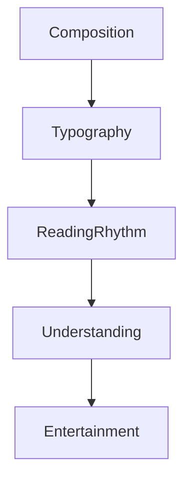

<!--
File: design/mds/MDS-004 Typography System/01-typography-philosophy.md
Document: MDS-004
Chapter: 01
Title: Typography Philosophy
Status: Draft
Version: 0.1
-->

# Typography Philosophy

---

# Purpose

Before defining scales, hierarchy or responsive behaviour, contributors must first understand what typography represents within Mosaic.

Many interface design systems treat typography as a method of displaying information efficiently.

Mosaic intentionally adopts a different philosophy.

Typography exists to communicate understanding with the same calm confidence as a knowledgeable friend.

It should never feel mechanical.

It should never feel corporate.

It should never draw unnecessary attention to itself.

Typography is the voice of the Companion.

---

# Philosophy Statement

> **Typography should quietly guide understanding while allowing entertainment and ideas to remain the centre of attention.**

Everything within the Typography System derives from this statement.

---

# Typography Is Conversation

The interface should not feel as though it is issuing commands.

It should feel as though it is speaking naturally.

Examples.

Poor.

```
WATCH NOW
```

Preferred.

```
Continue watching
```

Poor.

```
LIBRARY UPDATED
```

Preferred.

```
New episodes are available
```

Typography should communicate with confidence.

Not urgency.

---

# Typography Exists To Be Forgotten

Users should remember:

- what they discovered,
- what they watched,
- what they read,

rather than:

- font weights,
- decorative headings,
- oversized typography.

Typography succeeds when it quietly disappears behind understanding.

---

# Editorial Rather Than Technical

The Mosaic Typography System intentionally takes inspiration from editorial design rather than dashboard software.

Editorial typography encourages:

- reading
- reflection
- pacing
- rhythm

Dashboard typography often encourages:

- scanning
- monitoring
- processing

Entertainment should feel read.

Not processed.

---

# Calm Before Density

Interfaces often attempt to maximise information density.

Typography should instead maximise comprehension.

Sometimes this means:

- shorter line lengths,
- larger breathing spaces,
- quieter hierarchy,
- fewer simultaneous type styles.

Typography should reduce cognitive effort rather than maximise information throughput.

---

# Hierarchy Before Size

Large text is not automatically important.

Hierarchy should emerge from:

- Composition,
- spacing,
- rhythm,
- proximity,
- typography.

Font size is only one tool.

It should not become the primary mechanism communicating importance.

---

# Reading Is A Journey

Typography should encourage continuous reading.

Users should naturally progress from:

```text
Hero

↓

Supporting Information

↓

Context

↓

Detail
```

Every transition should feel inevitable.

Readers should never wonder:

> "Where should I look next?"

---

# Confidence

Typography should feel confident.

Confidence is communicated through:

- restraint,
- consistency,
- predictable hierarchy,
- generous rhythm.

Not through:

- oversized headings,
- decorative fonts,
- excessive weight,
- dramatic styling.

The interface should never shout.

---

# Warmth

Although Typography should remain professional, it should never feel cold.

The Companion should sound:

- knowledgeable,
- thoughtful,
- reassuring,
- quietly enthusiastic.

The interface should avoid:

- robotic language,
- unnecessary technical jargon,
- marketing exaggeration,
- aggressive calls to action.

Users should feel they are being guided.

Not sold to.

---

# Typography Supports Materials

Typography exists inside Materials.

It should therefore respect them.

Examples.

Hero Material.

↓

Slightly more spacious typography.

Overlay Material.

↓

Higher clarity.

Canvas.

↓

Editorial rhythm.

Materials establish environment.

Typography establishes understanding.

The two systems should always feel related.

---

# Typography Supports Atmosphere

Runtime Atmosphere may subtly influence the emotional character of typography.

It should never reduce:

- readability,
- contrast,
- hierarchy.

Atmosphere influences surrounding materials.

Typography remains comparatively stable.

Words should always remain the clearest part of the interface.

---

# Typography Supports Composition

Typography should reinforce the Composition Model.

Examples.

Primary understanding.

↓

Highest typographic emphasis.

Supporting understanding.

↓

Moderate emphasis.

Peripheral information.

↓

Quiet typography.

Typography should follow Composition.

It should never compete with it.

---

# Typography Across Domains

The same Typography System should support:

- films,
- television,
- books,
- music,
- administration.

Different domains may alter rhythm.

They should never invent new typographic languages.

Users should always feel:

> This is still Mosaic.

---

# Accessibility

Typography should remain understandable before colour is applied.

Removing:

- colour,
- materials,
- atmosphere,

should still preserve:

- hierarchy,
- rhythm,
- comprehension.

Typography therefore becomes one of the strongest accessibility mechanisms within the Design System.

---

# Good Examples

## Film

Large but restrained title.

Comfortable supporting metadata.

Editorial spacing.

The interface feels cinematic without becoming theatrical.

---

## Reading

Long-form typography.

Generous rhythm.

Minimal interruption.

The interface quietly supports extended reading sessions.

---

## Administration

Clear structure.

Higher information density.

Editorial hierarchy preserved.

The interface becomes more functional without abandoning the Mosaic voice.

---

# Anti-patterns

## Dashboard Typography

Every piece of information competes equally.

Scanning replaces reading.

---

## Marketing Typography

Oversized headings.

Excessive emphasis.

Promotional tone.

The interface begins selling rather than accompanying.

---

## Decorative Typography

Typography becomes a visual feature.

Understanding weakens.

---

## Dense Typography

Small text.

Minimal spacing.

Continuous visual pressure.

Reading becomes work.

---

# Typography Philosophy Model



Typography exists to strengthen understanding.

Entertainment remains the destination.

---

# Relationship To Future Chapters

The remaining chapters formalise this philosophy into implementation.

They define:

- Editorial Hierarchy
- Type Scale
- Reading Rhythm
- Hero Typography
- Responsive Typography
- Accessibility
- Runtime Resolution

Every implementation decision should reinforce the philosophy established here.

---

# Summary

Typography is the voice of Mosaic.

It should feel:

- calm,
- intelligent,
- editorial,
- trustworthy,
- quietly human.

When successful, users should never think about typography.

They should simply feel that understanding came effortlessly.

That quiet confidence is the defining characteristic of the Mosaic Typography System.

---

# Review Status

**Status**

Draft

**Next File**

`02-editorial-hierarchy.md`
