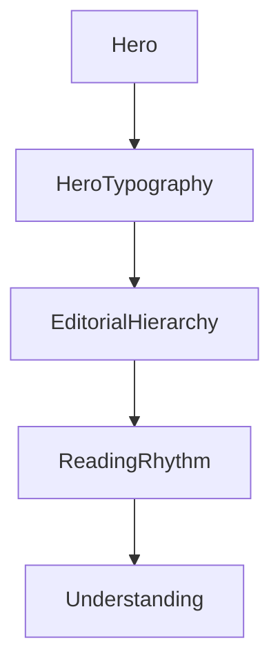

<!--
File: design/mds/MDS-004 Typography System/05-hero-typography.md
Document: MDS-004
Chapter: 05
Title: Hero Typography
Status: Draft
Version: 0.1
-->

# Hero Typography

---

# Purpose

The Hero represents the centre of the current Composition.

Hero Typography represents the voice of that Hero.

Unlike marketing interfaces, which often use oversized typography to dominate attention, Mosaic treats Hero Typography with restraint.

Its purpose is not to impress.

Its purpose is to orient.

The Hero should quietly answer:

- What am I looking at?
- Why does it matter?
- What should I do next?

before the user consciously asks those questions.

---

# Definition

Within MDS, **Hero Typography** is defined as:

> **The highest level of editorial typography used to establish the current Focus while preserving the emotional dominance of the user's entertainment.**

Hero Typography communicates:

- identity,
- confidence,
- orientation,

rather than spectacle.

---

# Philosophy

The Hero should never feel like advertising.

Instead imagine opening a beautifully designed hardback book.

The title is confident.

Comfortable.

Elegant.

It does not shout.

Hero Typography should evoke that same feeling.

The interface should introduce entertainment with quiet confidence.

---

# One Hero Voice

Every Composition should normally possess one Hero voice.

Poor.

```
Featured

Trending

Recommended

Continue Watching
```

Every heading competes.

Preferred.

```
Continue Watching

↓

Frieren

↓

Episode 18
```

One clear editorial voice.

Everything else supports it.

---

# Hero Before Decoration

Hero Typography should communicate importance before visual style.

Avoid relying upon:

- oversized text,
- excessive weight,
- bright colours,
- dramatic effects.

Importance should already exist within:

- Composition,
- Material,
- Hierarchy.

Typography simply reinforces it.

---

# Hero And Artwork

Artwork remains the emotional centre.

Hero Typography provides context.

Relationship.

```text
Artwork

↓

Hero Typography

↓

Supporting Information
```

Typography should never obscure artwork.

Nor should artwork reduce typographic clarity.

Both systems should feel deliberately balanced.

---

# Hero Rhythm

Hero Typography establishes the editorial rhythm for the entire Composition.

Typical progression.

```text
Hero Title

↓

Supporting Metadata

↓

Primary Action

↓

Context

↓

Related Information
```

Readers should instinctively understand where to continue.

The Hero begins the conversation.

The remainder of the Composition continues it.

---

# Hero Weight

Hero Typography should communicate confidence through restraint.

Preferred characteristics.

- moderate weight,
- generous spacing,
- balanced proportions,
- comfortable line length.

Avoid:

- extremely bold weights,
- condensed typography,
- excessive uppercase,
- promotional emphasis.

Entertainment already provides emotional intensity.

Typography should remain composed.

---

# Hero Length

Hero Typography should gracefully support varying title lengths.

Examples.

```
Up
```

```
The Lord of the Rings:
The Return of the King
```

```
Frieren:
Beyond Journey's End
```

The editorial hierarchy should remain consistent regardless of title complexity.

Future implementations should optimise:

- wrapping,
- line balancing,
- optical alignment.

---

# Hero Metadata

Supporting metadata should remain visually subordinate.

Examples include:

- release year,
- runtime,
- author,
- studio,
- rating.

Incorrect.

```text
Title

Runtime

Codec

Audio

Resolution

HDR

Dolby Vision
```

Preferred.

```text
Title

↓

Synopsis

↓

Supporting Metadata
```

Technical information should never interrupt editorial flow.

---

# Hero Across Domains

Television.

↓

Series.

↓

Episode.

Books.

↓

Book.

↓

Current Chapter.

Music.

↓

Album.

↓

Current Track.

Administration.

↓

Current Task.

The editorial relationship remains identical.

Only the content changes.

---

# Hero Across Themes

Light Theme.

Typography should feel:

- editorial,
- airy,
- quietly premium.

Dark Theme.

Typography should feel:

- cinematic,
- confident,
- softly illuminated.

The typographic identity remains identical.

Only environmental interpretation changes.

---

# Hero Across Devices

Desktop.

↓

Expanded hierarchy.

Tablet.

↓

Editorial hierarchy.

Phone.

↓

Compact hierarchy.

Television.

↓

Greater physical scale.

Greater viewing distance.

The Hero should remain immediately recognisable regardless of implementation.

---

# Runtime Behaviour

Hero Typography should remain remarkably stable.

Runtime may adjust:

- contrast,
- scale,
- spacing,
- optical sizing.

Runtime should never dramatically alter:

- hierarchy,
- weight,
- editorial tone.

The Hero should always sound like the same Companion.

---

# Accessibility

Hero Typography should remain identifiable under:

- enlarged text,
- reduced colour,
- high contrast,
- reduced motion.

Accessibility should preserve:

- hierarchy,
- rhythm,
- confidence.

Hero Typography should never become promotional simply because text becomes larger.

---

# Materials

Hero Typography should respect surrounding materials.

Hero Acrylic.

↓

More breathing space.

↓

Softer atmosphere.

↓

Higher perceived refinement.

Typography and Materials should feel like one physical system.

Neither should dominate the other.

---

# Good Examples

## Film

Film title.

↓

Synopsis.

↓

Continue Watching.

↓

Supporting metadata.

The interface quietly introduces the experience.

---

## Book

Book title.

↓

Current Chapter.

↓

Reading Progress.

↓

Supporting Information.

Editorial rhythm remains calm.

---

## Music

Album.

↓

Artist.

↓

Playback.

↓

Related Albums.

The Hero introduces listening without interrupting it.

---

# Anti-patterns

## Marketing Hero

Huge typography competing with artwork.

---

## Promotional Tone

Multiple calls-to-action surrounding the Hero.

---

## Decorative Fonts

Typography becoming visual identity.

---

## Metadata First

Technical information appearing before understanding.

---

# Hero Typography Model



Hero Typography begins the editorial conversation.

The Composition completes it.

---

# Relationship To Future Chapters

The next chapter defines **Responsive Typography**.

Hero Typography explains:

> **How the Hero speaks.**

Responsive Typography explains:

> **How that voice remains consistent across every device and viewing environment.**

Together they ensure that the Companion sounds recognisably like Mosaic everywhere.

---

# Summary

Hero Typography should feel like the opening sentence of a beautifully written story.

Confident.

Calm.

Inviting.

It should introduce the user's current World without demanding attention for itself.

The entertainment remains the emotional centre.

Hero Typography simply gives it a voice.

---

# Review Status

**Status**

Draft

**Next File**

`06-responsive-typography.md`
