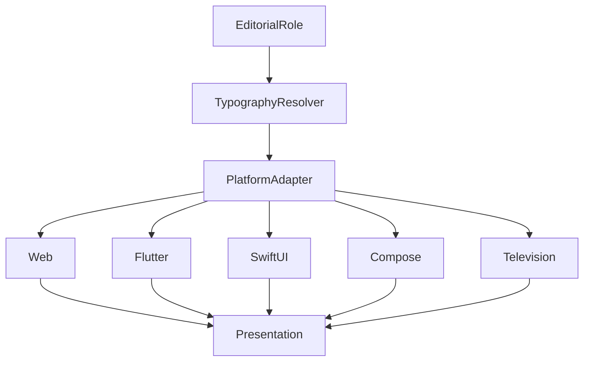

<!--
File: design/mds/MDS-004 Typography System/09-platform-typography.md
Document: MDS-004
Chapter: 09
Title: Platform Typography
Status: Draft
Version: 0.1
-->

# Platform Typography

---

# Purpose

The Typography System defines one editorial language.

Mosaic clients implement that language across many rendering technologies.

Platform Typography ensures that:

- Web
- Flutter
- SwiftUI
- Jetpack Compose
- Desktop
- Television
- Future clients

all communicate the same editorial experience despite differing implementation capabilities.

Platform implementation should never redefine editorial meaning.

It should simply express it.

---

# Definition

Within MDS, **Platform Typography** is defined as:

> **The platform-specific implementation of the Mosaic Typography System while preserving one consistent editorial language.**

Platform Typography concerns implementation.

It does not concern design philosophy.

---

# Philosophy

Every platform possesses different capabilities.

Examples include:

- font rendering
- anti-aliasing
- shaping engines
- variable font support
- hinting
- sub-pixel rendering

These differences are implementation concerns.

Readers should experience one consistent Companion regardless of platform.

---

# Platform Independence

Editorial meaning should remain platform independent.

Conceptually.

```text
Heading

↓

Web

Heading

↓

Flutter

Heading

↓

SwiftUI

Heading

↓

Compose
```

Only rendering changes.

Meaning remains identical.

---

# Platform Responsibilities

Each platform implementation is responsible for:

- font loading
- shaping
- rendering
- fallback fonts
- locale support
- glyph rasterisation

Platforms are **not** responsible for:

- editorial hierarchy
- type scale
- reading rhythm
- semantic typography

Those responsibilities belong to the Typography System.

---

# Typography Resolver

Every platform should consume the output of the Typography Resolver.

Conceptually.

```text
Editorial Role

↓

Typography Resolver

↓

Platform Typography

↓

Rendering
```

Platforms should never reinterpret editorial roles.

---

# Rendering Quality

Platform implementations should prioritise:

- readability
- consistency
- stability

before:

- rendering tricks
- custom effects
- decorative styling

Typography exists to communicate understanding.

Rendering quality should strengthen that communication.

---

# Font Metrics

Different rendering engines interpret font metrics differently.

Examples include:

- ascender height
- descender height
- x-height
- line height
- baseline

Future platform adapters should compensate for these differences.

Users should perceive one typographic rhythm regardless of implementation.

---

# Font Fallback

Platform Typography should define predictable fallback behaviour.

Conceptually.

```text
Primary Typeface

↓

Platform Fallback

↓

System Typeface
```

Fallbacks should preserve:

- hierarchy
- rhythm
- readability

Editorial identity should remain recognisable even when the preferred font is unavailable.

---

# Variable Fonts

Platforms supporting variable fonts should use them.

Platforms without variable font support should approximate the same editorial result using discrete font weights.

The editorial role remains identical.

Only implementation differs.

---

# International Typography

Platform implementations should support multilingual typography.

Examples include:

- Latin
- Cyrillic
- Greek
- Arabic
- Hebrew
- Devanagari
- Japanese
- Korean
- Chinese

Editorial hierarchy should remain consistent regardless of writing system.

The Typography System should feel culturally adaptable rather than culturally fixed.

---

# Bidirectional Text

Future implementations should support bidirectional text.

Editorial hierarchy should remain identical for:

- left-to-right
- right-to-left
- mixed-direction documents

The reading model adapts.

The editorial philosophy does not.

---

# Responsive Rendering

Platform typography should adapt to:

- display density
- operating system scaling
- viewing distance
- accessibility

The implementation may differ.

The perceived reading comfort should remain stable.

---

# Television

Television typography should optimise for:

- distance
- larger viewing angles
- remote interaction

Rendering should favour clarity over compactness.

Long reading passages should remain comfortable despite increased viewing distance.

---

# Mobile

Mobile typography should optimise for:

- close viewing
- interruption
- one-handed interaction

Editorial rhythm should remain intact despite constrained space.

---

# Desktop

Desktop typography should take advantage of:

- additional space
- longer reading sessions
- precise rendering

Extra space should improve rhythm.

It should not increase visual complexity.

---

# Performance

Platform implementations should:

- cache glyphs
- reuse layouts
- minimise recomposition
- preserve rendering stability

Typography should remain visually stable throughout interaction.

Rendering should never distract from reading.

---

# Plugins

Extensions should never provide platform-specific typography.

Plugins contribute:

- information
- language
- editorial content

The platform determines typography.

This guarantees one editorial voice throughout the ecosystem.

---

# Good Examples

## Web

Variable fonts.

↓

Editorial hierarchy preserved.

↓

Reading rhythm preserved.

---

## Flutter

Platform text engine.

↓

Typography Resolver.

↓

Identical editorial behaviour.

---

## Television

Larger physical typography.

↓

Greater spacing.

↓

Equivalent reading comfort.

---

# Anti-patterns

## Platform Fonts

Each client invents different editorial hierarchy.

---

## Platform Styling

Platform-specific decorative typography.

---

## Manual Scaling

Application code selecting typography independently.

---

## Decorative Rendering

Rendering effects reducing readability.

---

# Platform Typography Model



One editorial language.

Many platform implementations.

---

# Relationship To Future Chapter

The next chapter defines **Variable Fonts**.

Platform Typography explains:

> **How platforms implement typography.**

Variable Fonts explain:

> **How typography becomes more adaptive while preserving editorial consistency.**

Together they complete the implementation architecture of the Typography System.

---

# Summary

Platform Typography exists to ensure that Mosaic speaks with one voice everywhere.

Different rendering engines may implement typography differently.

Readers should never perceive those differences.

They should simply feel that the Companion remains:

- calm,
- confident,
- familiar,

regardless of the device in their hands.

---

# Review Status

**Status**

Draft

**Next File**

`10-variable-fonts.md`
