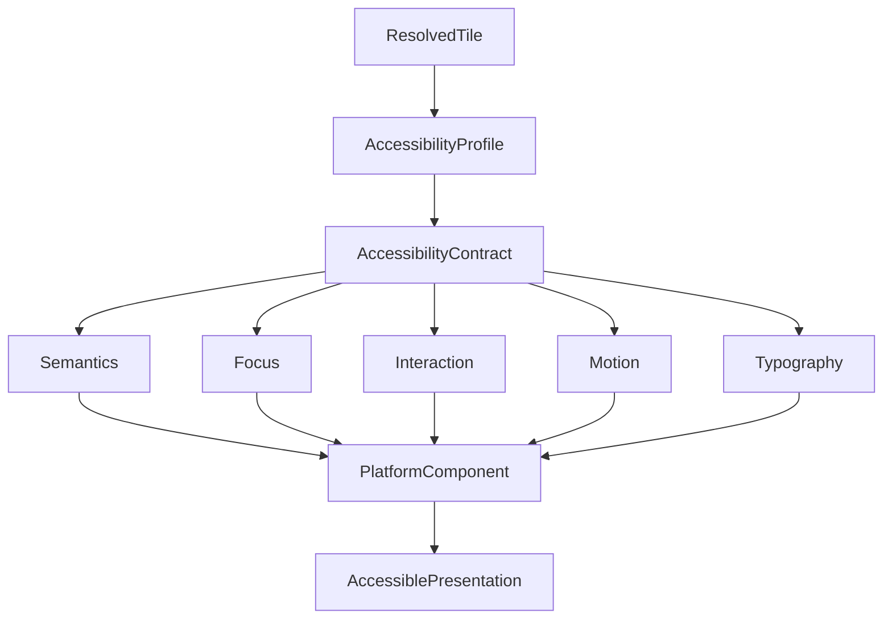

<!--
File: design/mds/MDS-008 Component Library/08-accessibility-contracts.md
Document: MDS-008
Chapter: 08
Title: Accessibility Contracts
Status: Draft
Version: 0.1
-->

# Accessibility Contracts

---

# Purpose

Accessibility should never be treated as an optional implementation layer.

By the time a Component renders, accessibility has already been resolved by the runtime.

Accessibility Contracts communicate that resolved behaviour to platform Components.

They ensure every implementation preserves:

- behavioural understanding,
- hierarchy,
- interaction,
- presentation,

without requiring Components to invent accessibility behaviour independently.

---

# Definition

Within MDS, **Accessibility Contracts** are defined as:

> **Immutable runtime contracts describing the accessibility behaviour every Component must implement while preserving behavioural parity with the standard presentation model.**

Accessibility Contracts describe implementation.

They never redefine behaviour.

---

# Philosophy

Traditional UI frameworks often require each Component to implement accessibility independently.

This frequently results in:

- inconsistent screen reader behaviour,
- incomplete keyboard navigation,
- different accessibility across platforms.

Mosaic intentionally resolves accessibility centrally.

```text
Runtime

↓

Accessibility Contract

↓

Platform Component

↓

Accessible Presentation
```

Behaviour remains identical.

Only implementation changes.

---

# Accessibility Before Components

Accessibility should always be resolved before Components exist.

Incorrect.

```text
Component

↓

Accessibility Logic
```

Correct.

```text
Runtime

↓

Accessibility Contract

↓

Component
```

Components consume accessibility.

They do not create it.

---

# Contract Inputs

Accessibility Contracts are generated from:

```text
Resolved Tile

↓

Accessibility Profile

↓

Interaction Profile

↓

Typography Profile

↓

Material Profile
```

All behavioural decisions have already been made.

Accessibility refines presentation.

---

# Contract Outputs

Accessibility Contracts communicate:

- semantic role
- accessible name
- accessible description
- interaction actions
- focus behaviour
- reading order
- motion behaviour
- contrast behaviour

Every platform consumes the same conceptual contract.

---

# Semantic Roles

Every Component should expose one semantic role.

Examples include:

```text
Heading

Button

Progress

Navigation

Image

List

Dialog

Article
```

Semantic roles originate from resolved runtime behaviour.

Not from component implementation.

---

# Accessible Names

Every interactive Component should expose an accessible name.

Example.

```text
Resume Tile

↓

Resume playback
```

Not.

```text
Button
```

Names communicate behavioural purpose.

Not implementation.

---

# Accessible Descriptions

Additional context should remain available when required.

Examples.

```
Continue watching.

Episode 18.

32 minutes remaining.
```

Descriptions should enrich understanding.

Never replace it.

---

# Focus Behaviour

Focus order should follow Runtime Hierarchy.

Preferred.

```text
Hero

↓

Primary

↓

Supporting

↓

Peripheral
```

Focus should never depend upon rendering order alone.

Behavioural hierarchy remains authoritative.

---

# Reading Order

Screen readers should communicate:

- editorial hierarchy,
- behavioural grouping,
- relationships,

rather than raw component structure.

Reading order should follow the same understanding experienced visually.

---

# Interaction Actions

Accessibility Contracts expose behavioural actions.

Examples.

```text
Activate

Resume

Bookmark

Download

Open

Dismiss
```

Platform-specific gestures invoke these actions.

Behaviour remains platform independent.

---

# Typography Accessibility

Typography adjustments may include:

- larger text
- optical sizing
- stronger grade
- additional spacing

Components should consume these changes automatically through Typography Contracts.

Accessibility remains runtime owned.

---

# Material Accessibility

Material adjustments may include:

- increased contrast
- reduced translucency
- simplified refraction
- clearer separation

Material identity remains recognisable.

Only presentation changes.

---

# Motion Accessibility

Accessibility Contracts communicate Motion preferences.

Examples.

Full Motion.

↓

Reduced Motion.

↓

Minimal Motion.

↓

Instant.

Components execute these profiles.

They never interpret accessibility preferences independently.

---

# High Contrast

High Contrast behaviour should remain behaviourally identical.

Only presentation changes.

Examples include:

- stronger contrast
- clearer focus indicators
- simplified Materials

Hierarchy should remain unchanged.

---

# Input Independence

Accessibility Contracts should support:

- touch
- keyboard
- pointer
- remote
- switch access
- voice

Interaction methods differ.

Behavioural meaning remains identical.

---

# Platform Integration

Each platform should map Accessibility Contracts onto native accessibility APIs.

Examples include:

- VoiceOver
- TalkBack
- Narrator
- browser accessibility trees

Platform differences remain implementation details.

---

# Runtime Updates

Accessibility Contracts may change during runtime.

Examples.

Large Text enabled.

↓

Typography Contract updates.

↓

Accessibility Contract updates.

↓

Component updates.

Behaviour remains unchanged.

Only presentation evolves.

---

# Deterministic Behaviour

Given identical:

- Runtime World
- Accessibility Profile
- Resolved Tile

Accessibility Contracts should always remain identical.

Determinism improves:

- testing
- replay
- platform parity

Accessibility should be predictable.

---

# Plugins

Extensions never implement accessibility.

Plugins contribute:

- behaviour
- information
- Expressions

The runtime produces Accessibility Contracts.

Every extension therefore automatically inherits future accessibility improvements.

---

# Good Examples

## Playback

Resume Tile.

↓

Accessibility Contract.

↓

VoiceOver.

↓

"Resume playback. Episode 18. Thirty-two minutes remaining."

Behaviour remains clear.

---

## Reading

Chapter Tile.

↓

Large Text.

↓

Updated Typography.

↓

Reader continues naturally.

---

## Television

Navigation Tile.

↓

Remote focus.

↓

Accessible labels.

↓

Equivalent behavioural understanding.

---

# Anti-patterns

## Component Accessibility

Components independently implementing accessibility policy.

---

## Platform Accessibility

Different clients exposing different behavioural semantics.

---

## Decorative Accessibility

Accessibility changing behavioural hierarchy.

---

## Plugin Accessibility

Extensions bypassing runtime accessibility.

---

# Accessibility Contract Model



Accessibility is resolved once.

Every platform implements the same behavioural contract.

---

# Relationship To Future Chapters

The next chapter defines **Runtime Rendering**.

Accessibility Contracts explain:

> **How Components become accessible.**

Runtime Rendering explains:

> **How resolved Components are scheduled, updated and rendered efficiently while preserving behavioural and accessibility guarantees.**

Together they complete the implementation pipeline of the Component Library.

---

# Summary

Accessibility Contracts ensure every Mosaic experience remains:

- understandable,
- navigable,
- consistent,
- behaviourally identical,

regardless of:

- platform,
- input method,
- accessibility preference.

Accessibility is therefore not an additional feature.

It is part of the architectural contract every Component faithfully implements.

---

# Review Status

**Status**

Draft

**Next File**

`09-runtime-rendering.md`
