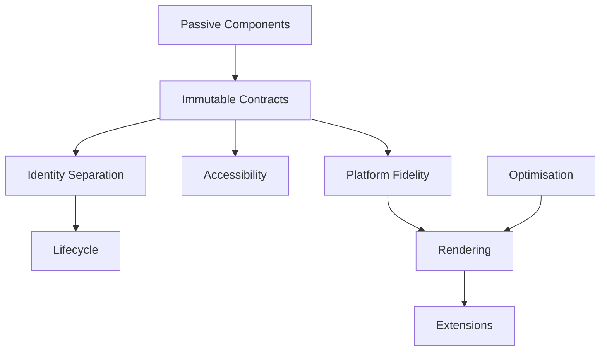

<!--
File: design/mds/MDS-008 Component Library/12-adrs.md
Document: MDS-008
Chapter: 12
Title: Architectural Decision Records
Status: Draft
Version: 0.1
-->

# Architectural Decision Records

---

# Purpose

The Architectural Decision Records (ADRs) contained within MDS-008 preserve the architectural reasoning behind the Mosaic Component Library.

Every previous specification established:

- Behaviour
- Runtime World
- Composition
- Expressions
- Tiles

MDS-008 establishes how those concepts become concrete platform implementations.

These ADRs explain why Mosaic deliberately treats Components as implementation artefacts rather than behavioural objects.

Future contributors should understand these decisions before modifying the Component Library.

---

# ADR Format

Every Mosaic ADR follows the standard structure.

```text
ADR Number

Status

Context

Decision

Consequences

Alternatives Considered

Related Specifications
```

Each ADR documents one architectural decision.

---

# ADR-182

## Title

Components Render Rather Than Reason

### Status

Accepted

### Context

Traditional UI frameworks frequently allow Components to own behaviour and application state.

Founder workshops consistently reinforced that behaviour should remain external to implementation.

### Decision

Components become passive renderers of resolved runtime Contracts.

### Consequences

Behaviour remains framework independent while rendering technologies become replaceable.

---

# ADR-183

## Title

Introduce Immutable Component Contracts

### Status

Accepted

### Context

Allowing Components to reinterpret runtime information fragments behavioural consistency.

### Decision

Every Component consumes immutable runtime Contracts.

Components never modify them.

### Consequences

Presentation becomes deterministic across every Mosaic client.

---

# ADR-184

## Title

Separate Component Identity From Tile Identity

### Status

Accepted

### Context

Behavioural presentation and rendering implementation evolve at different rates.

### Decision

Tiles preserve behavioural identity.

Components preserve implementation identity.

### Consequences

Rendering frameworks may evolve independently from runtime architecture.

---

# ADR-185

## Title

Accessibility Is Resolved Before Rendering

### Status

Accepted

### Context

Platform-specific accessibility implementations frequently become inconsistent.

### Decision

Accessibility becomes part of Component Contracts rather than Component logic.

### Consequences

Every platform receives identical behavioural accessibility semantics.

---

# ADR-186

## Title

Platform Components Never Redefine Behaviour

### Status

Accepted

### Context

Different UI frameworks naturally encourage different implementation patterns.

### Decision

Platform Components faithfully implement runtime Contracts without reinterpretation.

### Consequences

Flutter, Web, SwiftUI and Compose all communicate identical behavioural understanding.

---

# ADR-187

## Title

Optimisation Must Preserve Behaviour

### Status

Accepted

### Context

Rendering optimisations frequently simplify runtime behaviour for performance.

### Decision

Performance improvements must preserve behavioural correctness completely.

### Consequences

Optimisation becomes transparent to users.

---

# ADR-188

## Title

Component Lifecycle Is Independent From Tile Lifecycle

### Status

Accepted

### Context

Behavioural continuity should survive implementation changes.

### Decision

Components may be recreated, pooled or virtualised independently from behavioural Tiles.

### Consequences

Rendering flexibility increases without weakening user understanding.

---

# ADR-189

## Title

Rendering Is The Final Architectural Layer

### Status

Accepted

### Context

Many frameworks blur the distinction between runtime architecture and rendering.

### Decision

Rendering becomes the final implementation stage only.

### Consequences

Every upstream architectural layer remains independent from graphics technology.

---

# ADR-190

## Title

Extensions Never Implement Components

### Status

Accepted

### Context

Plugin-owned rendering fragments presentation quality and behavioural consistency.

### Decision

Extensions contribute runtime behaviour only.

The platform owns Components completely.

### Consequences

Community extensions automatically inherit future rendering improvements.

---

# ADR Relationships



Together these decisions establish the Component Library as a thin implementation layer that faithfully renders the runtime architecture without altering it.

---

# Future ADRs

Future Component Library ADRs are expected to formalise:

- GPU-driven Component Rendering
- Streaming Component Trees
- Server-assisted Rendering
- Spatial UI Components
- Adaptive Rendering Pipelines
- AI-assisted Rendering Optimisation
- Hardware Capability Profiles
- Runtime Rendering Personas

These intentionally remain outside the scope of MDS-008 Version 0.1.

---

# ADR Governance

Component Library ADRs should change only when:

- rendering architecture fundamentally evolves,
- accessibility standards require refinement,
- platform implementation strategies change,
- the Mosaic Design Language itself evolves.

Framework trends alone should never justify architectural changes.

Components should remain behaviourally passive regardless of future implementation technology.

---

# Summary

The ADRs contained within MDS-008 define the implementation identity of Mosaic.

Behaviour belongs to the Runtime World.

Presentation belongs to Tiles.

Implementation belongs to Components.

Rendering belongs to platforms.

Maintaining these boundaries allows Mosaic to continuously adopt new UI technologies without ever compromising its behavioural architecture.

---

# Review Status

**Status**

Draft

**Next File**

`13-contributor-guidance.md`
