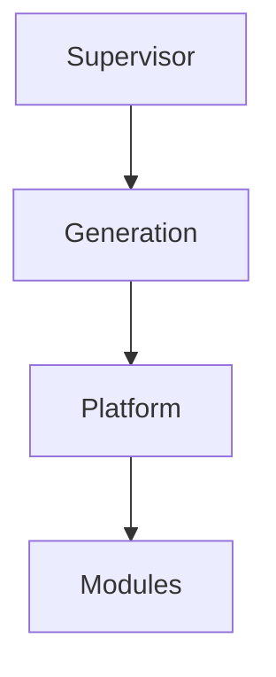

# 4. Supervisor as Mosaic host manager

**Status:** Accepted
**Date:** 2026-07-14

## Context

Mosaic is a self-hosted media centre whose architecture is evolving toward an operating-system-like model, which means users should be able to add Mosaic to a Docker Compose file and start from one durable process. That process must be able to install the Shell, guide onboarding, resolve selected functionality, invoke a Build Pipeline, activate immutable Generations, apply upgrades and recover the system when normal services fail.

Framing the Supervisor as an internal Runtime Service does not match that boundary, because the Supervisor needs authority outside Platform packages and Generations.

## Decision

The Supervisor is the always-running host-level Mosaic manager. It owns:

- Shell installation and management
- the onboarding entry point
- selected Module resolution
- Build Pipeline invocation
- Platform package validation
- Generation activation
- Platform boot through the active Generation
- background upgrade preparation
- atomic activation
- rollback by reactivating a previous known good Generation
- a recovery UI independent of the Platform and able to survive Shell failure

Because the Supervisor sits outside every Platform package and Generation, the Platform is left to own Runtime execution, Module lifecycle, scheduling, workers, Runtime State and media capability behaviour. Modules are Go libraries that implement the Mosaic SDK and participate through the Module system.

The Supervisor resolves the selected Modules and invokes the Build Pipeline to produce a Platform package, but the Build Pipeline owns build mechanics; the Supervisor only validates and activates the resulting Generation. The Recovery UI is Supervisor-owned state that can be rendered by the Shell when available and by an embedded recovery renderer when the Shell is unavailable.

## Alternatives considered

**Supervisor as an internal Runtime Service.** *Rejected:* it cannot recover the Platform when the Platform itself fails, which defeats the purpose of having a supervisor at all.

**Shell as installer and recovery owner.** *Rejected:* Shell failure would remove the recovery surface exactly when it is needed.

**User manually composes Platform binaries.** *Rejected:* self-hosted installation would become fragile and operationally complex.

**Dynamic Module loading only.** *Deferred:* the initial model favours producing a concrete Platform package from selected Modules.

**In-place Platform upgrade.** *Rejected:* atomic candidate activation with rollback provides a safer upgrade model.

**Supervisor owns build logic.** *Rejected:* build mechanics would make the Supervisor larger, more changeable and harder to recover — and the Supervisor's dependability is the whole point.

**Recovery UI only inside the Shell.** *Rejected:* Shell failure would remove the last-resort recovery surface.

## Consequences

The Supervisor becomes the durable layer below Shell, Platform and Generations, which allows Mosaic to support appliance-like installation through Docker Compose while still activating a tailored Platform package from selected Modules. Upgrade and rollback become explicit architecture rather than operational afterthoughts, and Generations provide a cleaner activation and rollback model because rollback means activating a previous Generation rather than undoing mutations. The Recovery UI therefore remains available when the Platform is unavailable, and can fall back further when the Shell is unavailable.

The cost of that position is restraint. The Supervisor must remain small enough to be dependable, so it must not accumulate media business behaviour and it must also avoid accumulating build logic. The architectural hierarchy becomes:

The recovery layer remains below the layers it may need to recover.

## Implementation implications

Runtime implementations should treat the Supervisor as the parent process or host manager for Mosaic. The Supervisor should maintain host management state for:

- installed Generations
- the active Generation
- the candidate Generation
- the previous known good Generation
- the selected Module set
- build and activation history
- rollback points
- recovery diagnostics

The Platform should expose enough health and activation information for the Supervisor to decide whether an activation succeeded. The Shell should support onboarding and normal administration, but recovery must not depend on Shell availability, which is why the Recovery UI should expose installed Generations, logs, health, configuration, storage, network diagnostics and recovery actions without depending solely on the Shell or Platform.

Module selection and compatibility should align with the static composition model and the manifest contract described in ADR 0007.
