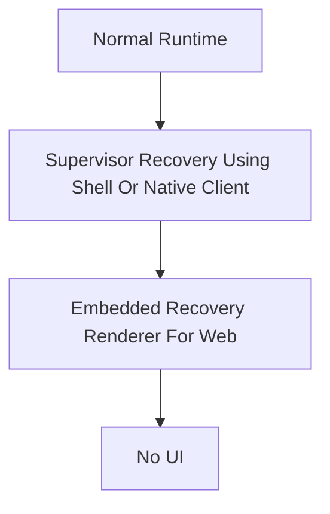

# 5. Supervisor guarantees an intelligent interface

**Status:** Accepted
**Date:** 2026-07-14

## Context

Mosaic should not lose its user interface simply because the Platform is unavailable. The Supervisor already owns Platform lifecycle, Shell lifecycle, updates, rollback, recovery and diagnostics, which makes it the only component positioned below both the Shell and the Platform. Recovery should therefore degrade through increasingly primitive presentation layers rather than disappearing.

The Presentation Layer remains available to communicate Supervisor state while the Supervisor recovers the layers it manages, but it does not recover or supervise the Supervisor itself.

## Decision

The Supervisor is the only public HTTP entry point for Mosaic, and the Platform never serves UI directly. The Supervisor guarantees an intelligent interface by using the richest available presentation layer:

The Supervisor emits Recovery SDUI rather than HTML, and the Shell renders Recovery SDUI when it is available. The embedded recovery renderer exists only for browser bootstrap and Shell failure; native clients render Recovery SDUI with their own renderers and do not require it. Onboarding also uses Recovery SDUI, because the Platform does not yet exist at that point and cannot produce Runtime SDUI.

The Supervisor begins downloading, verifying and installing the Shell immediately at process startup, without waiting for browser traffic. When the Shell is available it remains loaded throughout onboarding, build progress and the initial Platform activation, and it switches from Supervisor-owned Recovery SDUI to Platform-owned Runtime SDUI only after the Platform has passed health checks.

## Alternatives considered

**Platform serves UI directly.** *Rejected:* Platform failure would remove the normal user interface.

**Supervisor emits HTML directly.** *Rejected:* it couples recovery state to the web client and excludes native renderers.

**Embedded renderer as the normal recovery UI.** *Rejected:* it weakens the richer Shell experience, and should remain a fallback rather than the default.

**Normal installation starts in recovery.** *Rejected:* recovery is exceptional. Proactive Shell bootstrap should make the Shell the first interface most users see.

**A manual `Build Mosaic` bootstrap action.** *Rejected:* bootstrap should begin automatically, and onboarding should lead directly into build orchestration.

**A blank or log-only failure page.** *Rejected:* users should see confidence, progress and actionable recovery state.

**The Presentation Layer supervises or recovers the Supervisor.** *Rejected:* clients present Supervisor state but do not own Supervisor lifecycle or recovery.

**Establishing a separate recovery architecture specification now.** *Deferred:* recovery lifecycle and recovery presentation already have owners; a further authoritative home is justified only when broader cross-cutting invariants require one.

## Consequences

The Supervisor owns the public entry point and recovery state, so the Shell becomes the preferred operational facade over both Platform and Supervisor recovery state, and normal installation presents Mosaic through the Shell rather than presenting recovery as a required mode.

Because it must survive the failure of everything above it, the embedded recovery renderer must remain tiny, self-contained and independent from Shell assets. Recovery SDUI becomes a separate contract from Runtime SDUI. Users therefore experience graceful degradation instead of abrupt failure.

## Implementation implications

The Supervisor should expose state such as:

- Starting
- Installing Shell
- Shell Ready
- Onboarding
- Building Platform
- Starting Platform
- Healthy
- Updating
- Rollback
- Recovery
- Maintenance

Recovery diagnostics should include Platform status, build progress, runtime health, storage checks, package validation, rollback status, logs and the available recovery actions.

The embedded recovery renderer should be a single HTML document with inline CSS and JavaScript only. It should not depend on external CSS, JavaScript bundles, images, fonts, frameworks or a build pipeline, and it should automatically yield to the Shell when Shell installation completes.

Onboarding should be generated from Module Catalogue and manifest metadata, produce a declarative Build Specification, and expose build progress through Recovery SDUI.
