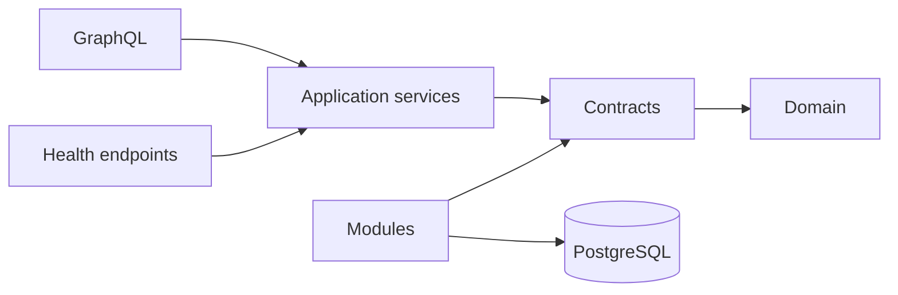

# Architecture

How Mosaic is built. This document describes the system as it exists in `mosaic-platform` — 162 Go files, ~15,300 lines — not a system that is planned. Where it describes something unbuilt, it says so.

Read this before changing anything. For what Mosaic is and why, see [MOSAIC.md](index.md). For what is being built next, see [ROADMAP.md](roadmap.md).

---

## Bird's eye view

Mosaic is a self-hosted media server built as a single Go binary. A Supervisor selects which modules a user wants, compiles them into that binary, and manages the running process. There are no plugins, no dynamic libraries, and no RPC between local components.

The Platform is hexagonal. Its core defines contracts — interfaces describing what it needs — and everything technological satisfies them from outside. PostgreSQL is not privileged; it is a module that implements the storage port and could be replaced by another.

Arrows mean *depends upon*. Dependencies point inward: transports depend on application services, which depend on contracts, which depend on the domain. Modules depend on contracts too, from the outside. **The domain imports nothing.**

---

## Code map

### `internal/platform/` — the core

Trusted, compiled in, defines the rules everything else follows. Imports no module and no transport.

**`domain/`** — business types with no infrastructure knowledge. `User`, `Session`, `Role`, `Grant`, `Permission`, `PasswordCredential`, `PasskeyCredential`, `RecoveryFactor`, `ConfigVersion`, `Event`, `OutboxEvent`, `DeliveryPolicy`, `ComponentHealth`, `LifecycleState`, `Secret`, `SecretRef`, and typed identifiers (`UserID`, `SessionID`, `EventID`, …) over a shared `ID`.

**`contracts/`** — the ports. Every interface the core needs from the outside world:

| Contract | Purpose |
|---|---|
| `UnitOfWork` | `WithinTx(ctx, fn)` — the transaction boundary |
| `Tx` | Transaction scope. Stores reached through one `Tx` share one transaction |
| `Store[T](tx)` | Uniform, type-safe store resolution |
| `StorageAdapter` | The storage port an engine implements |
| `UserStore`, `SessionStore`, `PermissionStore`, `ConfigStore`, `CredentialStore` | Persistence contracts |
| `EventOutbox`, `EventPublisher` | Event durability and delivery |
| `SecretBroker` | Secret resolution and rotation |
| `Clock`, `IDGenerator` | Determinism seams for testing |
| `HealthProbe`, `ComponentHealthReporter` | Health reporting |

**`app/`** — application services. One file per command or query: `create_local_user`, `authenticate_local_user`, `revoke_session`, `set_user_status`, `draft_config_version`, `validate_config_version`, `activate_config_version`, and read-side queries for users, permissions and configuration.

**`policy/`** — an ABAC-shaped engine. `Subject`, `Action`, `Resource`, `PolicyContext` produce a `Decision`, resolved by RBAC lookups against `PermissionStore`. Default-deny.

**`sessions/`** — `Manager` with `Issue`, `Validate`, `Revoke`.

**`config/`** — `ReloadClass`, a `Schema`/`FieldSpec` registry, `ChangedFields` diffing, and a `Manager` running the version state machine.

**`secrets/`** — `Broker` preferring the OS keychain, falling back to an AES-256-GCM encrypted local vault. Backend chosen once per process. `secret://` reference parsing.

**`events/`** — `Bus` (in-process publisher, subscriber registry keyed by event type) and `Worker` (drains the outbox on a ticker).

**`diagnostics/`** — health `Registry`, a JSON-Lines `Logger` that redacts by default, and support-bundle construction.

**`runtime/`** — the Supervisor-facing surface. Generation metadata, lifecycle state, readiness, liveness, migration tracking, config activation status, and `Shutdown`.

### `internal/modules/` — built-in modules

Infrastructure implementing Platform contracts, using the same registration and manifest shape an external module would use, but compiled in, required and trusted.

`postgres/` is the only one today: `pgx/v5`, eleven embedded SQL migrations, a deterministic migrator, implementations of every store contract, and SQLSTATE-to-category error mapping. **No pgx type, row or SQLSTATE escapes this package.**

### `internal/adapters/` — not module-shaped

Helpers that don't implement a full contract surface: `crypto/` (AES-GCM) and `filesystem/` (atomic writes). Storage engines do **not** belong here.

### `internal/transport/` — inbound

`graphql/` — a hand-built executable schema. `health/` — the Supervisor handoff endpoints.

### `internal/composition/builtin/` — module discovery

A `Registry` holding modules that present a `Manifest{ID, Version, Fulfills []string}`. Discovery is by registration rather than filesystem scan, but the shape deliberately mirrors how an external module would be discovered.

### `contracts/platform/v1/` — the public SDK surface

**Currently empty apart from `doc.go`.** Promoting the proven contracts here is the next milestone, and the reason the reference-capability work is blocked.

---

## Invariants

Break these and the architecture stops holding.

**Dependencies point inward.** Domain imports nothing. Application services depend on contracts, never on concrete module types. Transport calls application services, never storage.

**Seven error categories.** `InvalidArgument`, `Unauthenticated`, `PermissionDenied`, `NotFound`, `Conflict`, `Unavailable`, `Internal`. Modules may keep driver errors internally; nothing above sees them.

**One command order.** Validate shape → authenticate → authorise via policy → open `UnitOfWork` → load through contracts → apply domain rules → persist state *and* outbox events in the same transaction → return a Platform type.

**State and events commit together.** Structural, not conventional: `WithinTx` shares one `pgx.Tx` across every store. Proven by a test that fails mid-transaction and queries raw tables to confirm neither row persists.

**GraphQL resolvers call services only.** Enforced by a test that parses import declarations and fails on `internal/modules/postgres`, `pgx` or `database/sql`.

**Every config field declares a reload class.** `Hot`, `Restart`, `Generation`, or `Recovery`. Only Hot-only changes apply without escalation.

**At-least-once delivery.** Subscribers must be idempotent. A retry redelivers to every subscriber of that type, not only the one that failed.

**Secrets are unobservable.** Log fields redact unless explicitly marked safe; an unclassified field fails closed. Support bundles replace any free text not explicitly marked as containing nothing sensitive.

---

## Cross-cutting behaviour

**Transactions.** `Store[T](tx)` resolves any store uniformly. *Currently a delegation shim* — it forwards to `Tx`'s six named accessors, which still exist. Sealing `Tx` and repointing resolution onto the `StorageAdapter` binding is outstanding work; `resolveStore` is the single place that changes.

**Events.** Writers append to the outbox inside the business transaction. The worker drains it, publishes through the bus, and marks published or records failure. Failure applies an exponential backoff capped at one hour and dead-letters after eight attempts. Events carry a full envelope: identity, type, timestamps, actor, correlation and causation identifiers, payload, redaction class.

**Migrations.** Embedded, versioned, checksummed. Applied with their tracking row in one transaction. The startup gate fails fast on a missing, checksum-mismatched, gapped, or database-ahead schema.

**Configuration.** Draft → Validated → Active, with Rejected and Superseded terminal paths. At most one Active version, enforced by a unique partial index rather than application logic.

**Shutdown.** Stop the worker's poll loop, run one final synchronous drain, exit. Proven by a test using a one-hour ticker so only the shutdown drain can deliver.

---

## Supervisor handoff

Five HTTP endpoints, each a thin call into `internal/platform/runtime`:

`/metadata` · `/readyz` · `/healthz` · `/migrations` · `/config`

Readiness is false if any component reports Unavailable; Degraded alone does not block. Liveness goes false once shutdown begins, so an intentional exit is not read as a crash. The Platform never reverses a database mutation — rollback is the Supervisor activating a different Generation.

---

## Testing

`test/contract/` holds an adapter-agnostic suite proving any storage implementation satisfies the contracts. It runs against real PostgreSQL — embedded by default, or dockerised. The PostgreSQL adapter passes the same behavioural tests a future storage adapter would have to pass.

Integration tests run against a real database, not mocks. Application service tests run without PostgreSQL, against contract fakes. Boundary tests parse import declarations rather than grepping text. Where a test could pass by construction, it was verified to fail against a deliberately introduced violation.

Gate for every change: `go build ./...`, `go vet ./...`, `go test ./... -race`.

### Standing gates

Each of these must keep passing. They are the properties that stop the architecture eroding.

| Gate | Evidence required |
|---|---|
| Contract compile | Core contracts compile without adapters |
| Import boundary | Modules and transports cannot import private Platform internals |
| Application service | Commands enforce validation, authentication, policy and transactions |
| Storage contract | Adapter passes the shared contract suite against real PostgreSQL |
| Migration | Fresh install and upgrade path both tested |
| Outbox | State change and event append commit atomically |
| Policy | Denied actions cannot mutate state |
| GraphQL | Resolvers call services, not database packages |
| Diagnostics | Health reporting and support-bundle redaction verified |
| Supervisor | Process exposes readiness, liveness and shutdown behaviour |

---

## Not built

Stated plainly so nothing here is mistaken for a description of something real.

- **The content model.** There is no node tree, no relation graph and no attribute storage. Every table in the schema is infrastructure — identity, sessions, permissions, configuration, events, jobs, diagnostics, and a blob registry that tracks files rather than content. **A capability currently has nowhere to put an anime.** Designed in ADR 0013 and ADR 0014; not implemented.
- **Module permissions.** The policy engine governs *user* authority. Module authority is undecided and unimplemented.
- **External modules.** Only the built-in shape exists.
- **Jobs and diagnostics history.** Tables exist from earlier migrations with no contract or service above them. GraphQL resolvers for them return `Unavailable` rather than faking success.
- **Session refresh and device pairing.** No backing service.
- **Shell, SDUI, design language.** Nothing.
- **HTTP transport for GraphQL.** The schema is executable and tested, but not yet served.
