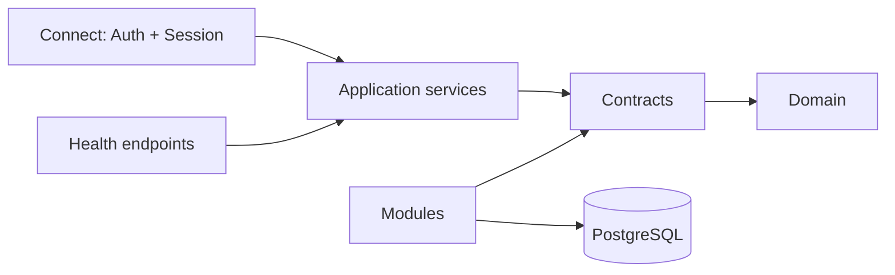

# Architecture

How Mosaic is built. This document describes the system as it exists in `platform` — 175 Go files, ~17,650 lines — not a system that is planned. Where it describes something unbuilt, it says so.

Read this before changing anything. For what Mosaic is and why, see [MOSAIC.md](index.md). For what is being built next, see [ROADMAP.md](roadmap.md).

---

## Bird's eye view

Mosaic is a self-hosted media server built as a single Go binary. A Supervisor selects which modules a user wants, compiles them into that binary, and manages the running process. There are no plugins, no dynamic libraries, and no RPC between local components.

The Platform is hexagonal. Its core defines contracts — interfaces describing what it needs — and everything technological satisfies them from outside. PostgreSQL is not privileged; it is a module that implements the storage port and could be replaced by another.

Arrows mean *depends upon*. Dependencies point inward: transports depend on application services, which depend on contracts, which depend on the domain. Modules depend on contracts too, from the outside. **The domain imports nothing.**

---

## Code map

### `internal/platform/` — the core

Trusted, compiled in, defines the rules everything else follows. Imports no module and no transport.

**`domain/`** — business types with no infrastructure knowledge. `User`, `Session`, `Role`, `Grant`, `Permission`, `PasswordCredential`, `PasskeyCredential`, `RecoveryFactor`, `ConfigVersion`, `Event`, `OutboxEvent`, `DeliveryPolicy`, `ComponentHealth`, `LifecycleState`, `Secret`, `SecretRef`, the content model's `Node`, `Part`, `MediaLocation`, `Relation` and `SourceBinding`, and typed identifiers (`UserID`, `SessionID`, `EventID`, `NodeID`, …) over a shared `ID`.

**`contracts/`** — the ports. Every interface the core needs from the outside world:

| Contract | Purpose |
|---|---|
| `UnitOfWork` | `WithinTx(ctx, fn)` — the transaction boundary |
| `Tx` | Transaction scope. Stores reached through one `Tx` share one transaction |
| `StorageAdapter` | The storage port an engine implements |
| `UserStore`, `SessionStore`, `PermissionStore`, `ConfigStore`, `CredentialStore` | Persistence contracts |
| `NodeStore`, `PartStore`, `RelationStore`, `SourceBindingStore` | The content model — containment tree, bytes, association graph, identity |
| `EventOutbox`, `EventPublisher` | Event durability and delivery |
| `SecretBroker` | Secret resolution and rotation |
| `Clock`, `IDGenerator` | Determinism seams for testing |
| `HealthProbe`, `ComponentHealthReporter` | Health reporting |

**`app/`** — application services. One file per command or query: `create_local_user`, `authenticate_local_user`, `revoke_session`, `set_user_status`, `draft_config_version`, `validate_config_version`, `activate_config_version`, and read-side queries for users, permissions and configuration.

**`policy/`** — an ABAC-shaped engine. `Subject`, `Action`, `Resource`, `PolicyContext` produce a `Decision`, resolved by RBAC lookups against `PermissionStore`. Default-deny.

**`sessions/`** — `Manager` with `Issue`, `Validate`, `Revoke`.

**`config/`** — `ReloadClass`, a `Schema`/`FieldSpec` registry, `ChangedFields` diffing, and a `Manager` running the version state machine.

**`secrets/`** — `Broker` preferring the OS keychain, falling back to an AES-256-GCM encrypted local vault. Backend chosen once per process. `secret://` reference parsing.

**`events/`** — `Bus` (in-process publisher, subscriber registry keyed by event type) and `Worker` (drains the outbox on a ticker).

**`diagnostics/`** — health `Registry`, a JSON-Lines `Logger` that redacts by default, and support-bundle construction.

**`runtime/`** — the Supervisor-facing surface. Generation metadata, lifecycle state, readiness, liveness, migration tracking, config activation status, and `Shutdown`.

### `internal/modules/` — built-in modules

Infrastructure implementing Platform contracts, using the same registration and manifest shape an external module would use, but compiled in, required and trusted.

`postgres/` is the only one today: `pgx/v5`, twelve embedded SQL migrations, a deterministic migrator, implementations of every store contract, and SQLSTATE-to-category error mapping. **No pgx type, row or SQLSTATE escapes this package.**

### `internal/adapters/` — not module-shaped

Helpers that don't implement a full contract surface: `crypto/` (AES-GCM for the secret vault, and an Argon2id `PasswordHasher`) and `filesystem/` (atomic writes). Storage engines do **not** belong here.

An adapter is not a built-in module: there is no manifest and no registration through `internal/composition/builtin`, because each fulfils a single small port rather than a broad contract surface. It is still swappable, behind the same hexagonal seam — the composition root wires it directly. The password hasher satisfies the `domain.PasswordVerifier` port (`Hash`/`Verify`) and is chosen in `main.go`, so replacing Argon2id with bcrypt, scrypt or an HSM-backed signer is a one-line change there. The `crypto` package imports no Platform code, so the compile-time assertion that it satisfies the port lives in its external test package rather than coupling the adapter to `domain`.

### `internal/transport/` — inbound

`session/` — the **first-party client transport**, a typed two-lane Connect/gRPC surface generated from one `.proto` ([ADR 0041](adr/0041-cross-client-transport-two-lane-rpc.md)). Lane 1 is unary intents (`Attach`/`Navigate`/`Invoke`/`SubmitInput`); lane 2 is one server-streaming `Subscribe` per session over which the Platform pushes region updates, shell mutations, toasts and unsolicited events. Both lanes multiplex onto one HTTP/2 connection (served over h2c). A per-session **outbound mailbox** owns the wire — unary handlers only enqueue; a single sender goroutine drains to `Send` (gRPC `Send` is not goroutine-safe) — and a monotonic per-session `seq` with a bounded replay buffer gives stream resume, which subsumes [ADR 0033](adr/0033-supervisor-driven-live-handover.md)'s handover. An `Invoke` routes straight to the application services (`ImportContent`/`ConfigureModule`/`playPart`) through a `dispatch` switch that is now the complete enumeration of what a client can invoke — since [ADR 0061](adr/0061-one-client-transport.md) there is no other transport to reach a command through, so an action `dispatch` cannot map does not exist. The screen emit-side ([ADR 0029](adr/0029-sdui-emit-side.md)) backs it; `UINode` subtrees ride the envelope as SDUI-JSON bytes (ADR 0041's encoding option (a)). This supersedes the bespoke WebSocket of [ADR 0032](adr/0032-live-session-websocket.md); the first-party clients are ported and the chain works end to end.

`auth/` — the Connect **`AuthService`** ([ADR 0061](adr/0061-one-client-transport.md)): `SignIn`/`SignOut` over `AuthenticateLocalUser`/`RevokeSession`. It is a service of its own because it is the one call made *without* a session — every `SessionService` request begins with a session ref. Together with `session/` it is the **entire** client API: [ADR 0061](adr/0061-one-client-transport.md) deleted the GraphQL transport that [ADR 0041](adr/0041-cross-client-transport-two-lane-rpc.md) had retained as an external/tooling surface, having found it had no caller — the Shell used exactly one operation of it (`signIn`), and its other resolvers duplicated commands the session transport already dispatched. `rpc/` — the plumbing both services share: the Platform's seven error categories mapped onto Connect status codes (the thing GraphQL's always-200 envelope could not do), and the telemetry interceptor that seeds each request's trace ([ADR 0055](adr/0055-instrument-at-the-seams.md)), parameterised by component so each service names itself. `screens/` — the SDUI emit-side ([ADR 0029](adr/0029-sdui-emit-side.md)) the session transport renders through; `artwork/` — the artwork proxy ([ADR 0030](adr/0030-artwork-proxy-and-cache.md)); `playback/` — the media origin ([ADR 0045](adr/0045-playback-consumer-and-media-origin.md)); `health/` — the Supervisor handoff endpoints. The composition root serves the client-facing API and the operational handoff on separate ports (`:8081` and `:8080`), and constructs `app.Service` with an Argon2id password hasher. **Not every Platform capability is client-reachable** — the full list is [Unreachable capability](unreachable-capability.md), and it is longer than the transport change that prompted it. Creating roles, granting them, drafting and activating config versions and setting user status have commands, policy actions and tests, but no client surface: they had GraphQL mutations with no UI behind them, and [ADR 0061](adr/0061-one-client-transport.md) chose to delete rather than re-port them, on the grounds that they arrive properly as server-emitted screens when an admin UI exists. `bootstrap.EnsureAdmin` — env-gated and idempotent — remains the only in-band way to establish the first authority.

### `internal/composition/builtin/` — module discovery

A `Registry` holding modules that present a `Manifest{ID, Version, Fulfills []string}`. Discovery is by registration rather than filesystem scan, but the shape deliberately mirrors how an external module would be discovered.

### Optional external-shaped modules — their own repositories

Distinct from `internal/modules/` (built-in, trusted, required) and from `capabilities/reference/` (a package *inside* the Platform module): an **optional module** is its **own Go module in its own repository**, importing only the SDK, statically composed into the binary and invoked through a capability registry ([ADR 0019](adr/0019-module-capability-and-invocation.md), [ADR 0020](adr/0020-optional-module-composition.md)).

[`module-stremio-addons`](https://github.com/mosaic-media/module-stremio-addons) is the first: a client of the Stremio addon protocol. It implements the SDK `Capability` interface (`Manifest()` plus `Import(ctx, ContentService, ImportRequest)`), owns no schema, and reflects movies and TV into the graph — metadata as the Work and its tree, streams as `RemoteLocation` Parts, the two independent so a meta-only addon adds no Parts. A boundary test, and Go itself, keep it to the SDK and the standard library.

The Platform requires it as a tagged dependency (`v0.1.0`) from the module proxy, and `main.go`'s `registerCapabilities` registers it into an `app.CapabilityRegistry`. A caller invokes it through the `ImportContent` command (the session transport's `importContent` action, policy action `content.import`), which authorises the caller, resolves the capability by id, and hands it the `app.Service` as its `ContentService` — so the module's own writes each re-authorise as the invoking user ([ADR 0017](adr/0017-how-a-capability-acts.md)). Explicit registration stands in for [ADR 0007](adr/0007-static-go-module-composition.md)'s eventual Build-Pipeline-generated `imports.go`.

The addons the Stremio module sources from are **user-managed settings**, not composed-in config ([ADR 0021](adr/0021-module-settings.md)): a `ModuleSettingsStore` (one jsonb document per module id, joined to `Tx`) holds them, generic `configureModule`/`moduleSettings` commands (actions `module.configure`/`module.read`) set and read them, and the Platform hands them to the module on each invocation through `ImportRequest.Settings`. The Platform stores the document opaquely; the module interprets it (`{"addons":[...]}`). This is the first of the SDK gaps building the module surfaced.

### The published SDK — its own module

The public contract surface ([ADR 0016](adr/0016-published-contract-surface.md)) has been **extracted into a standalone module**, [`github.com/mosaic-media/sdk`](https://github.com/mosaic-media/sdk). The Platform depends on it importing `github.com/mosaic-media/sdk/contracts/platform/v1`. `v0.1.0` extracted the content surface; `v0.2.0` adds the `Capability` side — a `Capability` interface, a minimal `Manifest`, and an `ImportResult` ([ADR 0019](adr/0019-module-capability-and-invocation.md)); `v0.3.0` replaces `Import`'s parameter list with an `ImportRequest{Caller, Query, Settings}` struct so the Platform can hand a module its user-managed settings ([ADR 0021](adr/0021-module-settings.md)).

It carries the content models (`Node`, `Part`, `Relation`, `SourceBinding` and their vocabularies), the nine content command, query and result types, the `ContentService` interface `internal/platform/app.Service` implements, the `Capability` interface an optional module implements, and an opaque `Caller`. The store contracts, `Tx` and the identity and configuration models are **not** in it — they are Platform↔engine plumbing and stay internal. Because the SDK is a separate module, Go itself forbids it from importing the Platform's `internal/`, so an internal-type leak is a compile error rather than something a test must catch. `capabilities/reference` (the reference capability) and `test/sdkprobe` build against the SDK and nothing else of the Platform's; `test/sdkboundary` compiles the probe as a standing check.

Known gap: `ContentService` exposes no *read* for relations (`ListFrom`/`ListTo`), so a capability can create edges but not query them back through the surface. The reference capability does not need it; it is a candidate addition rather than a defect.

### The Shell — its own repository

The human-facing surface, [`mosaic-shell`](https://github.com/mosaic-media/mosaic-shell), is a **client of the Platform over Connect** ([ADR 0061](adr/0061-one-client-transport.md)) — not a Module, not part of the binary — in its own first-party repository (React + TypeScript + Vite), AGPL-3.0-only ([ADR 0022](adr/0022-licensing.md)). It is **Server-Driven** ([ADR 0023](adr/0023-server-driven-ui-and-the-shell.md)): the Platform sends a tree of typed `UINode`s carrying declarative `Action` envelopes, and the Shell renders it. The vocabulary is open (an unknown node type degrades to a placeholder) and the contract is technology-agnostic, so a future Flutter client for TV, desktop and mobile renders the same payloads.

Its components are **primitives or definitions** ([ADR 0024](adr/0024-primitives-and-definitions.md)): a small, irreducible set of native primitives (the cross-client vocabulary, styled from tokens) and everything else — containers included — as `ComponentDefinition` data a module can author. The React implementation of that vocabulary — primitives, registry, renderer, definition expander, token skin — has itself been extracted into a shared package, `mosaic-sdui-react` (below), so the Shell is now a thin app on top of it. The SDUI contract — the schema, the standard definition library and the tokens — is likewise its own repository, `sdui` (below), because two Go producers already need it ([ADR 0025](adr/0025-sdui-contract-repository.md)). The Shell runs on mock SDUI payloads until the Platform emits real ones.

### The SDUI contract — its own repository

[`sdui`](https://github.com/mosaic-media/sdui) is to the interface what the SDK is to content: the language-neutral contract a **producer** (the Platform's emit-side, a UI-contributing Module) emits and a **client** (the Shell, a native client) renders ([ADR 0023](adr/0023-server-driven-ui-and-the-shell.md), [ADR 0025](adr/0025-sdui-contract-repository.md)). It carries the schema as **JSON Schema** (`UINode` open tree, the `Action` envelope, `ComponentDefinition`) — JSON for the *authoring* layer, because the vocabulary is open and the definitions and tokens are JSON data. The *wire* is protobuf end to end: `UINode` is generated as a message too ([ADR 0044](adr/0044-contracts-protobuf-workspace.md)), and since [ADR 0061](adr/0061-one-client-transport.md) protobuf/Connect is the only client transport there is. It ships a **Go producer binding** (`Node`/`Action` types plus standard-component builders), a **TypeScript** binding for the Shell, the **standard definition library** as data, and the **design tokens** (DTCG). Apache-2.0, like the SDK ([ADR 0022](adr/0022-licensing.md)). Producers wire it with a `replace` directive until it is tagged.

### The React runtime and the storybook — their own repositories

The **web renderer** of the contract is a shared package, [`mosaic-sdui-react`](https://github.com/mosaic-media/mosaic-sdui-react) (`@mosaic-media/sdui-react`, [ADR 0026](adr/0026-react-sdui-runtime.md)): the React implementation of the primitives, the registry, the recursive renderer, the definition expander, the runtime provider, and the token skin. It is the reference *web* rendering engine; the Shell and the storybook consume it as **peers**. AGPL-3.0-only — first-party client code, distinct from the Apache-2.0 contract. A native (Flutter) client would be its own runtime implementing the same contract.

The **component storybook**, [`mosaic-storybook`](https://github.com/mosaic-media/mosaic-storybook), renders every component live from `@mosaic-media/sdui` data beside the `UINode` payload that produced it — bespoke rather than Storybook.js, because a definitions-as-data component's API *is* its payload. It is deployed to [mosaic-media.github.io/mosaic-storybook](https://mosaic-media.github.io/mosaic-storybook/).

---

## Invariants

Break these and the architecture stops holding.

**Dependencies point inward.** Domain imports nothing. Application services depend on contracts, never on concrete module types. Transport calls application services, never storage.

**Seven error categories.** `InvalidArgument`, `Unauthenticated`, `PermissionDenied`, `NotFound`, `Conflict`, `Unavailable`, `Internal`. Modules may keep driver errors internally; nothing above sees them.

**One command order.** Validate shape → authenticate → authorise via policy → open `UnitOfWork` → load through contracts → apply domain rules → persist state *and* outbox events in the same transaction → return a Platform type.

**State and events commit together.** Structural, not conventional: `WithinTx` shares one `pgx.Tx` across every store. Proven by a test that fails mid-transaction and queries raw tables to confirm neither row persists.

**Transports call services only.** Enforced by a test that parses import declarations and fails on `internal/modules/postgres`, `pgx` or `database/sql`. It lived in the GraphQL transport, which was the first one; since [ADR 0061](adr/0061-one-client-transport.md) retired that package the copies in `transport/auth` and `transport/health` carry the rule.

**Every config field declares a reload class.** `Hot`, `Restart`, `Generation`, or `Recovery`. Only Hot-only changes apply without escalation.

**At-least-once delivery.** Subscribers must be idempotent. A retry redelivers to every subscriber of that type, not only the one that failed.

**Secrets are unobservable.** Log fields redact unless explicitly marked safe; an unclassified field fails closed. Support bundles replace any free text not explicitly marked as containing nothing sensitive.

**Adding a media type is rows, not tables.** No schema migration, no new query path, no per-type column. This is the property the content model exists to deliver and the one that makes a community-built module possible without Platform changes. Vocabulary the Platform branches on is the exception and stays closed ([ADR 0015](adr/0015-open-and-closed-vocabularies.md)).

**Deletion is never a silent cascade.** Removing a node's last source binding leaves it `orphaned`, not deleted. Deleting a node that still has children, parts or bindings is refused, so a subtree is never taken by implication.

---

## Cross-cutting behaviour

**Transactions.** `Tx` enumerates the Platform's stores by name, and every store reached through one `Tx` writes to the same database transaction. The store set is Platform-owned and closed: capabilities own no schema, so there is nothing to register and nothing to resolve at runtime ([ADR 0012](adr/0012-capabilities-do-not-own-stores.md)). Growing the set means editing `Tx`, which is deliberate Platform evolution rather than a cost. One transaction spans one bounded context's stores plus the shared outbox ([ADR 0014](adr/0014-storage-authority-and-transaction-scope.md)); work crossing contexts is two transactions joined by an event.

**Events.** Writers append to the outbox inside the business transaction. The worker drains it, publishes through the bus, and marks published or records failure. Failure applies an exponential backoff capped at one hour and dead-letters after eight attempts. Events carry a full envelope: identity, type, timestamps, actor, correlation and causation identifiers, payload, redaction class.

**Migrations.** Embedded, versioned, checksummed. Applied with their tracking row in one transaction. The startup gate fails fast on a missing, checksum-mismatched, gapped, or database-ahead schema.

**Configuration.** Draft → Validated → Active, with Rejected and Superseded terminal paths. At most one Active version, enforced by a unique partial index rather than application logic.

**Shutdown.** Stop the worker's poll loop, run one final synchronous drain, exit. Proven by a test using a one-hour ticker so only the shutdown drain can deliver.

---

## The content model

Four tables — `nodes`, `parts`, `relations`, `source_bindings` — designed in [ADR 0013](adr/0013-object-graph.md) and [ADR 0014](adr/0014-storage-authority-and-transaction-scope.md). They are the first content in a schema that was otherwise entirely infrastructure.

**Containment is a tree; association is a graph.** `nodes` is one recursive tree of variable depth: a film is Work → Item, a series is Work → Container(season) → Item(episode), a chapter-only manga is Work → Item until a volume layer is inserted later. Nothing may assume a node has a parent or that a Work's children are containers. `relations` carries typed, directed, confidence-scored edges that do not nest. Conflating the two is what makes flat media models accumulate edge cases indefinitely.

**A Part is what plays.** An edition or cut is not a new Node — one Item carries however many cuts exist, because the cut is a property of which bytes play. Multi-disc releases use the same mechanism with `part_role = segment`, so there is one source-selection path rather than two. A Part points at bytes and never contains them; local paths and remote provider references are equally first-class.

**Identity resolution is visible.** A weak match lands as `pending_review` and surfaces to a user rather than silently merging two works that share a title. A merge is a confirmed high-confidence binding; a split moves a binding to a different node without re-fingerprinting the source.

### Four deliberate non-uniformities

Forcing every media type through one shape is its own bug. These four are modelled against the grain on purpose, and each is cheap to normalise away by accident, so each is pinned by a contract test:

- **Artists are not containers of albums.** Box sets, collaborations and various-artist compilations all break single-parent containment. An artist is its own Work joined to album Works by Relation.
- **Collected editions are their own Work**, related to what they collect by `collection_member` — the same mechanism as any other collection.
- **An anime and its source manga are two Works** joined by `adaptation`. They have different part structures and diverge in canon, so one tree would corrupt both.
- **IPTV programme listings never become Nodes.** A channel is a Node; a programme that airs once is not. Running identity, merge and relation machinery over guide data is waste rather than correctness.

### Implementation notes

**`media_type`, `container_type` and `item_type` are unconstrained text; the graph vocabulary is not.** [ADR 0015](adr/0015-open-and-closed-vocabularies.md) draws the line: vocabulary the Platform *branches on* — `node_kind`, `part_role`, relation types, match methods, statuses — is closed and `CHECK`-constrained, because an unrecognised value there is a traversal that does not know what it is looking at. Vocabulary that only *describes content* is open, because a `CHECK` would make every new media type a schema migration. Open is not unguarded: stores canonicalise on write, so `Anime Series`, `anime-series` and `anime_series` are one media type and not three, and a write returns the canonical value. What normalisation cannot recover — a missing separator, a misspelling — is owed to the `media_types` registry landing with the reference capability. Attribute correctness in the JSONB columns belongs to the writing capability on the same terms.

**Identifiers are UUIDv7 in native `uuid` columns**, with their own generator alongside the UUIDv4 one that continues to serve the infrastructure tables. Those keep their `text`/UUIDv4 ids and are not migrated.

**Three things ADR 0013 leaves open are unbuilt rather than invented:** the fractional ordering scheme at large scale (`natural_order` is stored as given and nothing rebalances), relation confidence decay or reverification (edges are written once, and `RelationStore` has no `Update` so the absence stays visible), and attribute validation.

---

## Supervisor handoff

Five HTTP endpoints, each a thin call into `internal/platform/runtime`:

`/metadata` · `/readyz` · `/healthz` · `/migrations` · `/config`

Readiness is false if any component reports Unavailable; Degraded alone does not block. Liveness goes false once shutdown begins, so an intentional exit is not read as a crash. The Platform never reverses a database mutation — rollback is the Supervisor activating a different Generation.

---

## Testing

`test/contract/` holds an adapter-agnostic suite proving any storage implementation satisfies the contracts. It runs against real PostgreSQL — embedded by default, or dockerised. The PostgreSQL adapter passes the same behavioural tests a future storage adapter would have to pass.

Integration tests run against a real database, not mocks. Application service tests run without PostgreSQL, against contract fakes. Boundary tests parse import declarations rather than grepping text. Where a test could pass by construction, it was verified to fail against a deliberately introduced violation.

Gate for every change: `go build ./...`, `go vet ./...`, `go test ./... -race`.

### Standing gates

Each of these must keep passing. They are the properties that stop the architecture eroding.

| Gate | Evidence required |
|---|---|
| Contract compile | Core contracts compile without adapters |
| Import boundary | Modules and transports cannot import private Platform internals |
| Application service | Commands enforce validation, authentication, policy and transactions |
| Storage contract | Adapter passes the shared contract suite against real PostgreSQL |
| Migration | Fresh install and upgrade path both tested |
| Outbox | State change and event append commit atomically |
| Policy | Denied actions cannot mutate state |
| Transports | Handlers call services, not database packages |
| Diagnostics | Health reporting and support-bundle redaction verified |
| Supervisor | Process exposes readiness, liveness and shutdown behaviour |
| Content model | Tree, graph, parts and bindings pass the contract suite; the four non-uniformities stay expressible |

---

## Not built

Stated plainly so nothing here is mistaken for a description of something real.

This section covers what does not *exist*. Its counterpart is
[Unreachable capability](unreachable-capability.md) — what exists, works, is
tested, and has no way for a human to reach it. That register is the more
dangerous of the two, because nothing in the build or the test suite reports it:
`CreateLocalUser`, to take the clearest case, is a complete and well-tested
command whose only callers are its own tests.

- **IPTV programme listings.** ADR 0013 gives them their own lightweight table keyed to the channel node, deliberately outside the Node machinery. That table is unbuilt.
- **Module-granular permissions.** The policy engine governs *user* authority, and a capability acts as its invoking user ([ADR 0017](adr/0017-how-a-capability-acts.md)). Authority a module holds *distinct* from that user — and a system principal for background work — is scoped to future ADRs, not built.
- **External modules.** Only the built-in shape exists.
- **Jobs and diagnostics history.** Tables exist from earlier migrations with no contract or service above them. They had schema stubs that returned `Unavailable` rather than faking success; [ADR 0061](adr/0061-one-client-transport.md) deleted the transport those stubs lived in, so today they have no surface at all — which is the more honest statement of the same fact.
- **Session refresh and device pairing.** No backing service.
- **The Platform's SDUI surface.** The Shell and its Server-Driven-UI runtime exist ([ADR 0023](adr/0023-server-driven-ui-and-the-shell.md), [ADR 0024](adr/0024-primitives-and-definitions.md)), but the Platform does not yet *emit* screens or their queries — the Shell runs on mock payloads of the shape the Platform will send.
- **The Mosaic Design Language.** The Shell ships a neutral, token-driven skin; the design language that will replace those token values — acrylic with weight, artwork as the light source — is not built.
