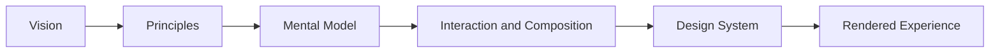

<!--
File: docs/design/index.md
Document: Design
Status: Draft
Version: 0.2
-->

# Design

Design documentation defines how Mosaic thinks, behaves, presents itself, and composes product experiences.

## At a Glance

| Area | Question answered | Use it for |
|------|-------------------|------------|
| [Design Language](language/index.md) | Why should Mosaic feel and behave this way? | Vision, principles, mental models, interaction and composition intent |
| [Design System](system/index.md) | How does that intent become a reusable interface system? | Tokens, colour, materials, typography, motion, composition, Tiles and components |

The Design Language establishes intent. The Design System realises that intent as reusable design infrastructure.

## Recommended Reading Paths

- For product and design intent, begin with [MDL-001 — Mosaic Design Language Vision](language/mdl-001-vision/index.md), then follow the Design Language in order.
- For interface implementation, understand [MDL-003 — Mental Model](language/mdl-003-mental-model/index.md) and [MDL-005 — Composition Model](language/mdl-005-composition-model/index.md) before entering the [Design System](system/index.md).
- For reusable UI infrastructure, begin with [MDS-001 — Design Token Architecture](system/mds-001-design-token-architecture/index.md) and follow the Design System sequence.

These summaries provide orientation. The linked MDL and MDS specifications remain authoritative.
