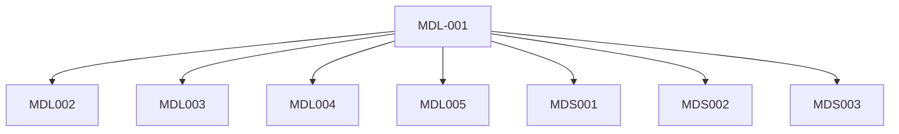

<!--
File: docs/design/language/mdl-001-vision/00-document-control.md
Document: MDL-001
Status: Draft
Version: 0.4
-->

# Document Control

---

# Document Metadata

| Field | Value |
|--------|-------|
| Document ID | MDL-001 |
| Title | Mosaic Design Language Vision |
| Type | Foundational Specification |
| Classification | Internal |
| Status | Draft |
| Version | 0.4 |
| Owner | AdamNi-7080 |
| Repository | `/design/mdl/MDL-001 Vision/` |
| Parent Standard | DSS-001 Documentation Standard |
| Target Release | Mosaic v1.0 |

---

# Purpose

This document establishes the vision of the Mosaic Design Language (MDL).

MDL-001 is the highest-level design specification within the Mosaic documentation hierarchy.

Its purpose is to define **why** Mosaic exists from a design perspective rather than **how** it is implemented.

Every subsequent MDL and MDS specification inherits from this document.

---

# Authority

The authority of this specification extends to:

- User Experience
- Visual Design
- Motion Design
- Information Architecture
- Component Design
- Design Tokens
- Runtime Composition
- Module Experience
- Native Client Experience

This document intentionally does **not** prescribe engineering implementation.

Engineering architecture should implement the vision described here, not redefine it.

---

# Design Authority

Changes to MDL-001 require approval from:

| Role | Responsibility |
|------|----------------|
| Founder | Product vision |
| Lead Design Systems Architect | Design integrity |
| Lead Engineer | Technical feasibility |

No single role may independently redefine the vision of Mosaic.

Major revisions should be discussed through the Mosaic Design Review process before approval.

---

# Document Lifecycle

Document states are defined as:

## Draft

Work in progress.

May change significantly.

Not suitable for implementation.

---

## Review

Submitted for design review.

Only review comments should result in modifications.

---

## Approved

Accepted by the Design Authority.

May be referenced by engineering specifications.

---

## Released

Published as the current authoritative version.

---

## Superseded

Retained for historical reference only.

Must not be used as the basis for future implementation.

---

# Versioning Strategy

MDL specifications follow semantic document versioning.

| Version | Meaning |
|---------|---------|
| 0.x | Draft specification |
| 1.x | Initial approved specification |
| 2.x | Major philosophical revision |
| x.y.z | Editorial or clarification updates |

Minor editorial changes should not alter design intent.

Any modification affecting philosophy, contributor expectations or long-term direction constitutes a major revision.

This approach keeps design intent stable while allowing documentation to evolve through complete revisions rather than fragmented page updates, a practice widely recommended in technical document control.  [Hanford Site](https://www.hanford.gov/tocpmm/files.cfm/TFC-ENG-DESIGN-C-25%2C_Technical_Document_Control%2C_Rev__G-19.pdf)

---

# Revision History

| Version | Date | Author | Summary |
|----------|------|--------|---------|
| 0.1 | July 2026 | Lead Design Systems Architect | Initial document created following founder discovery workshops. |
| 0.4 | July 2026 | AdamNi-7080 | Editorial, structural and cross-reference review completed. |

---

# Distribution

The latest approved version of this specification shall exist only within the Mosaic repository.

Generated PDFs, printed copies and exported documentation are considered reference copies.

The Markdown source within version control remains the authoritative document.

---

# Dependencies

This specification has no upstream dependencies.

Downstream specifications include:

- [MDL-002 — Principles](../mdl-002-principles/index.md)
- [MDL-003 — Mental Model](../mdl-003-mental-model/index.md)
- [MDL-004 — Interaction Model](../mdl-004-interaction-model/index.md)
- [MDL-005 — Composition Model](../mdl-005-composition-model/index.md)
- [MDS-001 — Design Token Architecture](../../system/mds-001-design-token-architecture/index.md)
- [MDS-003 — Material System](../../system/mds-003-material-system/index.md)
- [MDP-001 — Adaptive Composition Runtime](../../../engineering/architecture/mdp-001-adaptive-composition-runtime/index.md)

---

# Traceability

Every significant design decision introduced by downstream specifications should be traceable back to one or more principles established by MDL-001.

If traceability cannot be demonstrated, either:

1. the proposal belongs outside MDL, or
2. MDL-001 requires formal revision.

This requirement exists to prevent the design language from gradually drifting through isolated implementation decisions.
