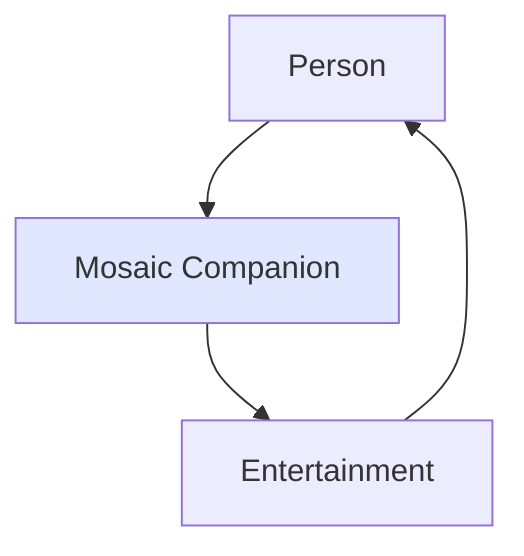

<!--
File: docs/design/language/mdl-001-vision/02-vision.md
Document: MDL-001
Chapter: 02
Title: Vision
Status: Draft
Version: 0.2
-->

# Vision

---

# Purpose

This chapter defines the long-term vision of Mosaic.

Unlike a mission statement, which explains what an organisation does today, this vision describes the future Mosaic is attempting to create.

It is intentionally aspirational.

It should remain relevant regardless of future implementation details, programming languages, client technologies or architectural changes.

A good product vision acts as a long-lived decision filter rather than a feature list.  [IBM](https://www.ibm.com/docs/en/engineering-lifecycle-management-suite/doors-next/beta?topic=requirements-vision-document)

---

# Vision Statement

> **Mosaic exists to remove the friction between people and the entertainment they love.**

Entertainment should feel like one continuous experience.

Not a collection of disconnected applications.

Not a collection of disconnected services.

Not a collection of disconnected file formats.

Whether someone is watching a television series, reading a novel, listening to music or exploring an anime franchise, they should remain inside the same entertainment world.

The software should quietly adapt around them.

---

# Long-Term Vision

The long-term ambition of Mosaic is not to become the largest media platform.

Nor is it to become the most feature-rich media server.

The ambition is significantly simpler.

> **To become the most thoughtful companion for personal entertainment.**

Mosaic should become software that understands what someone is currently enjoying and naturally helps them continue that experience without introducing unnecessary mental effort.

---

# The Future We Are Designing

When Mosaic succeeds:

People stop thinking about applications.

People stop thinking about libraries.

People stop thinking about metadata.

People stop thinking about file formats.

Instead they simply think about:

- what they are enjoying
- what they want to continue
- what they might explore next

The software becomes invisible.

The entertainment becomes memorable.

---

# What Mosaic Is

Mosaic is:

- an entertainment companion
- a contextual experience
- a continuous entertainment world
- a platform that quietly adapts
- software that values immersion over engagement

It exists to strengthen the relationship between people and the media they already love.

---

# What Mosaic Is Not

Mosaic is **not**:

- another streaming service
- another recommendation engine
- another dashboard
- another library manager
- another media server with a different theme

These products optimise different outcomes.

Mosaic intentionally optimises something else.

Immersion.

---

# Guiding Belief

The vision of Mosaic is founded upon one simple belief.

> **Personal entertainment should be effortless, allowing anyone to melt into their own private world without friction.**

Everything that follows within the Mosaic Design Language exists to support this belief.

---

# The Companion Philosophy

Mosaic should behave like a knowledgeable companion.

A companion does not dominate a conversation.

A companion does not constantly interrupt.

A companion does not attempt to redirect attention elsewhere.

Instead, a companion quietly supports the experience already taking place.

Examples include:

- reminding someone when the next episode airs
- revealing the novel that inspired a film
- showing the soundtrack currently playing
- helping continue a manga after the anime ends

These interactions deepen the user's existing interest.

They do not attempt to replace it.

---

# Enhancement Over Persuasion

Many modern entertainment platforms optimise for engagement.

They attempt to persuade users to begin something different.

Trending lists.

Featured releases.

Algorithmic promotion.

Infinite feeds.

Mosaic deliberately rejects this model.

Its purpose is not to maximise consumption.

Its purpose is to deepen enjoyment.

The distinction is subtle but fundamental.

Commercial platforms ask:

> *"What should this person watch next?"*

Mosaic asks:

> *"How can we help them enjoy what they've already chosen?"*

---

# The Interface Should Disappear

The greatest compliment Mosaic can receive is not:

> "That interface is beautiful."

Instead it is:

> "I forgot the software was there."

Once playback begins...

Once reading begins...

Once listening begins...

The interface has completed its primary responsibility.

At that point the entertainment should become the sole focus.

This principle influences every future decision regarding motion, navigation, composition and visual hierarchy.

---

# Relationship to the Roadmap

The long-term technical roadmap describes Mosaic evolving from a compatibility layer into a native entertainment platform with richer metadata, contextual experiences, adaptive composition and first-class support for multiple media domains.

The vision defined by MDL-001 exists independently of those implementation phases.

Whether realised through a Jellyfin compatibility layer, a native GraphQL client or future platform technologies, the objective remains unchanged:

> Remove friction.

> Preserve immersion.

> Strengthen the relationship between people and their entertainment.

---

# Vision Diagram

The software exists only to strengthen the connection between the person and their entertainment.

It should never become the destination itself.

---

# Success Criteria

Five years after release, contributors should be able to describe Mosaic without mentioning:

- GraphQL
- Go
- WebAssembly
- HTMX
- Jellyfin
- SQLite
- Components
- Themes

Instead they should describe:

- the experience
- the philosophy
- the feeling

If implementation details become easier to explain than the vision itself, the product has drifted away from its original purpose.

---

# Review Status

**Status**

Draft

**Architectural Decisions Introduced**

- ADR-007 — Mosaic is an entertainment companion rather than a media platform.
- ADR-008 — The interface exists to deepen enjoyment, never redirect attention.
- ADR-009 — Success is measured by immersion rather than feature count.

**Next File**

`03-product-beliefs.md`