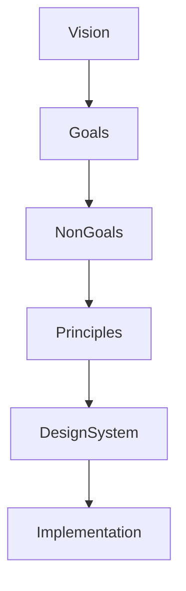

<!--
File: docs/design/language/mdl-001-vision/05-non-goals.md
Document: MDL-001
Chapter: 05
Title: Non-Goals
Status: Draft
Version: 0.2
-->

# Non-Goals

---

# Purpose

A strong vision is defined as much by what it refuses to become as by what it aspires to achieve.

Non-goals exist to protect the long-term identity of Mosaic.

Every successful platform eventually encounters feature requests, architectural proposals and community contributions that appear individually reasonable but collectively move the product away from its original purpose.

This chapter establishes the boundaries of the Mosaic Design Language.

These are deliberate decisions.

They are not limitations.

Research and industry guidance consistently recommend documenting explicit non-goals because they reduce scope creep and provide a shared framework for rejecting ideas that fall outside the product vision.  [Courses at Washington](https://courses.cs.washington.edu/courses/cse403/24au/lectures/04-requirements.pdf)

---

# NG-001

## Mosaic Is Not A Streaming Service

Mosaic does not exist to compete with commercial streaming platforms.

It is not responsible for:

- licensing content
- promoting content
- producing original content
- maximising viewing hours
- advertising releases

The software exists to help people enjoy **their** entertainment.

Not ours.

---

# NG-002

## Mosaic Does Not Optimise Engagement

Many entertainment platforms optimise:

- daily active users
- watch time
- session length
- recommendation click-through
- autoplay completion

These are valid commercial objectives.

They are not Mosaic objectives.

Mosaic optimises:

- immersion
- continuity
- comfort
- understanding
- trust

These metrics may occasionally conflict.

When they do, immersion takes priority.

---

# NG-003

## Mosaic Does Not Tell People What They Should Enjoy

The interface should never attempt to replace the user's interests with its own.

Examples of behaviour Mosaic intentionally avoids:

- "Trending Now"
- "Because everyone else watched..."
- "Editor's Picks"
- "Popular This Week"

These may exist as optional modules or community modules.

They are not part of the Platform foundation Mosaic experience.

The Platform foundation always begins with the user's current context.

---

# NG-004

## Mosaic Is Not A Dashboard

Dashboards optimise visibility.

Mosaic optimises understanding.

A dashboard attempts to display everything simultaneously.

Mosaic deliberately hides complexity until it becomes useful.

The interface should reveal information progressively as context changes.

Users should never feel overwhelmed simply because more information exists.

---

# NG-005

## Mosaic Does Not Reward Complexity

Additional features do not automatically improve the experience.

A proposal that adds capability while increasing friction should be viewed critically.

The preferred solution is often:

- fewer controls
- fewer screens
- fewer decisions
- fewer interruptions

Design maturity is measured by thoughtful restraint rather than feature quantity.

---

# NG-006

## Mosaic Is Not Built Around Pages

Traditional applications organise experiences around navigation.

```
Home

↓

Library

↓

Series

↓

Season

↓

Episode
```

Mosaic intentionally moves away from this model.

Future MDL specifications define the interface as a continuously evolving composition rather than a sequence of pages.

This distinction influences every later specification but is introduced here to establish intent.

---

# NG-007

## Mosaic Does Not Expose Internal Architecture

Users should never need to understand:

- GraphQL
- Jellyfin compatibility
- module boundaries
- storage engines
- metadata providers
- caching strategies

Implementation details belong to engineering.

The user experience should remain independent from technical architecture.

---

# NG-008

## Mosaic Does Not Allow Visual Competition

The interface should never compete with entertainment artwork.

Artwork communicates:

- emotion
- identity
- atmosphere

The interface communicates:

- structure
- hierarchy
- continuity

If interface chrome becomes more visually interesting than the content itself, the design has failed.

---

# NG-009

## Mosaic Is Not A Recommendation Engine

Recommendations are a consequence of context.

They are not the purpose of the platform.

Mosaic should avoid behaviour that attempts to maximise engagement through algorithmic persuasion.

Instead, recommendations should answer questions such as:

- What naturally comes next?
- What belongs with this?
- What completes this experience?

---

# NG-010

## Mosaic Does Not Sacrifice Clarity For Novelty

Innovation is encouraged.

Novelty is not.

Every interaction must remain immediately understandable.

If a new interaction requires explanation before it becomes usable, it should be reconsidered.

Originality is valuable only when it improves understanding.

---

# Trade-off Philosophy

Whenever uncertainty exists, contributors should ask:

> **Does this make Mosaic more like a companion... or more like a platform?**

If the proposal pushes Mosaic towards becoming another platform competing for attention, it should be reconsidered.

If the proposal strengthens Mosaic as a trusted companion, it is likely aligned with the vision.

---

# Examples

## Good

A user finishes an anime episode.

Mosaic presents:

- the next episode release date
- manga continuation
- soundtrack
- production notes

The current experience is deepened.

---

## Poor

A user finishes an anime episode.

Mosaic replaces the screen with:

- trending releases
- unrelated recommendations
- promoted content
- autoplay trailers

The user's attention has been redirected away from their original interest.

---

# Relationship To Future Specifications

These non-goals establish constraints for every downstream MDL and MDS document.

Future specifications should not introduce behaviour that contradicts these boundaries without first proposing a formal amendment to MDL-001.



Non-goals are not restrictions on creativity.

They are protections for product identity.

---

# Architectural Decisions

| ADR | Decision |
|------|----------|
| ADR-018 | Engagement optimisation is explicitly outside the scope of Mosaic. |
| ADR-019 | The interface must never become more important than the entertainment. |
| ADR-020 | Internal architecture must remain invisible to users. |
| ADR-021 | Product identity is protected through explicit non-goals. |

---

# Review Status

**Status**

Draft

**Outstanding Questions**

None.

**Next File**

`06-design-philosophy.md`