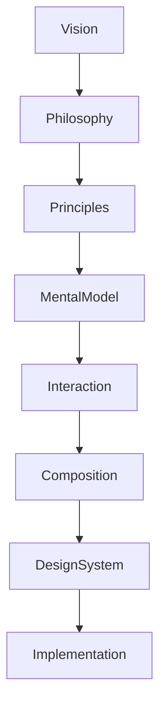

<!--
File: docs/design/language/mdl-001-vision/09-contributor-guidance.md
Document: MDL-001
Chapter: 09
Title: Contributor Guidance
Status: Draft
Version: 0.2
-->

# Contributor Guidance

---

# Purpose

The Mosaic Design Language is intended to outlive individual contributors.

This chapter exists to ensure that every designer, engineer and community contributor approaches the product using the same mental model.

It is not a coding standard.

It is not a visual style guide.

It is guidance for making decisions.

Good design system documentation explains not only *what* exists, but *why*, *when* and *how* contributors should use it, reducing inconsistency as teams grow.  [Magic Patterns](https://www.magicpatterns.com/blog/design-system-documentation)

---

# The Responsibility Of Every Contributor

Every contribution changes the experience of using Mosaic.

Whether writing backend services, designing interactions or implementing components, contributors are responsible for protecting the philosophy established by MDL.

Every contribution should leave the product:

- simpler
- calmer
- easier to understand
- more immersive
- more coherent

No contribution should exist purely because it is technically possible.

---

# The Contributor Mindset

Before beginning implementation, contributors should understand one fundamental truth.

> **You are not building screens.**

You are building an entertainment companion.

Everything else follows from that statement.

---

# Five Questions

Before opening a Pull Request, every contributor should answer the following questions.

## 1.

Does this reduce friction?

If the proposal introduces additional steps, navigation or mental effort, reconsider the design.

---

## 2.

Does this preserve immersion?

Will someone remain focused on their entertainment...

...or will they become focused on the software?

---

## 3.

Does this respect the user's current context?

Does the proposal strengthen what the user is already doing...

...or attempt to redirect them somewhere else?

---

## 4.

Does this strengthen existing systems?

Can this capability be expressed using:

- existing composition rules
- existing interaction patterns
- existing terminology
- existing materials

or is it introducing unnecessary exceptions?

---

## 5.

Would a trusted companion behave this way?

This question should become instinctive.

If the answer is:

"No."

The proposal almost certainly requires redesign.

---

# Contribution Hierarchy

When making decisions, contributors should follow this hierarchy.

Contributors should avoid solving disagreements by introducing implementation-specific arguments before checking the higher levels of the hierarchy.

---

# What Good Contributions Look Like

Good contributions typically:

- simplify existing interactions
- strengthen consistency
- reduce cognitive effort
- remove unnecessary options
- improve accessibility
- reuse existing systems
- make future work easier

Good contributions often remove more than they add.

---

# What Poor Contributions Look Like

Poor contributions often:

- introduce competing interaction models
- duplicate existing capabilities
- expose implementation details
- prioritise novelty over clarity
- increase visual noise
- increase configuration complexity
- solve one feature while weakening the overall experience

These proposals should be challenged regardless of implementation quality.

---

# Designing New Features

When proposing a new feature, contributors should avoid asking:

> "Where should this screen go?"

Instead ask:

> "What problem is the user experiencing?"

Then ask:

> "Can the existing Mosaic systems solve this naturally?"

New systems should be introduced only when existing systems genuinely cannot support the required experience.

---

# Extending Rather Than Replacing

Every new contribution should attempt to strengthen an existing system before creating another.

Examples include:

Prefer:

- extending composition rules

instead of:

- introducing a new layout model

Prefer:

- extending tile behaviour

instead of:

- inventing a new visual primitive

Prefer:

- extending interaction patterns

instead of:

- introducing isolated behaviours

This philosophy reduces long-term design fragmentation.

---

# Language Matters

Contributors should use MDL terminology consistently.

For example:

| Avoid | Prefer |
|--------|---------|
| Screen | Composition |
| Dashboard | World / Composition |
| Widget | Tile (until superseded by future Information Model) |
| Recommendation Engine | Companion |
| Navigation | Focus Change |

Consistent language produces consistent thinking.

Future specifications define this vocabulary formally.

---

# Design Reviews

Every significant proposal should include answers to the following questions.

- Which MDL principle does this reinforce?
- Which user problem does this solve?
- Does it introduce additional friction?
- Does it reduce immersion?
- Can the same outcome be achieved using an existing system?
- Does this strengthen Mosaic as a companion?

Review comments should reference MDL sections rather than personal preference whenever possible.

---

# Community Contributions

Community contributions are encouraged.

However, acceptance is determined by alignment with MDL rather than popularity.

A proposal should demonstrate that it:

- serves a genuine user need
- aligns with established philosophy
- reuses existing systems where possible
- does not duplicate existing capabilities

These contribution criteria mirror the governance models used by mature design systems, where proposals must demonstrate usefulness, consistency and broad applicability before becoming part of the Platform foundation system.  [GOV.UK Design System](https://design-system.service.gov.uk/community/contribution-criteria/)

---

# A Simple Rule

If contributors remember only one sentence from this chapter, it should be this:

> **Build experiences people forget they are using.**

People should remember:

- the story
- the music
- the characters
- the artwork

They should rarely remember the interface.

That is considered success.

---

# Architectural Decisions

| ADR | Decision |
|------|----------|
| ADR-030 | Contributors should solve user problems before proposing interface changes. |
| ADR-031 | Existing systems should be strengthened before new systems are introduced. |
| ADR-032 | Design discussions should reference MDL rather than personal preference. |
| ADR-033 | Community contributions are evaluated by alignment with MDL, not popularity. |

---

# Review Status

**Status**

Draft

**Outstanding Questions**

The formal terminology table will be expanded by **MDL-005 Vocabulary**.

**Next File**

`10-design-review-checklist.md`