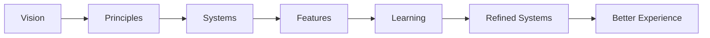

<!--
File: docs/design/language/mdl-001-vision/11-future-considerations.md
Document: MDL-001
Chapter: 11
Title: Future Considerations
Status: Draft
Version: 0.2
-->

# Future Considerations

---

# Purpose

MDL-001 intentionally defines a vision rather than a complete solution.

As Mosaic evolves, new technologies, interaction models and user expectations will emerge.

This chapter documents areas that are expected to evolve while preserving the philosophy established by MDL-001.

Future considerations are **not commitments**.

They are strategic directions that should be explored when they strengthen the Platform foundation vision.

A mature design language should provide long-term direction while remaining flexible enough to accommodate future implementation and organisational changes.  [U.S. Web Design System (USWDS)](https://designsystem.digital.gov/next/looking-ahead/vision/)

---

# Guiding Principle

The philosophy of Mosaic should remain significantly more stable than its implementation.

Over the lifetime of the project we expect:

- programming languages to change
- frameworks to change
- rendering engines to change
- devices to change
- interaction models to change

The experience people have when using Mosaic should remain recognisably Mosaic.

---

# Future Direction 01

## Information-Driven Experiences

Current software generally renders interfaces first.

Information is inserted afterwards.

Long-term, Mosaic should move towards the opposite model.

```
Knowledge

↓

Relationships

↓

Composition

↓

Presentation
```

Rather than asking:

> Which widget should we display?

Future systems should ask:

> What information best helps the user right now?

This distinction may ultimately influence:

- GraphQL
- module APIs
- runtime composition
- adaptive interfaces

This concept is intentionally deferred to future MDL and MDS specifications.

---

# Future Direction 02

## Adaptive Composition

Traditional applications navigate between pages.

Mosaic should continue exploring adaptive composition.

Future research areas include:

- context-aware layouts
- relationship-driven composition
- adaptive emphasis
- progressive disclosure
- composition solving

The objective is not novelty.

The objective is reducing cognitive effort.

---

# Future Direction 03

## Rich Relationships

Entertainment consists of relationships rather than isolated media.

Examples include:

- books adapted into films
- anime adapted from manga
- actors appearing across franchises
- composers contributing to multiple works
- directors influencing visual style

Future Mosaic experiences should increasingly surface these relationships naturally.

Users should discover more about what they already enjoy.

Not simply more content.

---

# Future Direction 04

## Atmosphere

Artwork already provides emotional context.

Future material systems should continue exploring:

- contextual atmosphere
- adaptive lighting
- artwork-informed materials
- environmental continuity

The interface should remain structurally consistent while allowing each entertainment world to possess its own atmosphere.

Brand identity must remain recognisable.

Atmosphere must never replace branding.

---

# Future Direction 05

## Device Independence

The user's world should not depend upon the device they happen to be using.

Desktop.

Tablet.

Television.

Mobile.

Automotive.

Future devices.

Each should represent the same underlying world using an interaction model appropriate for the device.

The world remains constant.

Only its expression changes.

---

# Future Direction 06

## Companion Intelligence

The role of the companion should become progressively more helpful without becoming more intrusive.

Future companion capabilities may include:

- remembering unfinished experiences
- surfacing useful relationships
- anticipating contextual information
- simplifying discovery

The companion should never become conversational for its own sake.

Nor should it interrupt entertainment unnecessarily.

The companion exists to reduce effort.

Not increase interaction.

---

# Future Direction 07

## Module Ecosystem

The Mosaic module ecosystem should strengthen rather than fragment the product.

Future module systems should prioritise:

- shared terminology
- shared interaction models
- shared composition rules
- shared visual language

Modules should feel native.

Users should rarely distinguish between:

Mosaic Platform

and

Community modules.

---

# Future Direction 08

## Accessibility As A Design Driver

Accessibility should continue evolving from:

> compliance

towards

> experience quality.

Future accessibility work should consider:

- cognitive accessibility
- reduced motion
- adaptive density
- alternative composition strategies
- assistive interaction models

Accessibility should improve every experience rather than existing as a separate mode.

---

# Things We Expect To Learn

The following assumptions should be continuously validated.

- Does adaptive composition genuinely reduce cognitive effort?
- Does contextual assistance increase trust?
- Does the companion metaphor remain effective as Mosaic grows?
- Which interaction models become intuitive over time?
- Which concepts require simplification?

Design language should evolve through evidence rather than fashion.

---

# Things We Expect To Reject

The following directions are unlikely to align with MDL unless compelling evidence emerges.

- engagement optimisation
- infinite promotional feeds
- algorithmic persuasion
- interface-first design
- attention-maximising notifications
- arbitrary visual novelty

Future contributors proposing these approaches should provide evidence that they strengthen, rather than weaken, the vision established by MDL-001.

---

# Long-Term Vision

The ultimate ambition of Mosaic is not to become invisible through minimalism.

It becomes invisible because users trust it.

When trust exists:

People stop thinking about software.

They simply continue enjoying entertainment.

That remains the long-term objective regardless of how the underlying platform evolves.

---

# Evolution Model



Notice that the vision never changes.

Only the understanding of how best to realise it.

---

# Architectural Decisions

| ADR | Decision |
|------|----------|
| ADR-037 | Future implementation should evolve without redefining the Platform foundation philosophy. |
| ADR-038 | Information is expected to become increasingly independent from presentation. |
| ADR-039 | Accessibility is considered a driver of better design rather than a compliance exercise. |
| ADR-040 | Future innovation must strengthen the companion philosophy rather than replace it. |

---

# Review Status

**Status**

Draft

**Outstanding Questions**

The Information-Driven Experience model should be formalised during MDL-003 (Mental Model) and MDS-003 (Composition Engine).

**Next File**

`glossary.md`