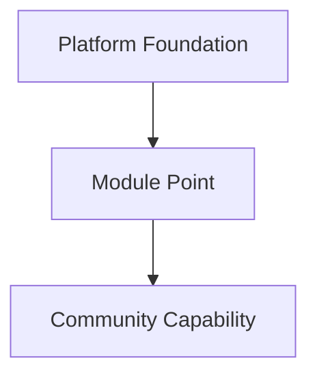
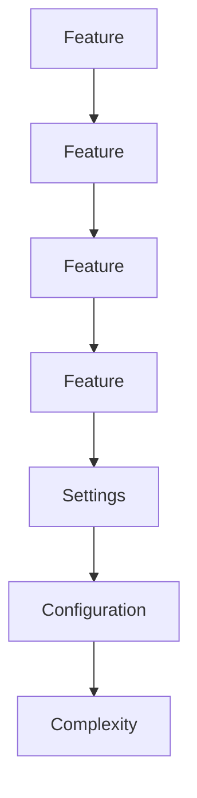

<!--
File: docs/design/language/mdl-002-principles/08-principle-06-the-platform-enables.md
Document: MDL-002
Chapter: 08
Principle: 06
Title: The Platform Enables
Status: Draft
Version: 0.4
-->

# Principle 06 — The Platform Enables

---

# Principle Statement

> **The Mosaic Platform should solve universal problems. Specialised experiences should emerge through modules rather than expansion of the Platform foundation.**

Mosaic is designed as a platform.

Not because modules are fashionable.

Because no central team can anticipate every way people wish to enjoy entertainment.

The responsibility of the Platform foundation is therefore to provide excellent foundations rather than infinite features.

---

# Why This Principle Exists

Software inevitably grows.

Without clear architectural boundaries, every successful feature request becomes another permanent responsibility of the Platform application.

Eventually:

- navigation expands
- settings multiply
- interactions diverge
- maintenance slows
- innovation becomes more difficult

A platform avoids this by distinguishing between:

- universal capabilities
- specialised capabilities

Universal capabilities belong in the Platform foundation.

Specialised capabilities belong behind module boundaries.

Extensible platform architectures consistently favour a stable foundation with well-defined module boundaries, allowing innovation without increasing coupling or destabilising the platform.  [arc42 Quality Model](https://quality.arc42.org/approaches/plugin-architecture)

---

# Definition

Within MDL, **the platform** is defined as:

> The collection of systems that every Mosaic experience depends upon.

Examples include:

- authentication
- composition
- playback
- navigation
- search
- materials
- design language
- module framework

Everything else should justify why it belongs inside the Platform foundation.

---

# The Responsibility Of The Platform Foundation

The Platform foundation owns:

- consistency
- composition
- accessibility
- interaction
- terminology
- behaviour
- quality

The Platform foundation should not attempt to own every possible entertainment experience.

Instead, it provides the environment within which those experiences can exist.

---

# The Responsibility Of Modules

Modules exist to provide:

- new domains
- specialised metadata
- community integrations
- experimental capabilities
- niche workflows

Modules should extend Mosaic.

They should not become independent applications running inside Mosaic.

---

# Platform Foundation First

When evaluating a proposal, contributors should first ask:

> **Is this solving a universal problem?**

If the answer is yes...

The capability probably belongs in the Platform foundation.

Examples:

- playback
- progress
- collections
- navigation
- accessibility

---

# Module First

If the proposal instead answers:

> **Only some users need this.**

The default assumption should become:

Module.

Examples include:

- manga providers
- audiobook integrations
- torrent health
- franchise-specific metadata
- community statistics

The burden of proof lies with moving functionality into the Platform foundation.

Not the module ecosystem.

---

# The Platform Contract

The platform promises:

- consistency
- stability
- accessibility
- composition
- behaviour

Modules promise:

- knowledge
- capability
- integration
- specialisation

Neither should attempt to perform the other's responsibilities.

---

# The UI Belongs To Mosaic

One of the most important architectural consequences of this principle is ownership of the interface.

Modules should not create arbitrary interfaces.

Modules should contribute capability.

The platform decides presentation.

This ensures:

- consistency
- accessibility
- device independence
- future evolution

Future MDS specifications are expected to formalise this separation through the Composition Engine and Information Model.

---

# Example

## Good

Anime module contributes:

```

Episode Release

Tomorrow
```

Book module contributes:

```

Chapter Progress

12 / 18
```

The platform determines:

- composition
- hierarchy
- movement
- materials
- interaction

Every module therefore feels native.

---

## Poor

Anime module renders:

- custom navigation
- custom cards
- custom animations
- custom spacing
- custom typography

The platform has lost ownership of the experience.

Users now experience multiple competing design languages.

---

# Platform Growth

Growth should occur through stronger systems.

Not larger systems.

Good platform evolution looks like:



Poor platform evolution looks like:



The objective is sustainable growth.

Not unlimited growth.

---

# Relationship To Other Principles

This principle reinforces:

- Every Feature Earns Its Place
- Be A Companion
- Content Leads

It also provides the architectural foundation for:

- Module Framework
- Composition Engine
- Runtime Systems
- Information Model

---

# Review Questions

Before approving a proposal ask:

- Does every Mosaic user require this capability?
- Can the existing platform already support it?
- Would a module provide the same value?
- Does this strengthen the platform or enlarge it?
- Is the proposal introducing a capability or a dependency?

If uncertainty remains, contributors should default towards module implementation rather than Platform implementation.

---

# Litmus Test

A proposal belongs in the platform if removing it would fundamentally weaken Mosaic.

A proposal belongs in a module if removing it only affects a particular audience or workflow.

The platform should remain intentionally small.

Its capabilities should remain intentionally powerful.

---

# Summary

Platforms do not become successful because they contain every feature.

They become successful because they enable others to build features without weakening the foundation.

Mosaic should grow by strengthening its systems.

Not by endlessly expanding the Platform foundation.

---

# Related Specifications

- [MDL-001 — Mosaic Design Language Vision](../mdl-001-vision/index.md)
- [MDL-005 — Composition Model](../mdl-005-composition-model/index.md)
- [MDP-001 — Adaptive Composition Runtime](../../../engineering/architecture/mdp-001-adaptive-composition-runtime/index.md)
- MDS-011 Module Design Specification *(planned; not yet published)*

---

# Architectural Decisions

| ADR | Decision |
|------|----------|
| ADR-020 | The Platform foundation owns behaviour, consistency and presentation. |
| ADR-021 | Modules own specialised capability rather than interface. |
| ADR-022 | Platform growth should occur through module boundaries before Platform expansion. |
