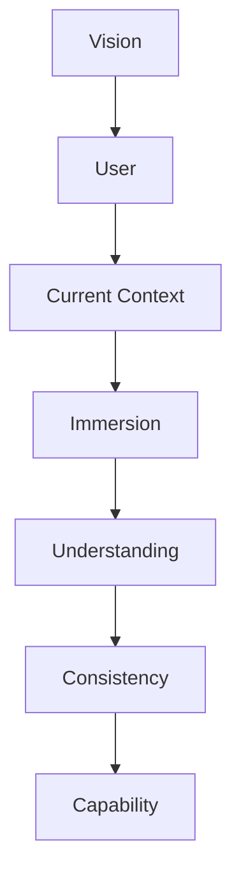
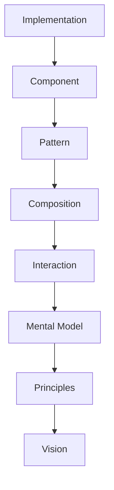

<!--
File: docs/design/language/mdl-002-principles/10-when-principles-conflict.md
Document: MDL-002
Chapter: 10
Title: When Principles Conflict
Status: Draft
Version: 0.2
-->

# When Principles Conflict

---

# Purpose

Design principles are not algorithms.

They do not produce a single objectively correct answer.

Instead, they provide a framework for making consistent decisions when multiple good solutions exist.

This chapter defines how contributors should resolve situations where two or more principles appear to recommend different approaches.

Principles are valuable precisely because they help teams navigate trade-offs rather than simply describing aspirations.  [Design Principles](https://principles.design/field-guide/)

---

# Conflict Is Expected

Conflicting principles are not a flaw.

They are evidence that a design problem contains genuine trade-offs.

Examples include:

- Simplicity vs Discoverability
- Context vs Exploration
- Continuity vs Efficiency
- Platform Consistency vs Module Flexibility

The objective is not to eliminate these tensions.

The objective is to resolve them consistently.

---

# The Resolution Hierarchy

When principles conflict, contributors should evaluate them using the following order.

Higher levels always possess greater authority than lower levels.

If satisfying a lower-level principle weakens a higher-level one, the higher-level principle should prevail.

---

# Step One

## Return To The Vision

Every disagreement should begin by asking:

> Which option more closely fulfils the vision established in MDL-001?

If one proposal clearly removes more friction or preserves immersion more effectively, the discussion is complete.

No further comparison is required.

---

# Step Two

## Consider The User's Current Context

If both proposals satisfy the vision equally, ask:

> Which proposal better supports the user's current activity?

Current context always has priority over speculative future value.

Example.

Proposal A:

Expose ten recommendations.

Proposal B:

Expose one recommendation directly related to the current media.

Proposal B better supports the user's current context.

---

# Step Three

## Preserve Understanding

If both proposals support the current context equally, evaluate understanding.

Questions include:

- Which proposal is easier to explain?
- Which proposal requires fewer assumptions?
- Which proposal preserves the user's mental model?
- Which proposal introduces fewer surprises?

Understanding is considered more valuable than cleverness.

---

# Step Four

## Preserve Consistency

Consistency should be considered only after:

- vision
- context
- understanding

have already been satisfied.

Consistency is important because it builds trust.

Consistency is not important enough to preserve poor experiences.

A genuinely better interaction should not be rejected simply because it differs from an older implementation.

Instead, contributors should evaluate whether the existing implementation should evolve.

---

# Step Five

## Introduce Capability

New capability should normally be the final consideration.

The existence of a technically impressive feature is not sufficient justification for its inclusion.

Capability is valuable only when it strengthens:

- understanding
- immersion
- trust
- continuity

---

# Worked Example

## Scenario

A contributor proposes displaying globally trending films on the home composition.

The proposal increases discoverability.

However, it also distracts from the user's current entertainment context.

---

### Principle Analysis

| Principle | Result |
|-----------|--------|
| Context Before Prediction | Conflicts |
| Enhancement Before Persuasion | Conflicts |
| Content Leads | Neutral |
| Movement Preserves Understanding | Neutral |
| Every Feature Earns Its Place | Unclear |
| Platform Enables | Neutral |
| Be A Companion | Conflicts |

Three governing principles conflict with the proposal.

The proposal should therefore be rejected or redesigned.

---

# Another Example

## Scenario

A module introduces audiobook progress.

Should it create a custom interface...

...or integrate with the existing Progress system?

---

### Principle Analysis

| Principle | Result |
|-----------|--------|
| Every Feature Earns Its Place | Existing system preferred |
| Platform Enables | Existing system preferred |
| Be A Companion | Existing system preferred |

The proposal naturally integrates with the existing Progress model.

No new interaction model is introduced.

---

# Escalation

Some conflicts cannot be resolved locally.

When this occurs, contributors should escalate upwards through the MDL hierarchy.

The first layer capable of resolving the disagreement should own the decision.

Escalating beyond that layer is unnecessary.

---

# Irreconcilable Conflicts

Occasionally two principles may appear equally valid.

When this occurs:

1. Document the conflict.
2. Create an ADR.
3. Record the alternatives considered.
4. Perform user validation where appropriate.
5. Update the specification if required.

Philosophy should evolve deliberately.

Never accidentally.

---

# Things That Should Never Resolve A Conflict

The following should never be used as primary decision criteria.

- Personal preference
- Visual novelty
- Existing implementation
- Technical convenience
- "We've always done it this way."
- Framework limitations

These may influence implementation.

They should never override MDL.

---

# Review Questions

When reviewing conflicting proposals ask:

- Which proposal better fulfils the vision?
- Which proposal reduces more friction?
- Which proposal better respects the current context?
- Which proposal preserves understanding?
- Which proposal would still make sense five years from now?

If uncertainty remains after these questions, additional user research or prototyping should be preferred over assumption.

---

# Summary

Principles are not intended to eliminate difficult decisions.

They exist to make difficult decisions consistent.

Whenever two good solutions exist:

The proposal that most strongly reinforces the Mosaic vision should always prevail.

---

# Architectural Decisions

| ADR | Decision |
|------|----------|
| ADR-027 | Principle conflicts are resolved using a defined hierarchy rather than subjective preference. |
| ADR-028 | Vision always possesses higher authority than implementation. |
| ADR-029 | User context is prioritised over discoverability when principles conflict. |

---

# Review Status

**Status**

Draft

**Next File**

`11-governance.md`
