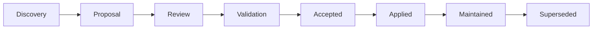

<!--
File: docs/design/language/mdl-002-principles/11-governance.md
Document: MDL-002
Chapter: 11
Title: Principle Governance
Status: Draft
Version: 0.2
-->

# Principle Governance

---

# Purpose

Principles only create value when they continue to influence decisions after they are written.

This chapter defines how the principles contained within MDL-002 are maintained, challenged, evolved and applied throughout the lifetime of Mosaic.

The purpose of governance is not enforcement.

The purpose of governance is preserving coherence while allowing thoughtful evolution.

---

# Principles Are Product Infrastructure

Within Mosaic, principles are treated as product infrastructure.

Just as engineering protects:

- APIs
- schemas
- protocols
- compatibility

MDL protects:

- decision making
- experience
- behaviour
- product identity

Breaking a principle should therefore be considered a significant architectural change rather than a routine design decision.

---

# Principle Lifecycle

Every principle follows the same lifecycle.



A principle should only enter the design language after repeated validation across multiple problems.

One successful feature is insufficient evidence.

---

# Stability Expectations

The expected lifetime of a principle is measured in years rather than releases.

| Artefact | Expected Lifetime |
|----------|-------------------|
| Components | Months |
| Patterns | Months to Years |
| Tokens | Years |
| Principles | Years |
| Vision | Decades |

This intentional stability allows implementation to evolve while preserving the identity of the product.

---

# Modifying A Principle

A principle should never change because:

- implementation became difficult
- another framework behaves differently
- a single feature requires an exception
- a contributor prefers another approach

A principle should change only when there is evidence that it no longer produces the desired user experience.

Evidence may include:

- repeated design conflicts
- user research
- accessibility findings
- architectural limitations
- long-term product evolution

---

# Exception Process

Occasionally a proposal will appear to conflict with an existing principle.

Before introducing an exception contributors should ask:

1. Have we interpreted the principle correctly?
2. Can an existing system solve the problem?
3. Does the proposal reveal a gap elsewhere in MDL?
4. Is this actually a new pattern rather than an exception?

Exceptions should remain genuinely exceptional.

Repeated exceptions indicate the principle requires revision.

---

# Principle Reviews

Every major design proposal should explicitly identify:

- which principles it reinforces
- which principles it weakens
- why those trade-offs are acceptable

Design reviews should reference principle identifiers rather than personal preference.

Example:

```
Supports

P-03
Content Leads

Supports

P-07
Be A Companion

Potential Conflict

P-05
Every Feature Earns Its Place
```

This creates objective discussions rather than subjective ones.

---

# Principle Ownership

Each principle has a steward.

Stewardship exists to maintain quality.

It does not imply exclusive ownership.

| Role | Responsibility |
|------|----------------|
| Founder | Product intent |
| Lead Design Systems Architect | Principle integrity |
| Engineering | Technical implications |
| Community | Feedback and evidence |

Healthy principles improve through contribution.

They should never become personal property.

---

# Design Drift

The greatest long-term risk to MDL is not incorrect implementation.

It is gradual design drift.

Design drift occurs when:

- terminology changes
- interaction models multiply
- exceptions accumulate
- similar problems receive different solutions
- contributors optimise locally rather than globally

Principles exist specifically to reduce drift.

Whenever drift is identified, contributors should first examine whether the relevant principle is being consistently applied.

---

# Measuring Principle Health

A principle should periodically be evaluated against the following questions.

## Clarity

Can new contributors understand the principle?

---

## Applicability

Does it influence real design decisions?

---

## Consistency

Do different contributors reach similar conclusions?

---

## Longevity

Has the principle remained useful as Mosaic evolved?

---

## Alignment

Does it still reinforce the Vision?

A principle failing several of these questions should enter formal review.

---

# Deprecating Principles

Principles should rarely be removed.

When necessary they should become:

Superseded

rather than

Deleted.

Historical decisions remain valuable.

Future contributors should understand:

- why the principle existed
- why it changed
- what replaced it

Maintaining decision history is a common governance practice because it preserves architectural reasoning rather than only documenting the latest state.  [Ramotion](https://www.ramotion.com/blog/design-system-guide-chapter-2-principles-and-governance/)

---

# Governance Checklist

Before modifying MDL-002 ensure:

- [ ] User evidence exists.
- [ ] Alternatives were documented.
- [ ] Existing principles were considered.
- [ ] A new ADR has been written.
- [ ] Downstream specifications have been reviewed.
- [ ] Migration guidance has been prepared if required.

---

# Summary

Principles are not static.

Neither are they fashionable.

They should evolve deliberately, slowly and with evidence.

A design language succeeds not because it never changes...

...but because every change strengthens the system instead of fragmenting it.

---

# Architectural Decisions

| ADR | Decision |
|------|----------|
| ADR-030 | Principles are treated as long-lived architectural assets. |
| ADR-031 | Exceptions should trigger investigation before they trigger modification. |
| ADR-032 | Principle changes require evidence rather than opinion. |
| ADR-033 | Historical principle evolution must remain traceable. |

---

# Review Status

**Status**

Draft

**Next File**

`12-adrs.md`
