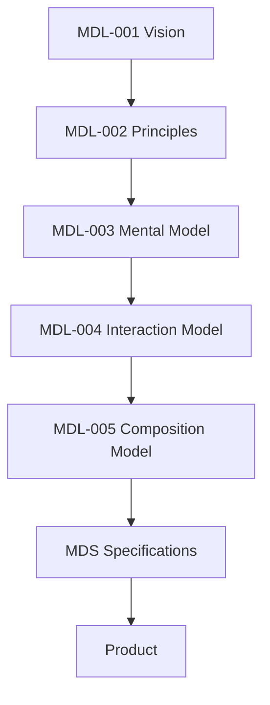

<!--
File: docs/design/language/mdl-003-mental-model/00-document-control.md
Document: MDL-003
Title: Mental Model
Status: Draft
Version: 0.2
-->

# Document Control

---

# Document Information

| Property | Value |
|----------|-------|
| Document ID | MDL-003 |
| Title | Mosaic Design Language — Mental Model |
| Classification | Internal |
| Status | Draft |
| Version | 0.1 |
| Owner | Lead Design Systems Architect |
| Parent Specifications | MDL-001 Vision, MDL-002 Principles |
| Repository | `/design/mdl/MDL-003 Mental Model/` |

---

# Purpose

MDL-003 establishes the conceptual architecture of Mosaic.

Where MDL-001 explains **why** Mosaic exists and MDL-002 explains **how** design decisions should be made, MDL-003 defines **how the platform understands the world**.

This distinction is critical.

A product's interface is only one expression of its underlying mental model.

If contributors misunderstand the mental model, every implementation built upon it becomes inconsistent regardless of visual quality.

---

# Authority

MDL-003 governs the conceptual architecture of Mosaic.

Its authority extends to:

- Product Design
- User Experience
- Information Architecture
- Composition
- Module Architecture
- GraphQL UI
- Runtime Composition
- Design Systems

MDL-003 intentionally does **not** prescribe:

- visual appearance
- implementation technologies
- rendering techniques
- framework-specific behaviour

Those concerns belong to MDS.

---

# Relationship To MDL

The Mosaic Design Language intentionally separates philosophy from implementation.

MDL-003 acts as the bridge between philosophy and behaviour.

Every interaction described by later specifications should be understandable through the concepts introduced here.

---

# Design Intent

The purpose of a mental model is not to describe software.

It is to describe reality as Mosaic understands it.

Users should never need to understand:

- databases
- APIs
- GraphQL
- modules
- rendering engines

Instead they should instinctively understand concepts such as:

- World
- Focus
- Context
- Relationships

Everything else exists to support those concepts.

---

# Why Mental Models Matter

People build mental models regardless of whether designers intentionally create one.

Poor products force users to invent inconsistent explanations.

Good products provide a simple conceptual model that naturally explains every interaction.

The objective of MDL-003 is therefore:

> **One product.**

> **One conceptual model.**

> **Infinite experiences.**

---

# Specification Objectives

Upon completing MDL-003, contributors should understand:

- what fundamentally exists inside Mosaic
- how information is organised
- why the interface behaves as it does
- how modules integrate
- why composition exists
- how future systems should evolve

without requiring implementation examples.

---

# Conceptual Stability

The concepts introduced by MDL-003 are expected to remain stable significantly longer than implementation.

Expected lifespan.

| Artefact | Expected Lifetime |
|----------|-------------------|
| Implementation | Months |
| Components | Months |
| Patterns | Years |
| Mental Model | Decades |

Changing the Mental Model should therefore be considered a major architectural event.

---

# Reader Expectations

Before continuing, contributors should already understand:

- MDL-001 Vision
- MDL-002 Principles

MDL-003 intentionally assumes familiarity with those documents.

It does not repeat them.

Instead, it builds upon them.

---

# Success Criteria

MDL-003 succeeds when:

- contributors naturally describe Mosaic using the same concepts
- modules integrate without introducing new conceptual models
- engineering systems reinforce rather than redefine product behaviour
- users rarely need explanations for how the product works

When contributors begin independently using terms such as:

- World
- Focus
- Context
- Composition

without conscious effort...

the Mental Model has become part of the culture of the project.

---

# Review Status

**Status**

Draft

**Dependencies**

- MDL-001 Vision
- MDL-002 Principles

**Supersedes**

None.

**Next File**

`01-what-is-a-mental-model.md`
