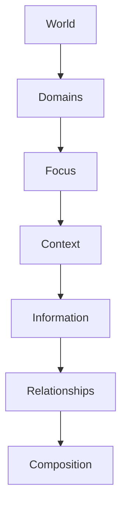

<!--
File: design/mdl/MDL-003 Mental Model/02-the-world.md
Document: MDL-003
Chapter: 02
Title: The World
Status: Draft
Version: 0.1
-->

# The World

---

# Purpose

The World is the highest-level concept within the Mosaic Mental Model.

Everything else described within MDL-003 exists inside a World.

Understanding this concept is fundamental because it changes how contributors think about the product.

Traditional media applications organise themselves around:

- libraries
- pages
- folders
- media collections

Mosaic intentionally does not.

Instead, Mosaic organises itself around **the user's entertainment world**.

---

# Definition

Within MDL, a **World** is defined as:

> **The complete representation of a person's entertainment life at a given point in time.**

A World is not:

- a page
- a library
- a dashboard
- a profile

Those are merely ways a World may be expressed.

The World is the conceptual environment within which every entertainment experience exists.

---

# Why "World"?

People rarely think about entertainment as isolated pieces of media.

Instead they naturally describe worlds.

Examples include:

> "I'm watching loads of medical dramas."

> "I've been reading Brandon Sanderson recently."

> "I've gone back into Marvel."

> "I'm catching up on this anime season."

These statements describe temporary entertainment worlds.

Not files.

Not libraries.

Not folders.

The Mental Model intentionally reflects how people naturally describe their own entertainment.

---

# A World Is Personal

Every user possesses a different World.

No two Worlds are identical.

A World reflects:

- interests
- current focus
- progress
- relationships
- collections
- history
- available entertainment

The World should therefore feel personal rather than generic.

When users open Mosaic they should immediately recognise:

> **This is my world.**

Not:

> "This is the application's homepage."

---

# The World Is Continuous

The World does not reset when users change media.

Watching:

```
Frieren
```

Reading:

```
The Hobbit
```

Listening:

```
Hans Zimmer
```

These are not separate applications.

They are different areas within the same World.

This continuity allows Mosaic to remove unnecessary mental transitions between media types.

---

# The World Evolves

A World is not static.

It continuously evolves as:

- progress changes
- episodes release
- books are completed
- albums are discovered
- plugins contribute information
- relationships become available

Importantly...

The World evolves.

It is not rebuilt.

This distinction becomes critical within later specifications covering interaction and composition.

---

# World Boundaries

A World intentionally contains everything required to understand a person's entertainment.

It includes:

- Domains
- Focus
- Context
- Information
- Relationships
- Collections
- History

It intentionally excludes:

- interface
- navigation
- layout
- rendering
- components

These belong to the presentation layer.

---

# Domains

A World contains one or more Domains.

Examples include:

```
World

├── Anime

├── Television

├── Books

├── Movies

├── Music
```

Domains organise entertainment.

They do not separate experiences.

Users remain inside the same World while moving between Domains.

---

# Multiple Worlds

Future Mosaic capabilities may introduce multiple Worlds.

Examples include:

- Personal World
- Family World
- Shared Household World
- Child World
- Temporary Watch Party World

The concept remains unchanged.

Each World simply represents a different entertainment environment.

Designing around "World" rather than "Home" allows future capabilities without redefining the Mental Model.

---

# Entering A World

Opening Mosaic should never feel like opening software.

Instead it should feel like returning to an existing place.

The first responsibility of the interface is therefore to answer one question.

> **What does my entertainment world look like right now?**

Only after establishing the World should Mosaic begin presenting:

- focus
- context
- relationships
- recommendations
- progression

Everything derives from the World.

---

# Good Examples

## Example 01

The user opens Mosaic.

Immediately visible:

- Continue Watching
- Current book
- New album from favourite artist
- Tomorrow's anime episode

The interface communicates:

> "This is your world."

---

## Example 02

The user returns after six months.

Instead of overwhelming them with everything that changed...

The World gently reflects what has changed within the entertainment they were previously enjoying.

Only when the user's Focus changes does another area of the World become dominant.

The World remains continuous.

Only emphasis changes.

---

# Anti-patterns

The following behaviours conflict with the World model.

## Dashboard Thinking

Displaying every possible metric simultaneously.

Users see software.

Not their entertainment.

---

## Application Switching

Treating books, music and television as independent products.

The World fragments.

Continuity disappears.

---

## Homepage Thinking

Assuming there is one static "home".

There is not.

The World is always changing.

The current composition merely expresses it.

---

# Conceptual Model



Everything inside Mosaic ultimately exists within a World.

Nothing should bypass this hierarchy.

---

# Design Consequences

Treating the World as the primary concept has significant consequences.

The interface becomes:

- continuous
- contextual
- adaptive
- personal

Navigation becomes:

- movement within a World

rather than

- movement between pages.

This conceptual shift forms the foundation for every subsequent chapter within MDL-003.

---

# Summary

The World is the highest-level concept within Mosaic.

It represents the user's complete entertainment environment.

Everything else exists inside it.

Users should never feel they are moving between applications.

They should feel they are exploring different parts of the same World.

---

# Review Status

**Status**

Draft

**Next File**

`03-focus.md`
