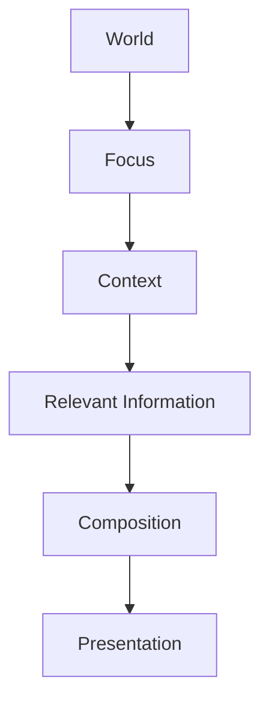

<!--
File: design/mdl/MDL-003 Mental Model/04-context.md
Document: MDL-003
Chapter: 04
Title: Context
Status: Draft
Version: 0.1
-->

# Context

---

# Purpose

If **Focus** answers:

> **"What currently matters?"**

then **Context** answers:

> **"Why does it matter right now?"**

Context transforms information into understanding.

Without Context, Mosaic becomes a sophisticated catalogue.

With Context, Mosaic becomes a companion.

Context allows the platform to understand not only **what** the user is interacting with, but **how** that interaction should influence the rest of the experience.

---

# Definition

Within MDL, **Context** is defined as:

> **The temporary circumstances surrounding the user's current Focus that determine what information is relevant at this moment.**

Context exists to answer:

- Why is this important?
- What should happen next?
- What information belongs here?
- What should be hidden?

Context is temporary.

It changes continuously.

---

# Why Context Exists

Entertainment rarely exists in isolation.

Watching an episode.

Reading a chapter.

Listening to an album.

Browsing a franchise.

Each activity creates a different set of questions.

Watching an episode naturally creates questions such as:

- Which episode is next?
- When does it release?
- How far through am I?
- Is there a manga continuation?

Reading a novel creates different questions:

- Which chapter am I on?
- How much remains?
- What other books has the author written?

The content has changed.

The questions have changed.

Therefore the Context has changed.

---

# Focus And Context

Focus and Context are intentionally separate concepts.

```
Focus

↓

The subject.

Context

↓

The circumstances.
```

Example.

```
Focus

Frieren
```

Possible Contexts:

- Watching Episode 14
- Browsing Characters
- Looking at Reviews
- Reading Manga
- Searching Similar Anime

The Focus remains identical.

The Context changes.

Consequently the interface should adapt.

---

# Context Is Temporary

Context should never permanently redefine the user's World.

Example.

```
Current Context

Searching
```

Searching is not a permanent state.

Once the search is complete, the previous Context should naturally return.

Likewise:

```
Browsing Settings
```

does not replace:

```
Watching Frieren
```

Administration is temporary.

Entertainment remains the user's World.

---

# Context Is Layered

Context may exist at several levels simultaneously.

Example.

```
World

↓

Anime

↓

Frieren

↓

Episode 14

↓

Watching
```

Each layer adds understanding.

The interface should respond primarily to the most immediate Context while preserving awareness of the surrounding layers.

---

# Context Defines Relevance

Context determines what information deserves emphasis.

Without Context:

Every piece of information appears equally valuable.

With Context:

Information naturally forms hierarchy.

Example.

Watching:

```
Episode 14
```

Relevant:

- Next Episode
- Remaining Runtime
- Playback Controls
- Watch Progress

Less Relevant:

- Complete Cast List
- Studio History
- Merchandise

The information still exists.

It simply no longer deserves primary attention.

---

# Context Is Not History

History describes what happened.

Context describes what is happening.

Example.

History:

```
Finished Episode 13
```

Context:

```
Watching Episode 14
```

History informs Context.

It does not replace it.

Future systems may use history to infer Context, but the two concepts remain distinct.

---

# Context Is Not Prediction

Prediction attempts to answer:

> What will the user want next?

Context answers:

> What does the user need right now?

This distinction reflects **Principle 01 — Context Before Prediction**.

Prediction may become useful later.

Context always comes first.

---

# Good Examples

## Example 01

Current Context

```
Watching Episode
```

Interface emphasises:

- playback
- remaining runtime
- subtitles
- audio
- next episode

Everything supports the current activity.

---

## Example 02

Current Context

```
Reading
```

Interface emphasises:

- chapter
- reading progress
- bookmarks
- notes

Playback controls are irrelevant.

They quietly disappear.

---

## Example 03

Current Context

```
Browsing Franchise
```

Interface emphasises:

- timeline
- relationships
- adaptations
- chronology

The user is exploring.

The interface should help exploration.

---

# Anti-patterns

The following behaviours violate the Context model.

## Static Interfaces

Every screen displays identical information regardless of what the user is doing.

Context has been ignored.

---

## Context Switching Without Explanation

The interface suddenly changes emphasis without an understandable reason.

The user loses trust.

---

## Predictive Overrides

The interface ignores the current Context because an algorithm believes something else should be important.

Current understanding has been replaced by speculation.

---

# Context Drives Composition

Context does not directly create interface.

Instead it influences composition.

```
World

↓

Focus

↓

Context

↓

Composition
```

The same information may appear very differently depending upon Context.

Future specifications define these transformations.

---

# Plugin Behaviour

Extensions should never attempt to own Context.

Instead they contribute information relevant to the existing Context.

Example.

Anime Extension

```
Episode 15

↓

Tomorrow
```

The platform determines whether that information is:

- Hero
- Timeline
- Badge
- Notification
- Metadata

The plugin contributes knowledge.

The platform contributes understanding.

---

# Design Consequences

Treating Context as a first-class concept produces several important behaviours.

The interface becomes:

- adaptive
- predictable
- relevant
- calmer

Users begin to trust that the information they see has been chosen because it is useful now.

Not because it was simply available.

---

# Conceptual Model



Context determines relevance.

Relevance determines composition.

Composition determines presentation.

---

# Summary

Context explains the user's current situation.

It determines what deserves attention.

It allows the same World and the same Focus to produce many different experiences without fragmenting the user's mental model.

Without Context, Mosaic cannot become a companion.

It can only become another catalogue.

---

# Review Status

**Status**

Draft

**Next File**

`05-information.md`
